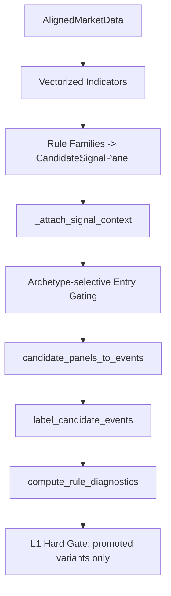

# 1. Overview

선물 Signal 레이어는 벡터화 Rule 패널을 생성하고, archetype 및 regime 문맥을 부착한 뒤, **공정한 L1 진입 게이트**를 통과한 Candidate Event만 downstream allocation으로 전달합니다.

# 2. Core Components

| Component | Responsibility | File |
|-----------|----------------|------|
| `build_rule_signal_panels` | 20개 family 기반 2D rule panel 생성 | `rule_signals.py` |
| `_entry_rising_edge_2d` | persistent state를 sparse entry event로 변환 | `rule_signals.py` |
| `_resolve_panel_archetype` | family를 `trend_continuation`, `mean_reversion` 등 archetype으로 매핑 | `rule_signals.py` |
| `_allowed_regimes_for_archetype` | archetype별 허용 regime 집합 정의 | `rule_signals.py` |
| `_attach_signal_context` | archetype, allowed regime, exit policy, regime code를 panel에 주입 | `rule_signals.py` |
| `candidate_panels_to_events` | 2D panel을 sparse candidate event table로 변환 | `rule_signals.py` |
| `compute_rule_diagnostics` | standalone breakeven hard gate와 recommendation 진단 수행 | `rule_diagnostics.py` |
| `build_exit_policies_for_panel` | archetype별 deterministic barrier geometry 부여 | `exit_policies.py` |

# 3. Data Flow

# 4. Business Rules & Invariants

- **Strict causality:** signal score, entry regime, barrier geometry는 모두 `t` 결정 시 미래 bar를 사용하지 않습니다.
- **Sparse entry only:** `side_hint_2d`는 상태 유지 구간 전체가 아니라 rising-edge 전이 시점에만 발화합니다.
- **Score/side decoupling:** `signed_score_2d`는 dense conviction, `side_hint_2d`는 sparse entry trigger입니다. `side_hint_2d == 0` 이더라도 score가 남아있는 것은 정상입니다.
- **Archetype-selective gating:** `mean_reversion_regime_entry_gating_enabled=True`가 기본값이며, mean-reversion archetype은 `bull_volatile`, `bear_volatile`, `crash`에서 진입하지 않습니다.
- **Fair standalone evaluation:** variant의 breakeven 평가는 archetype-valid regime 안에서만 해석됩니다. reversion을 추세장 손실로 영구 탈락시키지 않는 것이 목적입니다.
- **Hard breakeven gate:** `standalone_breakeven_hard_gate_enabled=True`면 OOS recommendation window에서 `edge_after_hurdle_bps` 평균이 양수이고 HAC/Newey-West 성격의 t-stat이 `min_rule_ir_t` 이상인 variant만 promotion 후보가 됩니다.
- **Archetype diversity is diagnostic:** trend/reversion 공존 여부는 `decision["keep_archetypes"]`, `keep_has_trend`, `keep_has_reversion`으로 기록되며 hard fail 조건은 아닙니다.

# 5. Data Schemas

### `CandidateSignalPanel`

- `signed_score_2d: NDArray[float64]`
- `side_hint_2d: NDArray[int8]`
- `valid_mask_2d: NDArray[bool]`
- `archetype: str`
- `allowed_regimes: tuple[str, ...]`
- `exit_policies: tuple[SignalExitPolicy, ...]`
- `regime_code_1d: NDArray[int8] | None`

### Candidate Event Row

- `family`, `variant`, `signal_cell`
- `archetype`
- `entry_idx`, `entry_regime`, `entry_regime_code`
- `side`, `raw_score`, `score_z`
- `expected_holding_bars`, `stop_atr_mult`, `take_profit_atr_mult`

# 6. Testing Expectations

- mean-reversion panel은 비허용 trending regime에서 `side_hint_2d=0`이어야 합니다.
- `candidate_panels_to_events`는 `entry_regime_code`와 `archetype`을 누락 없이 배출해야 합니다.
- breakeven hard gate는 sub-breakeven variant를 recommendation에서 제외해야 합니다.
- archetype coverage decision fields는 keep set 기준으로 trend/reversion 존재 여부를 반영해야 합니다.
