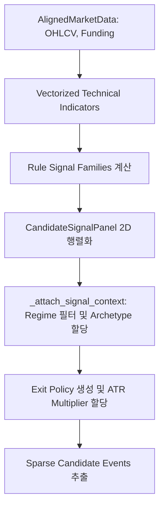

# 1. Overview

`my-coin-traider` 프로젝트의 선물(Futures) 전략 시그널 생성 아키텍처는 고속 벡터화 연산을 통해 시장 데이터를 스캔하고, **Candidate Event**(진입 후보 시점)를 추출하는 기반 레이어입니다. 단순 연속형 시계열 예측(Dense)을 지양하고, `Numba`와 `Numpy`를 활용해 의미 있는 시점에만 발화(Sparse Event)하는 패널들을 구성합니다. 생성된 패널은 ML 파이프라인의 핵심 입력이 됩니다.

---

# 2. Core Components

| Component | 책임 | 파일 |
|-----------|------|------|
| Vectorized Indicators | `_ema_2d`, `_rolling_std_2d`, `_atr_2d` 등 Numpy 기반 고속 지표 연산 | `rule_signals.py` |
| `build_rule_signal_panels` | Rule-based Signal(8+개 전략군) 생성 진입점. (MA, Donchian, Bollinger 등) | `rule_signals.py` |
| `_resolve_panel_archetype` | 신호의 성격(Archetype)을 분류 (`trend_continuation`, `mean_reversion` 등) | `rule_signals.py` |
| `filter_rule_signal_panels` | 설정(Allowlist) 및 Variant 기준으로 활성 패널 동적 필터링 | `rule_signals.py` |
| `CandidateSignalPanel` | 단일 전략 변종의 점수, 진입 방향, Exit Policy 등을 담는 Data Contract | `candidate_contracts.py` |
| `build_exit_policies_for_panel` | 전략 Archetype 및 Regime에 따른 동적 청산(SL/TP) 장벽 설정 | `exit_policies.py` |

---

# 3. Data Flow

---

# 4. Business Rules & Invariants

- **Strict Causality (Look-ahead 차단):** 모든 Vectorized 연산은 미래 데이터를 참조해서는 안 됩니다. 예를 들어 `_rolling_max_2d` (Donchian) 채널 계산 시, T 시점의 판단은 반드시 `shift(1)`을 통해 T-1 시점까지의 고가/저가 채널을 기준으로 이루어집니다.
- **Sparsity Principle:** 패널은 `side_hint_2d` 배열을 통해 매 시점의 포지션 방향을 정하는 것이 아니라, 특정 임계값을 충족하는 시점(1 또는 -1)만을 진입(Event) 후보로 추출합니다. (나머지는 0)
- **Archetype-Regime Alignment:** 신호의 Archetype에 따라 동작이 허용되는 Market Regime이 엄격히 분리됩니다 (`_allowed_regimes_for_archetype`). 
  - *예: Trend Continuation은 `quiet`나 `volatile` 국면에서 활성화, Reversion 계열은 특정 조건(transition) 등에 매핑.*
- **Dynamic Risk (ATR-based Barrier):** `Exit Policy`는 고정 비율이 아닌 `ATR (Average True Range)` 배수로 SL(Stop Loss), TP(Take Profit) 장벽 거리를 지정하여, 자산과 국면의 변동성에 따른 동적 청산을 보장합니다.

---

# 5. Data Schemas

### `CandidateSignalPanel` (2D 텐서 컨트랙트)
- `signed_score_2d`: `NDArray[float64]` — [-1.0, 1.0] 범위로 정규화된 연속 확신도
- `side_hint_2d`: `NDArray[int8]` — 진입 방향 힌트 (1=Long, -1=Short, 0=None)
- `valid_mask_2d`: `NDArray[bool]` — 상장 여부, Kill-switch 등 유효성 마스크
- `archetype`: `str` — 전략 군 (예: "trend_continuation", "carry_reversion")
- `exit_policies`: `tuple[SignalExitPolicy, ...]` — 시그널별 청산 정책 리스트

### `SignalExitPolicy` (청산 장벽)
- `stop_atr_mult`: `float` — ATR 단위 손절 장벽 승수
- `take_profit_atr_mult`: `float` — ATR 단위 익절 장벽 승수
- `expected_holding_bars`: `int` — 예상(Time-exit 기준) 보유 시간

---

# 6. Theory (수식 근거)

- **Robust Normalization:** 신호 강도(`signed_score_2d`)는 시장 충격을 흡수하기 위해 ATR이나 표준편차(Z-score)로 정규화됩니다. 이후 극단값을 억제하기 위해 `np.tanh` 또는 `np.clip`을 사용하여 [-1, 1] 범위로 매핑합니다.
  - **Trend MA Cross:** `ma_diff = (EMA_fast - EMA_slow) / ATR` → `score = np.tanh(ma_diff)`
  - **Vol Breakout (Bollinger Compression):** Bollinger Bandwidth의 Z-score가 -1.0 이하일 때(수축), 종가가 BB 2표준편차를 돌파하면 `(Close - BB_mean) / ATR` 로 강도를 산출.
  - **RSI Reversion:** `(50.0 - RSI) / 20.0` 으로 Z-score 유사 정규화.

---

# 7. Known Limitations

- **Threshold Sensitivity:** 현재 Signal Panel이 생성하는 Candidate Event 수는 하드코딩되거나 설정된 임계값(Threshold)에 직접적인 영향을 받으며, Optuna를 통한 파라미터 최적화와 강하게 결합되어 있습니다.
- **Collinearity (다중공선성):** 동일 패밀리(Family) 내의 여러 변종(Variant) 시그널들이 동시에 발화할 경우, 다운스트림(Downstream) ML Layer에서 이벤트 집중(Concentration) 제어가 필수적으로 요구됩니다.