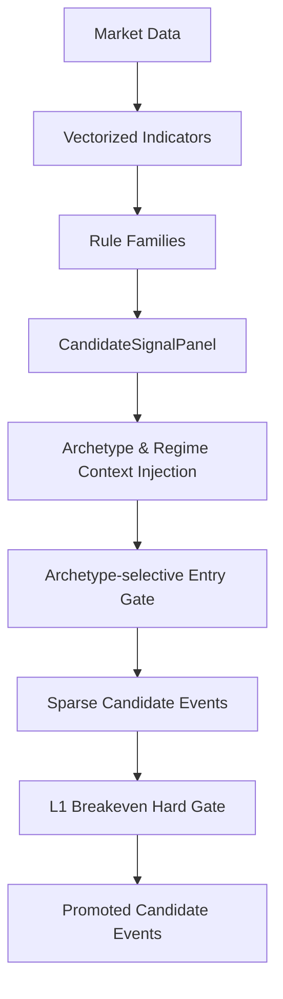

# 1. Purpose
Generates vectorized rule panels with archetype/regime contexts and filters them through an L1 breakeven hard gate to produce sparse candidate events.

# 2. Core Logic & Math

**Signal Vectorization & Sparsity**
- $S_{t} = f(\text{Market Data}_{1..t})$ (Dense conviction score)
- $E_{t} = 1 \text{ if } (S_{t} \neq 0 \land S_{t-1} == 0) \text{ else } 0$ (Sparse entry trigger, side hint)
- Strict Causality: No forward-looking data $t+k$ is used in evaluating $S_{t}$ or $E_{t}$.

**Archetype-Selective Regime Gating**
- $A_{\text{reversion}}$ (Mean Reversion) entries are blocked ($E_{t} \rightarrow 0$) in `bull_volatile`, `bear_volatile`, and `crash` regimes.

**L1 Breakeven Hard Gate (Hurdle)**
- For a variant to be promoted, its OOS mean edge after hurdle must be positive and significant.
- $\text{Edge}_{i} = \text{Gross Return}_{i} - \text{Execution Costs}_{i}$
- Condition: $\frac{1}{N} \sum (\text{Edge}_{i}) > 0 \land t_{\text{stat}}(\text{Edge}) \geq \text{min\_rule\_ir\_t}$
- Evaluated strictly within archetype-allowed regimes.

# 3. Architecture Flow

# 4. Core Variables & I/O

| Type | Variable | Description |
|------|----------|-------------|
| **Input** | `AlignedMarketData` | Vectorized pricing and volume data matrices |
| **Param** | `standalone_breakeven_hard_gate_enabled` | Enforces L1 profitability gate before allocation (boolean) |
| **Param** | `mean_reversion_regime_entry_gating_enabled` | Blocks mean-reversion entries in volatile/crash regimes (boolean) |
| **Output**| `CandidateSignalPanel` | Dense 2D structure containing `signed_score`, `side_hint`, and `valid_mask` |
| **Output**| `events: pd.DataFrame` | Sparse tabulated representation of valid entry signals |

# 5. Edge Cases & Handling
- **Data Gap/Missing Bars:** If input market data has NaNs due to exchange downtime, indicator valid_mask is strictly enforced (False), preventing erroneous signal generation.
- **Divergent Trend & Reversion Overlap:** Handled gracefully since rule panels are grouped by archetype; if both trigger simultaneously, they produce distinct sparse events evaluated independently by downstream allocators.
