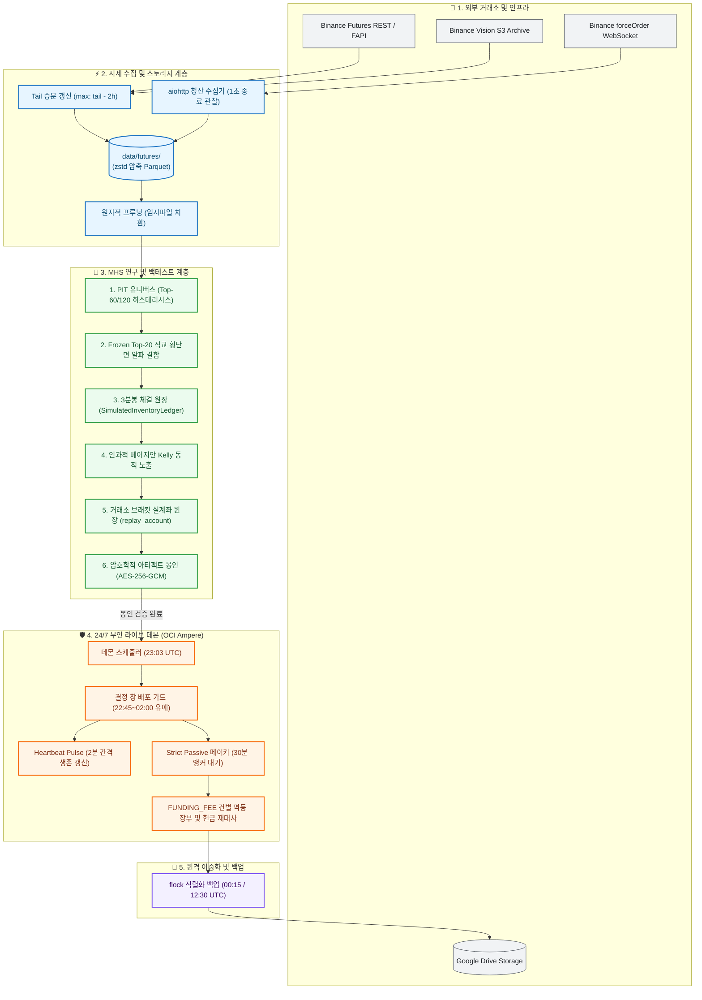

# System Architecture & Design Specification

> **crypto-pilot**: 바이낸스 USDT-M 무기한 선물 시장을 위한 퀀트 알파 연구 및 24/7 무인 자동매매 시스템

본 문서는 `crypto-pilot`의 핵심 엔지니어링 아키텍처 정본 명세서입니다. 단순 백테스트에서 발생하는 **"목표 가중치(Target Weight) PnL 착시의 배제"**를 최우선 원칙으로 삼으며, 3분봉(`3m`) 네이티브 체결 원장(`SimulatedInventoryLedger`), 8시간 펀딩비 실정산, 30분 앵커 지정가 메이커(`strict_passive`) 집행, 거래소 유지증거금율(MMR) 브래킷을 반영한 실계좌 원장(`replay_account`)과 인과적 베이지안 Kelly 동적 노출을 통해 저사양 클라우드(OCI Ampere A1.Flex, 2 vCPU / 2GB RAM) 환경에서 24/7 무인 집행을 완벽히 보장합니다.

---

## 1. System Goals & Boundaries

### 1.1 In-Scope (핵심 엔지니어링 목표)
* **시세 수집 & 실시간 증분 갱신**: Binance FAPI REST 및 Vision S3 분할 캐싱, `aiohttp` 기반 `forceOrder` 웹소켓 청산 틱 무차단 수집.
* **Point-In-Time (PIT) 유니버스**: 720h 과거 거래대금 중앙값 50% 필터 + Top-60 진입 / 120위 방출 이중 임계값(Schmitt-Trigger 히스테리시스, 미래 참조 0% 차단).
* **Frozen Top-20 직교 횡단면 알파**: 5개 직교 피처 랭크 결합 및 종목별 5% 가중치 클립. 1h 120일 패널 창 인프로세스 직접 산출.
* **인과적 베이지안 Kelly**: 사전 기댓값 $\mu_0 = 0$(730일 관측 가중)에서 출발하여 매일 전일까지의 실적만 반영한 사후 모멘트 동적 비중 배분.
* **3분봉 네이티브 체결 원장**: 실시간 마크 가격 시가평가(MTM), 8시간 펀딩비 실정산, High/Low 관통 검증, 30분 앵커 지정가 메이커/테이커 집행.
* **거래소 실거래 브래킷 원장**: 바이낸스 Notional 구간별 유지증거금율(MMR) 및 누적 공제액(cum), 최소 주문단위, 강제청산 실시간 판정.
* **24/7 무인 라이브 데몬**: 23:03 UTC 일별 사이클, 결정 창(22:45~02:00 UTC) 배포 유예 가드, AST 지문 기반 선택적 컨테이너 재생성.

### 1.2 Out-of-Scope (명시적 비목표 및 경계)
* **마이크로초 단위 L3 매칭 엔진 시뮬레이션**: 초고빈도(HFT) 오더북 대기열 경쟁은 배제하며, 3분봉 봉 관통 기반의 메이커/테이커 모델링을 채택합니다.
* **다중 거래소 간 횡단면 차익거래**: 바이낸스 USDT-M 무기한 선물 단일 시장에 집중하며, 타 거래소 간 레이턴시 차익거래는 다루지 않습니다.
* **온체인 DEX 유동성 풀 연동**: 중앙화 거래소 선물 시장 전용으로 설계되었으며, DeFi 스마트 컨트랙트 트랜잭션은 지원하지 않습니다.

---

## 2. Component Topology & External Interfaces

시스템의 컴포넌트 토폴로지와 외부 연동 경계는 5개 핵심 티어로 분리되어 있습니다.



### 외부 연동 인터페이스 (External Interfaces)
1. **Binance Futures FAPI REST**: Klines(`1m/1h`), Funding Rate(`8h`), Leverage Bracket 스냅샷 수집.
2. **Binance Vision S3 Archive**: 과거 대용량 Klines, 5분 메트릭스(OI, LSR) `.zip` 다운로드 및 SHA-256 체크섬 무결성 검증.
3. **Binance WebSocket (`forceOrder`)**: 비동기 `aiohttp` 스트리밍 직결, 실시간 강제청산 틱 수신 및 이벤트 정지 감시.
4. **Google Drive Storage**: 호스트 레벨 `flock` 파일 잠금 기반 rclone 원격 백업.

---

## 3. 24/7 State Machine & Daily Operational Lifecycle

라이브 트레이딩 데몬은 매일 UTC 기준 다음 4단계 수명주기를 무인으로 자율 순환합니다.

| 시각 (UTC) | 단계 | 핵심 처리 내용 및 안전 불변식 |
| :---: | :--- | :--- |
| 🛡️ **22:45 ~ 02:00** | **결정 창 보호 & 배포 유예** | • `daemon_idle_gate`가 활성화되어 CI 배포 시 컨테이너 재생성을 유예하여 신호 지연 손실(최대 -48%p)을 원천 방지.<br>• 백그라운드 스레드가 2분 주기로 생존 심박(`heartbeat`)을 갱신하여 데몬 오판 재기동 차단. |
| ⚡ **23:00 ~ 23:03** | **시세 동기화 & 신호 산출** | • 디스크 tail 기준 미수집 2시간 구간만 증분 패치(`~20초 소요`).<br>• 1h 120일 패널 기반 인프로세스 Frozen Top-20 직교 횡단면 신호 산출 및 5% 종목 클립 적용. |
| 📈 **23:03 ~ 23:33** | **주문 집행 (Strict Passive)** | • 사전 $\mu_0=0$ 인과적 베이지안 Kelly + 바이낸스 유지증거금율(MMR) 브래킷 사이징.<br>• 30분 앵커 지정가 대기 후 미체결 잔량만 테이커 폴백하여 수수료 절감 극대화. |
| 🌙 **00:15 / 12:30**| **장부 재대사 & 원격 백업** | • 8시간 펀딩비(`FUNDING_FEE`)를 장부 저장 전 건별 멱등 기록 및 현금 잔고 무결성 재대사.<br>• `flock` 직렬화 호스트 백업 스크립트로 30일 버전 보관 및 Google Drive 원격 동기화. |

---

## 4. Data Model & Financial Integrity Barrier

### 4.1 스토리지 디렉터리 레이아웃 (Storage Layout)
모든 시세 및 상태 데이터는 zstd 압축 Parquet 형식으로 저장되며, 디스크 I/O와 메모리를 최소화합니다:
```text
data/
  ├── futures/
  │   ├── ohlcv/ {1m, 3m, 1h}/*.parquet       # 11개 raw 필드 보존 캔들
  │   ├── markPriceKlines/ 1h/*.parquet       # 실시간 시가평가(MTM) 기준 캔들
  │   ├── funding/*.parquet                   # 8시간 선물 펀딩비 이력
  │   └── metrics/*.parquet                   # 5분 메트릭스 (available_at 5분 지연 강제)
  ├── venue_rules/                            # 바이낸스 유지증거금(MMR/cum) 브래킷 스냅샷
  ├── state/                                  # 24/7 라이브 영속 상태
  │   ├── live_fills/                         # 실제 체결 내역 (월별 파티션)
  │   ├── live_tax_ledger/                    # realized_pnl 및 FUNDING_FEE 건별 JSONL
  │   └── live_orderbook/                     # 일별 5-depth 호가창 스냅샷
  └── manifest.json                           # SHA-256 지문 및 결손(NaN) 감사 매니페스트
```

### 4.2 도메인 금융 무결성 배리어 (Financial Invariants)
1. **3분봉 네이티브 체결 원장 (`SimulatedInventoryLedger`)**:
   매 3분봉마다 `실시간 마크 가격 시가평가(MTM) ➔ 8시간 펀딩비 실정산 ➔ 테이커/메이커 체결` 정산 순서를 강제합니다. 지정가 매수는 봉 저가($Low < Price$), 매도는 봉 고가($High > Price$) 관통 시에만 체결을 인정합니다.
2. **거래소 실거래 브래킷 원장 (`replay_account.py`)**:
   바이낸스 공식 Notional Tier별 유지증거금율($MMR$) 및 누적 공제액($cum$) 사다리를 실시간 추적합니다:
   $$\text{Maintenance Margin} = \text{Position Notional} \times MMR - cum$$
   순자산 가치가 유지증거금 이하로 떨어지면 즉시 강제 청산으로 확정하며, 5개년 무청산 생존성을 입증했습니다.
3. **결손 펀딩비 임의 대체 금지 (Fail-Closed Zero-Filling Ban)**:
   누락된 펀딩비를 `0.0`으로 임의 대체하는 행위를 원천 차단하며, 데이터 부재 시 즉시 예외를 발생시키고 실행을 중단합니다.
4. **11개 원시 필드 온전 추출 (Full Field Extraction)**:
   Binance REST Klines의 모든 11개 필드(`quote_volume`, `taker_buy_base_volume` 등)를 온전히 보존하여 유동성 게이트와 플로우 불균형 피처의 NaN 오염을 차단합니다.

---

## 5. Architecture Layer Contracts & Static Verification

시스템은 명확한 6단계 단방향 계층 구조를 강제하며, 하위 계층의 상위 계층 역참조를 엄격히 금지합니다:

```text
Layer 5: CLI 진입점 및 운용 도구 (src/cli)
   ↓
Layer 4: 24/7 무인 라이브 데몬 및 안전 가드 (src/live)
   ↓
Layer 3: MHS 퀀트 연구 및 3분봉 체결 원장 엔진 (src/mhs)
   ↓
Layer 2: 정량적 알파 피처 및 리스크 수학 (src/quant)
   ↓
Layer 1: 바이낸스 시세 수집 및 Parquet 스토리지 (src/market_data)
   ↓
Layer 0: 코어 공통 계약, 불변식 스키마 및 설정 (src/common)
```

### 정적 아키텍처 불변식 규칙 (Static Guards)
* **모듈 크기 예산 (Module Budget)**: 모든 모듈은 최대 700줄 이하를 유지하며, 단일 책임 원칙을 강제합니다.
* **패키지 순환 참조 제로 (Zero Import Cycles)**: 패키지 간 순환 의존성을 0개로 강제합니다.
* **문서 길이 예산 (Doc Budget)**: 모든 아키텍처 문서는 파일당 300줄 이하를 엄격히 준수합니다.

```bash
# 아키텍처 계층 계약 및 문서 예산 검증
uv run pytest tests/contract/test_module_boundaries.py -k "test_architecture_docs_within_line_limit"
```
