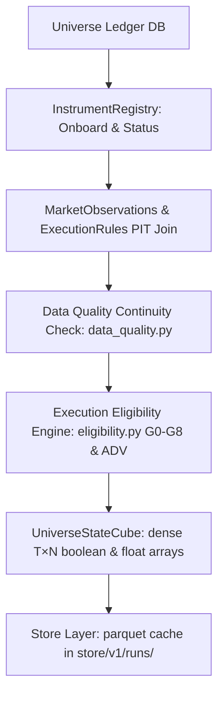

# 1. System Boundary
- **In-Scope**:
  - Point-in-Time (PIT) `UniverseStateCube [T, N]` 생성, 관리 및 디스크 저장/캐싱 (`universe_ledger.db` & `store/v1/runs/`).
  - G0~G8 및 ADV_FLOOR_FAIL 등 Execution Eligibility Gate 평가 (Symbol 단위 거래 수용성 제어).
  - Data Quality stage (`data_quality.py`) 및 Strategy Readiness Check (`data_readiness.py`).
  - Liquidity 및 ADV 기반 Capacity limit `capacity_usdt [T, N]` 및 Execution Cost `cost_bps [T, N]` 추정.
- **Out-of-Scope**:
  - Portfolio optimization 실행 및 Live Execution Order Routing (L2/L3 계층 담당).

# 2. Mathematical Formalism & Constraints

### PIT Eligibility
$$\text{eligible}[t, n] = 1 \iff \forall g \in \text{Gates}: g(\text{obs}_{t,n}, \text{rules}_{t,n}) = \text{PASS}$$
- Point-in-Time Guard: $\text{available\_at} \le \text{decision\_at}$ (미래 데이터 참조 오염 방지).

### Execution Cost Estimation Model (`_compute_round_trip_cost`)
Square-root market impact 모델 기반 총 라운드트립 비용(bps) 추정:
$$\text{impact\_bps} = 18.0 \times \sqrt{\frac{\text{intended\_notional\_usdt}}{\max(\text{ADV30}_{\text{usdt}}, 10^{-12})}}$$
$$\text{cost\_bps} = 2 \cdot (\text{taker\_fee\_bps} + 1.0) + 2 \cdot \text{impact\_bps}$$

### Capacity Calculation (`_capacity_from_cost`)
비용 상한(`max_round_trip_cost_bps`)과 ADV 참여율 상한(`max_participation_rate`)을 동시 만족하는 최대 노셔널 산출:
$$\text{capacity\_from\_cost} = \text{ADV30} \times \left( \frac{\text{max\_cost\_bps} - 2(\text{taker\_fee\_bps} + 1.0)}{36.0} \right)^2$$
$$\text{capacity\_usdt}[t, n] = \min\left(\text{capacity\_from\_cost}, \text{ADV30} \times \text{max\_participation\_rate}\right)$$

### Strategy Sub-window Readiness Constraints (`data_quality.py`, `data_readiness.py`)
- **In-Sample Bars**: 4H 기준 $N_{\text{bars}} \ge 1,296$ bars (최소 9개월분 이상 80% coverage).
- **60-Day Continuity**: Coverage $\ge 95\%$, zero-volume bars $\le 3$, frozen bars $\le 6$, bar gaps $\le 3$.

# 3. Execution Eligibility Gates (G0–G8 + ADV_FLOOR)

| Gate ID | Code Enum | Condition / Constraint | Fail Action | Default Threshold |
| :--- | :--- | :--- | :--- | :--- |
| **G0** | `LEVERAGED_TOKEN` | Symbol contains "UP", "DOWN", "BULL", "BEAR" | Exclude | Exclude leveraged tokens |
| **G1** | `NOT_ONBOARDED` | $\text{decision\_at} < \text{available\_at}$ or NaT | Exclude | PIT onboard timestamp check |
| **G2** | `STATUS_NOT_TRADING` | $\text{status} \ne \text{TRADING}$ | Exclude | `TRADING` status required |
| **G3** | `DATA_CONFIDENCE_LOW` | Instrument confidence level $<$ min threshold | Exclude | `min_data_confidence` (RECONSTRUCTED) |
| **G4** | `MISSING_RULES` | PIT execution rules (`ExecutionRules`) missing | Exclude | Fallback policy dependent |
| **G5** | `STALE_MARKET_DATA` | `adv30_usdt` missing or $\text{staleness\_bars} > \text{max\_staleness\_bars}$ | Exclude | $\text{max\_staleness\_bars} = 1$ bar |
| **G6** | `DATA_INTEGRITY_FAIL` | Coverage $< 95\%$, Gap count $> 3$, Gap bars $> 6$, Frozen $> 6$, NaN/Inf, TS issues | Exclude | Continuity & data validity limits |
| **ADV**| `ADV_FLOOR_FAIL` | $\text{adv30\_usdt} < \text{min\_adv\_usdt}$ | Exclude | $\text{min\_adv\_usdt} = 2,000,000$ USDT |
| **G7** | `ORDER_TOO_SMALL` | $\text{rounded\_qty} < \text{min\_qty} \lor \text{rounded\_notional} < \text{min\_notional}$ | Exclude | Min notional/qty order filter |
| **G8** | `COST_TOO_HIGH` | $\text{cost\_bps} > \text{max\_round\_trip_cost_bps}$ | Exclude | $\text{max\_round\_trip\_cost\_bps} = 50.0$ bps |

# 4. Core Variables & I/O

| Type | Variable | Shape / Type | Description |
| :--- | :--- | :--- | :--- |
| **Input** | `decision_at` | `datetime` | Point-in-Time decision timestamp |
| **Input** | `observations` | DataFrame | PIT market metrics (`adv30_usdt`, `last_price`, `vol30`) |
| **Input** | `rules` | Dict `[id, ExecutionRules]` | Instrument-level tick size, step size, min notional, taker fee |
| **Param** | `min_adv_usdt` | `float` | Hard minimum threshold for 30d ADV (2,000,000 USDT) |
| **Param** | `max_round_trip_cost_bps` | `float` | Hard ceiling on round-trip friction cost (50.0 bps) |
| **Output**| `eligible` | `[T, N]` `bool` | Final dense symbol eligibility state matrix |
| **Output**| `capacity_usdt` | `[T, N]` `float64` | Estimated execution capacity limit in USDT |
| **Output**| `cost_bps` | `[T, N]` `float64` | Estimated round-trip friction cost in basis points |

# 5. Topology & Dynamic Flow

# 6. Storage Specs
- **SQLite Ledger**: `universe_ledger.db` with unique index `(symbol, tf, date, knowledge_date)`.
- **Store Parquet Cache**: `store/v1/runs/` contains `manifest.parquet`, `decisions.parquet`, `cube.parquet` keyed by config hash.
