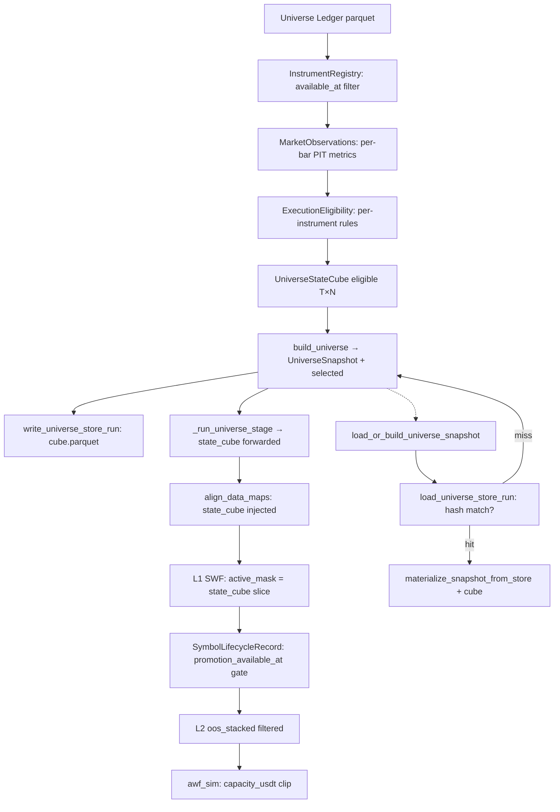

# 1. Purpose
바이낸스 USDT 무기한 선물 시장을 대상으로 선행 편향(Look-ahead) 및 생존 편향(Survivorship bias)이 없는 PIT(Point-in-Time) 성격을 지닌 `UniverseStateCube [T, N]`를 생성하고 관리한다.

# 2. Core Logic & Math

### PIT Eligibility Rule
- **심볼 진입 적격성 판별**:
  - $\text{eligible}[t, n] = 1 \iff \forall r \in \text{ExecutionRules}: r(\text{obs}_{t,n}) = \text{PASS}$
  - `available_at <= decision_at` 조건에 부합하는 시점의 데이터만 시뮬레이션에 유입하도록 제어함.
  - 결측 상태 발견 시 `eligible = False` 처리.

### Execution Cost Estimation
- **체결 예상 비용 산식**:
  - $\text{cost\_bps} = 2 \cdot \text{taker\_fee} + 2 \cdot \text{half\_spread} + \text{impact} + \text{tick\_cost}$
  - 2020년 이전: Corwin-Schultz OHLC 변동성 대용치를 활용한 스프레드 추정.
  - 2020년 이후: 실시간 호가 깊이의 중위수 스프레드 적용.

### Capacity Clip
- **최대 거래 가능 한도**:
  - $\text{capacity\_usdt}[t, n] = \text{adv\_usdt}_{30d}[t, n] \times \text{max\_participation\_rate}$
  - 포트폴리오 가중치 결정 시 $w \leftarrow \min\left(w, \frac{\text{capacity\_usdt}[t, n]}{\text{nav}}\right)$ 스케일링을 거치며, 5 USDT 미만 잔고 배분은 0으로 절사.

### PIT Sub-window Admission
생존 편향 우회를 위한 tiered 하위 구간 검증을 적용한다.
1. 시뮬레이션 시작 시점(`fetch_start`) 이전에 데이터가 존재할 것.
2. 데이터 샘플 밀도가 최소 `_TIERED_MIN_WINDOW_BARS` (1500개) 이상일 것.
3. OOS 영역에서 유효 데이터 밀도가 90% 이상일 것.

# 3. Execution Eligibility Gates (G0–G8 + ADV_FLOOR)
자산군 등록 정보와 데이터를 바탕으로 매 시점별로 필터 게이트를 통과시킨다.
- **G0 (LEVERAGED_TOKEN)**: UP, DOWN, BULL, BEAR 명칭 포함된 레버리지 토큰 제외.
- **G1 (NOT_ONBOARDED)**: 상장 승인 시점 이전 데이터 진입 제한.
- **G2 (STATUS_NOT_TRADING)**: 거래 상태가 `TRADING`이 아닌 품목 배제.
- **G3 (DATA_CONFIDENCE_LOW)**: 결측치(NaN), 무한대(Inf) 혹은 데이터 밀도 80% 미만 품목 제외.
- **G4 (MISSING_RULES)**: 유효한 거래 실행 규칙이 누락된 항목 필터링.
- **G5 (STALE_MARKET_DATA)**: 최종 유효 봉 이후 일정 봉 수 이상 갱신 지연 시 제외.
- **G6 (DATA_INTEGRITY_FAIL)**: 다수의 갭 발생, 장기 거래 중단(Frozen), 60일 데이터 밀도 부족 시 탈락.
- **G7 (ORDER_TOO_SMALL)**: 자산의 최소 체결 가능 금액이 목표 투입 금액보다 클 때 배제.
- **G8 (COST_TOO_HIGH)**: 추정 왕복 거래 비용이 `max_round_trip_cost_bps` 초과 시 제외.
- **ADV_FLOOR (ADV_FLOOR_FAIL)**: 30일 일평균 거래대금(ADV)이 임계값(2M USDT)에 미달할 때 배제.

# 4. Architecture Flow

# 5. Core Variables & I/O

| Type | Variable | Description |
|---|---|---|
| **Input** | `knowledge_date` | 거래 결정 시점 이전 데이터 한계선 (PIT 제어 장벽) |
| **Param** | `min_adv_usdt` | 거래 유지를 위한 최소 일평균 거래대금 하한 (2M USDT) |
| **Param** | `max_gap_bars` | G6 통과를 위한 연속 결측 허용치 |
| **Param** | `max_round_trip_cost_bps` | 허용 거래 왕복 마찰 비용 한계치 (기본 50.0 bps) |
| **Output**| `UniverseStateCube.eligible [T, N]` | 적격 심볼 판별 여부 최종 부울 행렬 |
| **Output**| `capacity_usdt [T, N]` | Kelly Sizing 스케일링용 심볼 최대 한도액 매트릭스 |

# 6. Storage & Ledger Management
- **Ledger Layer**: SQLite 파일(`universe_ledger.db`)을 주 원장 데이터베이스로 활용하여 `(symbol, tf, date, knowledge_date)` 조합 고유 인덱스를 통해 유일성을 보장함.
- **Store Layer**: 캐시 가속을 위해 `store/v1/runs/...` 하위에 `manifest.parquet`, `decisions.parquet`, `cube.parquet` 형태로 직렬화하여 적재하며, config의 해시가 일치할 경우 원장 쿼리를 우회하여 메모리에 즉각 로드함.
- **Data Sync**: incremental 자동 갱신 모드를 통해 필요 시점에 원장 보정을 유도하고, raw 파일 변경이 관측되면 feature 캐시 무효화를 수행함.
- **Metrics Sync**: Open Interest 및 Long-Short Ratio 지표를 일별 아카이브 및 REST API로부터 병합해 `xs_oi_skew` 등의 cross-sectional 시그널에 전달함.
