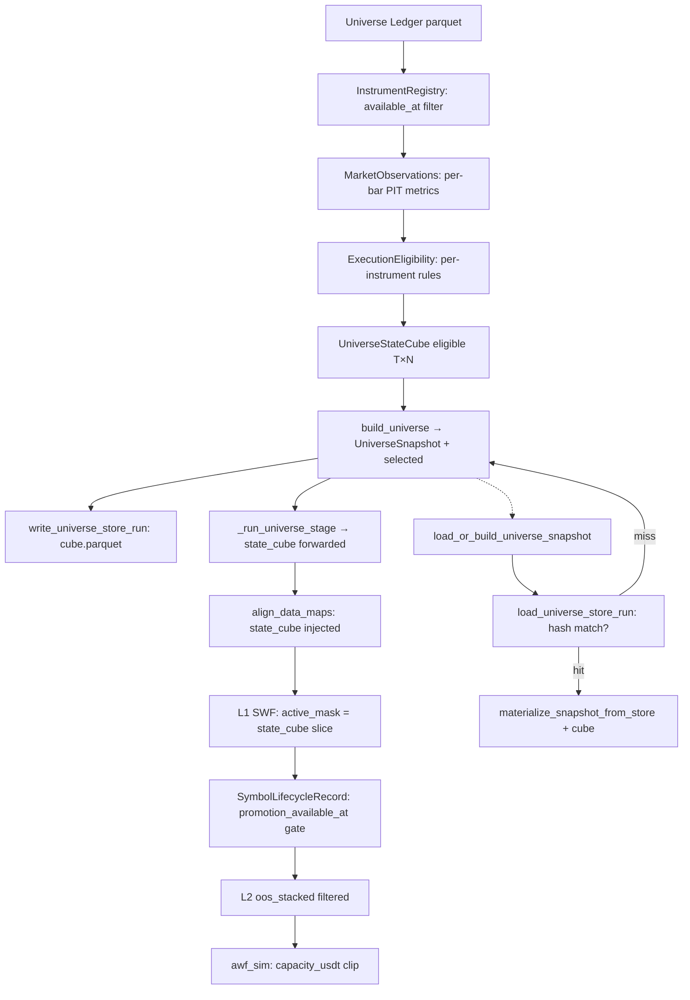

# 1. Purpose
Produces a bar-by-bar PIT-valid `UniverseStateCube [T, N]` for Binance USDT perpetual futures — no survivorship bias, no look-ahead. Replaces the legacy Stage2-6 ranked selection with per-bar execution eligibility rules evaluated at `available_at <= decision_at`.

# 2. Core Logic & Math

**PIT Eligibility Rule (per bar, per instrument)**
- $\text{eligible}[t, n] = 1 \iff \forall r \in \text{ExecutionRules}: r(\text{obs}_{t,n}) = \text{PASS}$
- `available_at ≤ decision_at` strictly enforced for every observation.
- Fail-closed: missing data → `eligible = False`.

**Execution Cost Estimation**
- $\text{cost\_bps} = 2 \cdot \text{taker\_fee} + 2 \cdot \text{half\_spread} + \text{impact} + \text{tick\_cost}$
- Post-2020: `half_spread` = empirical median bookDepth.
- Pre-2020: `half_spread` = Modified Corwin-Schultz OHLC model.

**Capacity Clip**
- $\text{capacity\_usdt}[t, n] = \text{adv\_usdt}_{30d}[t, n] \times \text{max\_participation\_rate}$
- Order sizing clips to capacity: $w \leftarrow \min(w, \text{capacity\_usdt}[t, n] / \text{nav})$. Min order 5 USDT; below threshold → $w = 0$.

**Capacity-Coverage Cap (quarterly snapshot)**
- `PITUniverseConfig.k_in > 0` (legacy): select top-k by `capacity_usdt` descending. `k_in = 0` (default) → capacity-coverage mode.
- **Capacity-coverage mode**: select minimum prefix of `eligible_syms_all` (sorted by `capacity_usdt` desc) such that $\sum_{\text{prefix}} \text{capacity} \ge \text{capacity\_coverage\_target} \times \sum_{\text{all}} \text{capacity}$. Prefix clipped to `k_max`.
- Fail-open: if total capacity = 0, falls back to `eligible_syms_all[:k_max]`.

**PIT Sub-window Admission (tiered pipeline scope)**
- Replaces full-window END-coverage filter that forced survivorship bias. Applied in `_resolve_tradeable_scope` before tiered pipeline entry.
- Three guards (all must pass):
  1. `datetimes.min() ≤ fetch_start` — warm-up coverage: symbol must predate fetch window start so intersection of all admitted symbols preserves full warm-up.
  2. `bars_in_window ≥ _TIERED_MIN_WINDOW_BARS` — minimum data density within `[fetch_start, holdout_end]`.
  3. `covered_oos_span / total_oos_span ≥ min_holdout_coverage` — symbol must span ≥ 90% of `[oos_start, holdout_end]` (protects against holdout-truncated/delisted symbols).

**Snapshot Quality Score (legacy, retained for audit)**
- $\text{Score} = \text{fill\_rate} \times \log_{10}\left(\frac{\text{median\_adv\_usdt}}{\text{adv\_scale\_factor}}\right) \times \frac{1}{\text{mAEC\_bps}}$

# 3. Architecture Flow

**Quarterly dispatch (`discover_universe_timeline`):**
- `cfg.universe_engine == "pit"` (default) → `_discover_universe_timeline_pit`: quarterly loop, pit_cubes forward-filled into merged `eligible [T, N]`.
- `cfg is None` → defaults to `UniverseConfig()` (PIT-only).

# 4. Core Variables & I/O

| Type | Variable | Description |
|------|----------|-------------|
| **Input** | `knowledge_date` | PIT barrier: `available_at <= decision_at` enforced |
| **Input** | `available_at` | Observation release timestamp (distinct from event timestamp) |
| **Param** | `PITUniverseConfig.k_in` | Legacy top-N cap; `0` (default) = capacity-coverage mode |
| **Param** | `capacity_coverage_target` | Cumulative capacity fraction to cover (default 0.90) |
| **Param** | `k_max` | Hard cap on admitted symbols in coverage mode (default 100) |
| **Param** | `_TIERED_MIN_WINDOW_BARS` | Min bars in `[fetch_start, holdout_end]` for tiered admission (1500) |
| **Param** | `min_holdout_coverage` | Min fraction of OOS span a symbol must cover for tiered admission (0.90) |
| **Param** | `max_participation_rate` | Fraction of ADV per order for capacity (default 0.01) |
| **Param** | `max_round_trip_cost_bps` | Hard execution-cost ceiling (default 50.0 bps) |
| **Output** | `UniverseStateCube.eligible [T, N]` | Bool array; SSOT for bar-by-bar eligibility |
| **Output** | `capacity_usdt [T, N]` | float64; injected into awf_sim for position sizing |
| **Output** | `UniverseSnapshot.selected` | Eligible symbols at as_of, no fixed k_in rotation |
| **Internal** | `SymbolLifecycleRecord` | Per-symbol L1 fold status + `promotion_available_at: date\|None` |

# 5. Edge Cases & Handling
- **Exchange API Rule Changes (e.g., Tick Size):** Universe caches API exchange info as-of `knowledge_date`; historical structure parameters used for simulation alignment.
- **Delisted/Dead Coins:** Symbols delisted post-`knowledge_date` remain in snapshot if eligible at `as_of` — enforces inclusion to prevent survivorship bias.
- **New Listings Guard:** Loader clips request start to `onboard_date`; backfills skipped if gap < 24 hours.
- **Delisted Symbol Sync Prevention:** Symbols with no data update > 180 days past requested end are treated as inactive; sync range clipped accordingly.
- **Mid-listing Promotion Gate:** `SymbolLifecycleRecord.promotion_available_at > l2_start` → symbol excluded from L2 `oos_stacked`; prevents look-ahead from mid-window listing entry.
- **Empty Ledger (stage0.empty):** `build_universe()` creates empty `UniverseStateCube` with all arrays shape `(0,0)`. `validate_materializable_pit_store_run` accepts only when `cube` exists, `cube.eligible` is all `False`, and `decisions` has zero selected symbols. `materialize_snapshot_from_store` requires `cube` argument for every cold-build path.

# 6. Storage & Persistence

## Ledger Layer (SQLite / Parquet)
- **Database Backend:** SQLite remains the SSOT backend for persistent universe history in `universe_ledger.db`.
- **Compatibility Layer:** `load_ledger_slice(...)` now dispatches by suffix. `.db/.sqlite/.sqlite3/""` use SQLite slices; `.parquet/.pq` use parquet load followed by the same PIT filter path.
- **Failure Contract:** Existing files no longer fall through to silent empty frames on read failure. Backend errors are raised with backend context; only genuinely missing files may return an empty frame.
- **Index Optimization:** A composite unique index on `(symbol, tf, date, knowledge_date)` prevents duplicates, ensuring idempotent upsert updates.
- **Query Slicing:** Both backend paths converge through `query_ledger_as_of(...)`, preserving `date <= as_of` and `knowledge_date <= as_of` semantics.

## Store Layer (Parquet-only Run Cache)
- **Single canonical location:** `store/v1/runs/tf={tf}/as_of={date}/run_id={sha256[:16]}/`
  - `manifest.parquet` — UniverseRunManifest (1-row)
  - `decisions.parquet` — UNIVERSE_DECISION_COLUMNS (27-column)
  - `filter_report.parquet` — per-symbol stage/passed/reason
  - `cube.parquet` — UniverseStateCube (numpy arrays serialized via tobytes)
- **Run identity:** SHA256(`tf|as_of|config_hash|data_manifest_hash`). Config or manifest change → different run_id → natural cache invalidation.
- **Storage-only path:** `load_or_build_universe_snapshot` checks store hit first. Miss falls back to `build_universe` which writes a complete store run.
- **Cube round-trip:** `pit_state_cube` is persisted via `cube.parquet` and restored on store hit. No transient data loss.
- **GC:** `gc_stale_store_runs(tf, as_of, keep_latest=1)` removes stale run directories by mtime, keeping latest N per as_of.
