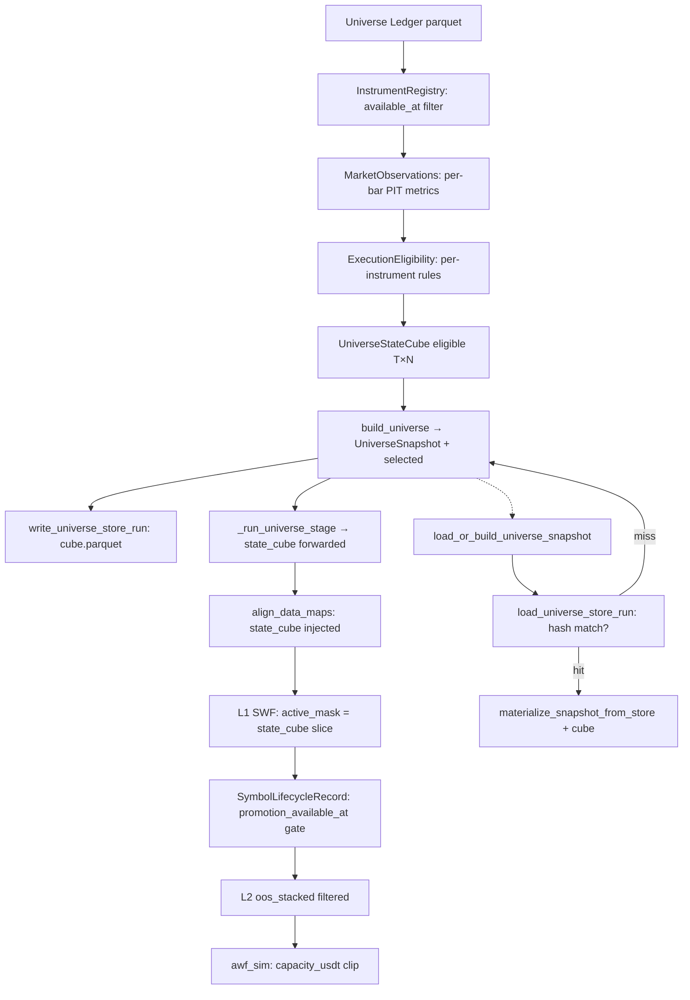

# 1. Purpose
Produces a bar-by-bar PIT-valid `UniverseStateCube [T, N]` for Binance USDT perpetual futures — no survivorship bias, no look-ahead. Replaces the legacy Stage2-6 ranked selection with per-bar execution eligibility rules evaluated at `available_at <= decision_at`.

# 2. Core Logic & Math

**PIT Eligibility Rule (per bar, per instrument)**
- $\text{eligible}[t, n] = 1 \iff \forall r \in \text{ExecutionRules}: r(\text{obs}_{t,n}) = \text{PASS}$
- `available_at ≤ decision_at` strictly enforced for every observation.
- Fail-closed: missing data → `eligible = False`.

**Execution Cost Estimation**
- $\text{cost\_bps} = 2 \cdot \text{taker\_fee} + 2 \cdot \text{half\_spread} + \text{impact} + \text{tick\_cost}$
- Post-2020: `half_spread` = empirical median bookDepth.
- Pre-2020: `half_spread` = Modified Corwin-Schultz OHLC model.

**Capacity Clip**
- $\text{capacity\_usdt}[t, n] = \text{adv\_usdt}_{30d}[t, n] \times \text{max\_participation\_rate}$
- Order sizing clips to capacity: $w \leftarrow \min(w, \text{capacity\_usdt}[t, n] / \text{nav})$. Min order 5 USDT; below threshold → $w = 0$.

**Symbol Breadth Policy (quarterly snapshot)**
- Universe is breadth-maximizing: all symbols passing G0–G8 + ADV_FLOOR are admitted.
- `k_max = 150`: compute backstop only (not a ranking cut). Almost never binding.
- `eligible_syms[:k_max]` — no capacity-coverage prefix; capacity is an L2 sizing constraint, not a universe gate.

**Execution Eligibility Gates (G0–G8 + ADV_FLOOR, per quarterly snapshot)**
- G0: LEVERAGED_TOKEN — suffix UP/DOWN/BULL/BEAR excluded.
- G1: NOT_ONBOARDED — `available_at > as_of`.
- G2: STATUS_NOT_TRADING — exchange status ≠ TRADING.
- G3: DATA_CONFIDENCE_LOW — `has_nan | has_inf | has_timestamp_issues | coverage < 0.80`.
- G4: MISSING_RULES — no execution rules computed.
- G5: STALE_MARKET_DATA — `staleness_bars > max_staleness_bars (=2 @4h)`.
- G6: DATA_INTEGRITY_FAIL — `n_bar_gaps > max_gap_count(=3) OR max_gap_bars > max_gap_bars_threshold(=6=24h @4h) OR frozen_bars > max_frozen_bars(=6) OR n_zero_volume_bars_60d > max_zero_vol_bars(=12) OR last_60d_coverage < min_60d_coverage(=0.90) OR has_nan OR has_inf OR has_timestamp_issues`.
- G7: ORDER_TOO_SMALL — `min_order_usdt > default_intended_notional_usdt`.
- G8: COST_TOO_HIGH — `round_trip_cost_bps > max_round_trip_cost_bps(=60)`.
- ADV_FLOOR: ADV_FLOOR_FAIL — `adv_usdt_30d < min_adv_usdt(=2M)`.

**Continuity Metrics (`compute_continuity_metrics`)**
- Computes `n_bar_gaps`, `max_gap_bars`, `frozen_bars`, `n_zero_volume_bars_60d`, `last_60d_coverage`, `has_nan`, `has_inf`, `has_timestamp_issues` from raw parquet klines.
- Grid uses `pd.date_range(true_first_date, as_of_date, freq=tf)` where `true_first_date = max(onboard_date, first_data_date)` — prevents pre-data gap inflation.
- `.as_unit("ns").asi8` on both expected grid and observed timestamps — eliminates pandas 2.x datetime unit mismatch (s vs us vs ns) that falsely maximized `max_gap_bars`.
- Written to ledger at sync time; G6 reads these fields via `_instrument_df_from_ledger`.

**Backtest Loader Gap Gate (`evaluate_symbol_data_sufficiency`)**
- After count-based checks (95% IS/OOS coverage), computes `max_gap_bars` from loaded datetime series: `round(max_diff / bar_delta) - 1`.
- `gap_ok = max_gap_bars <= FUTURES_BACKTEST_MAX_GAP_BARS (=6)` — boundary aligned with G6 (`>` strict).
- `reason = "gap_too_large"` when gap gate fails; `max_gap_bars` included in return dict.
- Applied to both `is_historical_stage5` and standard paths.

**PIT Sub-window Admission (tiered pipeline scope)**
- Replaces full-window END-coverage filter that forced survivorship bias. Applied in `_resolve_tradeable_scope` before tiered pipeline entry.
- `_resolve_base_symbol_scope` first narrows `valid_symbols` to symbols that have a non-empty timeframe frame in `full_strategy_maps`; this is a data-availability scope only.
- `_resolve_tradeable_scope` then applies strict temporal guards to that base scope:
  1. `datetimes.min() <= fetch_start` — warm-up coverage.
  2. `bars_in_window >= _TIERED_MIN_WINDOW_BARS` — minimum density over `[fetch_start, holdout_end]`.
  3. OOS coverage over `[oos_start, holdout_end]` is at least 90%.
- Empty strict admission is fail-closed at the tiered entry point; no fallback re-expands the scope.
- These guards operate on the base scope only; the resulting admitted symbols feed `align_data_maps` and later per-bar `active_mask` filtering.

**Snapshot Quality Score (legacy, retained for audit)**
- $\text{Score} = \text{fill\_rate} \times \log_{10}\left(\frac{\text{median\_adv\_usdt}}{\text{adv\_scale\_factor}}\right) \times \frac{1}{\text{mAEC\_bps}}$

# 3. Architecture Flow

**Quarterly dispatch (`discover_universe_timeline`):**
- `cfg.universe_engine == "pit"` (default) → `_discover_universe_timeline_pit`: quarterly loop, pit_cubes forward-filled into merged `eligible [T, N]`.
- `cfg is None` → defaults to `UniverseConfig()` (PIT-only).

# 4. Core Variables & I/O

| Type | Variable | Description |
|------|----------|-------------|
| **Input** | `knowledge_date` | PIT barrier: `available_at <= decision_at` enforced |
| **Input** | `available_at` | Observation release timestamp (distinct from event timestamp) |
| **Param** | `PITUniverseConfig.k_in` | Legacy top-N cap; `0` (default) = breadth-max mode |
| **Param** | `k_max` | Compute backstop (default 150); almost never binding |
| **Param** | `min_adv_usdt` | ADV floor for executability (2M USDT); not a ranking cut |
| **Param** | `max_gap_bars` | G6: max consecutive missing-bar gap allowed (6 = 24h @4h) |
| **Param** | `max_gap_count` | G6: max distinct gap runs in full history (3) |
| **Param** | `max_frozen_bars` | G6: max same-close consecutive bars (6 = 24h @4h) |
| **Param** | `FUTURES_BACKTEST_MAX_GAP_BARS` | Loader: aligns with G6 `max_gap_bars` threshold (6) |
| **Param** | `_TIERED_MIN_WINDOW_BARS` | Min bars in `[fetch_start, holdout_end]` for tiered admission (1500) |
| **Param** | `min_holdout_coverage` | Min fraction of OOS span a symbol must cover for tiered admission (0.90) |
| **Param** | `max_participation_rate` | Fraction of ADV per order for capacity (default 0.01) |
| **Param** | `max_round_trip_cost_bps` | Hard execution-cost ceiling (default 50.0 bps) |
| **Output** | `UniverseStateCube.eligible [T, N]` | Bool array; SSOT for bar-by-bar eligibility |
| **Output** | `capacity_usdt [T, N]` | float64; injected into awf_sim for position sizing |
| **Output** | `UniverseSnapshot.selected` | Eligible symbols at as_of, no fixed k_in rotation |
| **Internal** | `SymbolLifecycleRecord` | Per-symbol L1 fold status + `promotion_available_at: date\|None` |

# 5. Edge Cases & Handling
- **Exchange API Rule Changes (e.g., Tick Size):** Universe caches API exchange info as-of `knowledge_date`; historical structure parameters used for simulation alignment.
- **Delisted/Dead Coins:** Symbols delisted post-`knowledge_date` remain in snapshot if eligible at `as_of` — enforces inclusion to prevent survivorship bias.
- **New Listings Guard:** Loader clips request start to `onboard_date`; backfills skipped if gap < 24 hours.
- **Pre-data Gap Inflation:** `compute_continuity_metrics` clamps `true_first_date = max(onboard_date, first_data_date)` — prevents symbols listed in 2019 (BTC) but with data from 2022 from showing false 3-year gap.
- **Pandas Datetime Unit Mismatch:** `pd.date_range()` returns `datetime64[s, UTC]`; parquet timestamps are `datetime64[us, UTC]`. `.asi8` gave incompatible int64 values → zero intersection → every symbol showed `max_gap_bars=total_expected_bars`. Fixed: `.as_unit("ns").asi8` on both sides.
- **Delisted Symbol Sync Prevention:** Symbols with no data update > 180 days past requested end are treated as inactive; sync range clipped accordingly.
- **Mid-listing Promotion Gate:** `SymbolLifecycleRecord.promotion_available_at > l2_start` → symbol excluded from L2 `oos_stacked`; prevents look-ahead from mid-window listing entry.
- **Empty Ledger (stage0.empty):** `build_universe()` creates empty `UniverseStateCube` with all arrays shape `(0,0)`. `validate_materializable_pit_store_run` accepts only when `cube` exists, `cube.eligible` is all `False`, and `decisions` has zero selected symbols. `materialize_snapshot_from_store` requires `cube` argument for every cold-build path.
- **Membership Masking Vectorization and Numba Acceleration:** Membership masks (active, warm, entry block) are vectorized using `pd.Timestamp` comparison on the `DatetimeIndex` to bypass heavy `datetime.date` Python object allocation and `np.isin` object-search overhead. Continuous active-period counting (warmup bars check) is compiled via Numba `@njit` to bypass slow Pandas `groupby().cumsum()` loops.

# 6. Storage & Persistence

## Ledger Layer (SQLite / Parquet)
- **Database Backend:** SQLite remains the SSOT backend for persistent universe history in `universe_ledger.db`.
- **Compatibility Layer:** `load_ledger_slice(...)` now dispatches by suffix. `.db/.sqlite/.sqlite3/""` use SQLite slices; `.parquet/.pq` use parquet load followed by the same PIT filter path.
- **Failure Contract:** Existing files no longer fall through to silent empty frames on read failure. Backend errors are raised with backend context; only genuinely missing files may return an empty frame.
- **Index Optimization:** A composite unique index on `(symbol, tf, date, knowledge_date)` prevents duplicates, ensuring idempotent upsert updates.
- **Query Slicing:** Both backend paths converge through `query_ledger_as_of(...)`, preserving `date <= as_of` and `knowledge_date <= as_of` semantics.

## Store Layer (Parquet-only Run Cache)
- **Single canonical location:** `store/v1/runs/tf={tf}/as_of={date}/run_id={sha256[:16]}/`
  - `manifest.parquet` — UniverseRunManifest (1-row)
  - `decisions.parquet` — UNIVERSE_DECISION_COLUMNS (27-column)
  - `filter_report.parquet` — per-symbol stage/passed/reason
  - `cube.parquet` — UniverseStateCube (numpy arrays serialized via tobytes)
- **Run identity:** SHA256(`tf|as_of|config_hash|data_manifest_hash`). Config or manifest change → different run_id → natural cache invalidation.
- **Storage-only path:** `load_or_build_universe_snapshot` checks store hit first. Miss falls back to `build_universe` which writes a complete store run.
- **Cube round-trip:** `pit_state_cube` is persisted via `cube.parquet` and restored on store hit. No transient data loss.
- **GC:** `gc_stale_store_runs(tf, as_of, keep_latest=1)` removes stale run directories by mtime, keeping latest N per as_of.

## Data Synchronization & Enriched Cache Invalidation
- **Automated Sync Dispatch:** `auto` mode is the system default. The universe ledger database (`universe_ledger.db`) synchronizes incrementally when the target date shifts beyond the maximum date present in the ledger. Explicit opt-out is supported via the `skip` sync mode.
- **Enriched Cache Invalidation:** Enriched feature datasets (`*_enriched.parquet`) are automatically invalidated and regenerated dynamically when their source raw parquet files have a newer modification time (`mtime`) on disk.
- **Open-Interest / Long-Short-Ratio Metrics Sync:** `DataLoaderService.ensure_metrics_data` sources the pre-28-day segment from `BinanceVisionDownloader.fetch_range_metrics` (daily archive) and the trailing 28-day segment from REST (`fetch_open_interest_history`/`fetch_long_short_ratio_history`), writing a coalesced `{symbol}_metrics.parquet`. `_normalize_metrics_frame` branches on the raw `timestamp` column's dtype — numeric input is parsed as epoch-ms, non-numeric input is parsed as a datetime string (the Vision archive's `create_time` format) — and derives the canonical `int64` ms `timestamp` via a resolution-fixed `datetime64[ns]` cast (avoids drift across pandas' input-dependent `to_datetime` resolution). Downstream, `common/alignment.py` populates `oi_2d`/`lsr_2d` only when `sum_open_interest`/`long_short_ratio` columns are present in the enriched frame, gating the `xs_oi_skew` signal family.
