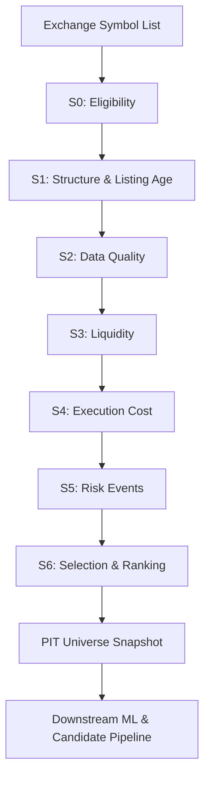

# 1. Purpose
Generates a Point-In-Time (PIT) valid, survivorship-bias-free trading universe through a strict 7-stage filtration funnel.

# 2. Core Logic & Math

**Execution Cost Estimation (Stage 4)**
- $\text{cost\_bps} = 2 \cdot \text{taker\_fee} + 2 \cdot \text{half\_spread} + \text{impact} + \text{tick\_cost}$
- Post-2020: `half_spread` = empirical median of `bookDepth`.
- Pre-2020: `half_spread` = Modified Corwin-Schultz OHLC model.

**Snapshot Quality Score**
- $\text{Score}_{\text{universe}} = \text{fill\_rate} \times \log_{10}\left(\frac{\text{median\_adv\_usdt}}{\text{adv\_scale\_factor}}\right) \times \frac{1}{\text{mAEC\_bps}}$

**PIT Constraints**
- Strict requirement: `knowledge_date <= as_of`. No forward-looking metadata or delisting knowledge is allowed.

**7-Stage Funnel Hurdles**
- **S1 (Structure):** `listing_age_days >= min_listing_days`
- **S2 (Quality):** `min_is_coverage >= min_coverage_is`, `min_coverage_60d >= min_coverage_60d_req`
- **S3 (Liquidity):** `adv_usdt_median >= min_adv_usdt`, `max_amihud_30d <= max_amihud`
- **S4 (Cost):** `execution_cost_bps <= max_exec_cost_bps`
- **S5 (Risk):** $\text{min\_vol} \leq \text{vol\_30d} \leq \text{max\_vol}$, $|\text{funding\_zscore}| \leq \text{max\_funding\_zscore}$

# 3. Architecture Flow

# 4. Core Variables & I/O

| Type | Variable | Description |
|------|----------|-------------|
| **Input** | `knowledge_date` | Point-in-time barrier for all historical data queries |
| **Param** | `min_listing_days` | Minimum days since listing to bypass structural gate. Bounds: `[0, ∞)` |
| **Param** | `min_adv_usdt` | Minimum 30-day median trading volume. Bounds: `[0, ∞)` |
| **Param** | `max_exec_cost_bps` | Maximum tolerated round-trip execution cost. Bounds: `[0, ∞)` |
| **Output**| `Universe Snapshot` | Static, timestamped set of valid symbols |
| **Output**| `Static Metadata` | Metrics passed downstream: `vol_30d`, `friction_score`, `beta_vs_market`, etc. |

# 5. Edge Cases & Handling
- **Exchange API Rule Changes (e.g., Tick Size):** The universe generation caches API exchange info as-of the `knowledge_date`. If an exchange modifies tick sizes, the snapshot uses the historical structure parameters to maintain exact simulation alignment.
- **Delisted/Dead Coins:** Symbols that are delisted post-`knowledge_date` remain in the snapshot if they met the criteria at `as_of`. This structurally enforces the inclusion of failing assets to prevent survivorship bias in the backtest.
