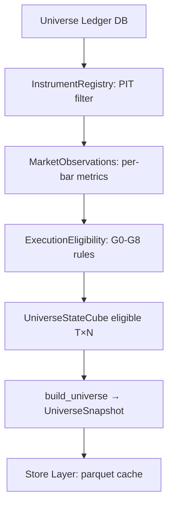

# 1. System Boundary
- **In-Scope**:
  - PIT(Point-in-Time) `UniverseStateCube [T, N]` generation, management, and disk caching (`universe_ledger.db` & `store/v1/runs/`).
  - G0~G8 and ADV_FLOOR gate evaluation for symbol eligibility.
  - Liquidity and ADV-based Kelly Sizing `capacity_usdt [T, N]` matrix calculation.
- **Out-of-Scope**:
  - Portfolio optimization execution and live execution/order routing.

# 2. Mathematical Formalism & Constraints

### PIT Eligibility
$$\text{eligible}[t, n] = 1 \iff \forall r \in \text{ExecutionRules}: r(\text{obs}_{t,n}) = \text{PASS}$$
- $\text{available\_at} \le \text{decision\_at}$

### Execution Cost Estimation
$$\text{cost\_bps} = 2 \cdot \text{taker\_fee} + 2 \cdot \text{half\_spread} + \text{impact} + \text{tick\_cost}$$
- Pre-2020: Spread estimated via Corwin-Schultz OHLC volatility proxy.
- Post-2020: Spread mapped to median orderbook depth spread.

### Capacity Clip
$$\text{capacity\_usdt}[t, n] = \text{adv\_usdt}_{30d}[t, n] \times \text{max\_participation\_rate}$$
$$w_{t, n} \leftarrow \min\left(w_{t, n}, \frac{\text{capacity\_usdt}[t, n]}{\text{nav}}\right)$$
- If allocated capital $< 5 \text{ USDT}$, $w_{t, n} \leftarrow 0$.

### PIT Sub-window Admission Constraints
$$\text{Admission} = \text{PASS} \iff (t_{start\_obs} < t_{sim\_start}) \land (N_{bars} \ge 1500) \land (\text{OOS\_density} \ge 0.90)$$

# 3. Execution Eligibility Gates (G0–G8 + ADV_FLOOR)

| Gate ID | Rule Name | Math / Structural Constraint | Action on Fail |
| :--- | :--- | :--- | :--- |
| **G0** | LEVERAGED_TOKEN | Symbol name does not contain "UP", "DOWN", "BULL", "BEAR" | Exclude |
| **G1** | NOT_ONBOARDED | $\text{decision\_at} < \text{onboarded\_at}$ | Exclude |
| **G2** | STATUS_NOT_TRADING | $\text{trading\_status} \ne \text{TRADING}$ | Exclude |
| **G3** | DATA_CONFIDENCE_LOW | NaN/Inf count or $\text{density} < 0.80$ | Exclude |
| **G4** | MISSING_RULES | Trading execution rules missing | Exclude |
| **G5** | STALE_MARKET_DATA | $\Delta t_{last\_update} > \text{max\_gap\_bars}$ | Exclude |
| **G6** | DATA_INTEGRITY_FAIL | Consecutive gaps observed / Frozen / 60d density $< 0.80$ | Exclude |
| **G7** | ORDER_TOO_SMALL | $\text{min\_order\_size} > \text{target\_allocation\_size}$ | Exclude |
| **G8** | COST_TOO_HIGH | $\text{cost\_bps} > \text{max\_round\_trip\_cost\_bps}$ | Exclude |
| **ADV**| ADV_FLOOR_FAIL | $\text{adv\_usdt}_{30d} < 2,000,000$ | Exclude |

# 4. Core Variables & I/O

| Type | Variable | Shape | Data Type | Description |
| :--- | :--- | :--- | :--- | :--- |
| **Input** | `knowledge_date` | Scalar | `datetime` | Point-in-Time decision barrier timestamp |
| **Param** | `min_adv_usdt` | Scalar | `float` | Hard minimum threshold for ADV (2M USDT) |
| **Param** | `max_gap_bars` | Scalar | `int` | Allowed sequential missing bars for G5 |
| **Param** | `max_round_trip_cost_bps` | Scalar | `float` | Max allowable friction drag (default 50.0 bps) |
| **Output**| `eligible` | `[T, N]` | `bool` | Final symbol eligibility state matrix |
| **Output**| `capacity_usdt` | `[T, N]` | `float32` | Maximum scaling capacity limits per symbol |

# 5. Topology & Dynamic Flow

# 6. Storage Specs
- **SQLite Ledger**: `universe_ledger.db` with unique index `(symbol, tf, date, knowledge_date)`.
- **Store Parquet Cache**: `store/v1/runs/` contains `manifest.parquet`, `decisions.parquet`, `cube.parquet` keyed by config hash.
