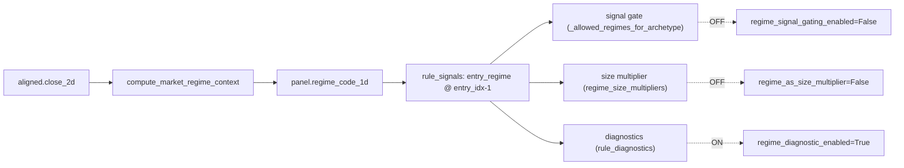

# Regime Classifier — 아키텍처 현황 (As-Is) 압축

> **목적**: 현재 regime 분류 모듈의 실제 구조·역할·상태를 정직하게 기록.
> 다른 AI / 채팅 세션에서 regime 개선 논의 시 기준점. 현재 연속 overlay/CUSUM 계약은 `docs/architecture/ml-strategy.md`를 참조.

---

## 1. 한 줄 요약

현재 regime 분류기는 **검증된 regime 모델이 아니라, 튜닝·검증된 적 없는 단기 방향+변동성 태그**이며, 매매 결정에 영향을 주는 두 consumer가 모두 OFF라 **사실상 휴면 진단용**이다. 냉정 점수: **52/100**.

---

## 2. Core Components

| 컴포넌트 | 책임 | 파일 | 상태 |
|---|---|---|---|
| `compute_market_regime_context` | 6-state threshold 분류 (ACTIVE) | `market_regime.py:91` | ✅ 사용 중 (rule_signals.py:274) |
| `compute_market_regime_context_4state` | 6→4 state 축약 | `market_regime.py:137` | ☠️ **dead code (사용처 0)** |
| `_REGIME_NAMES_4STATE`, `_6STATE_TO_4STATE` | 4-state 매핑 테이블 | `market_regime.py:20,30` | ☠️ **dead code** |
| `_ema_1d`,`_rolling_mean_1d`,`_rolling_std_1d`,`_zscore_1d` | causal 보조 통계 | `market_regime.py:40~76` | ✅ 사용 (Python loop, O(T·W)) |
| `RegimeConfig` | 5-state soft-posterior(HMM) 설정 | `config.py:44` | 🚫 `enabled=False` ("provider removed") |
| `MarketRegimeContext` | 결과 컨테이너(code_1d, name_by_code, trend/vol/disp) | `market_regime.py:79` | ✅ 계약 |

---

## 3. 분류 로직 (6-state) & 4h 환산

```
trend_score = EMA20(BTC) / EMA100(BTC) - 1        # 4h → 3.3일 / 16.7일 (스윙 horizon)
vol_z       = zscore_120( std_20( mean_log_ret ) ) # baseline 120bar = 20일 (매우 짧음)
dispersion_z= zscore_120( std_xsec( log_ret ) )
```

| code | name | 조건 |
|---|---|---|
| 0 | bull_quiet | trend≥0 & vol_z≤0.5 |
| 1 | bull_volatile | trend≥0 & vol_z>0.5 |
| 2 | bear_quiet | trend<0 & vol_z≤0.5 |
| 3 | bear_volatile | trend<0 & vol_z>0.5 |
| 4 | transition | \|trend\| < 0.002 (overwrite) |
| 5 | crash | vol_z>2.0 & disp_z>1.0 (overwrite) |

- **Magic numbers**: `0.5, 2.0, 1.0, 0.002` — 어디서도 fit/validate된 적 없음.
- trend은 **BTC 단일자산** 기준.

---

## 4. Data Flow & 실제 역할



- **역할 1 — Signal Gate** (`_allowed_regimes_for_archetype`, rule_signals.py:178): archetype별 허용 regime hard-mask. **OFF**.
- **역할 2 — Size Multiplier** (candidate_portfolio.py:907): Kelly weight에 regime 배수(crash 0.3 ~ bull_quiet 1.0) 적용. **OFF**.
- **역할 3 — Diagnostic Tag**: 이벤트에 `entry_regime`/`entry_regime_code` 부착, rule_diagnostics 리포트. **ON (유일 활성)**.

➡️ **결론: 현재 regime은 trading 의사결정에 0 영향. 라벨만 흘러다님.**

---

## 5. Look-ahead 안전성 ✅

- EMA/rolling/zscore 전부 causal (`values[:idx+1]`).
- 소비: `entry_idx = t_idx + 1`, regime은 `regime_code_1d[t_idx]` = **진입 직전 bar**. (rule_signals.py:1218 / 211) → 누수 없음.

---

## 6. 냉정 감사 점수 (52/100)

| 항목 | 점수 | 평가 |
|---|---|---|
| Look-ahead 안전성 | 9/10 | causal + entry_idx-1 소비. 깨끗 |
| 방향 축(bull/bear) | 6/10 | EMA 기반이라 지속성 있음. 단 3.3d/16.7d = 스윙, "macro regime" 아님 |
| 변동성 축(quiet/volatile) | 4/10 | 20일 rolling-z → 지속 고변동이 "new normal"로 정규화 (반전 문제) |
| Crash 탐지 | 3/10 | 20일 기준 onset만, 지속 위기 놓침 |
| 지속성/whipsaw 방지 | 2/10 | hysteresis·min-dwell 전무, 4h 경계 깜빡임 |
| 임계값 검증/경제적 구별성 | 2/10 | magic number, signal 성과상 구별성 미검증 |
| 단일자산(BTC) 프록시 | 6/10 | 크립토 방어 가능, alt-season 놓침 |
| 코드 견고성/테스트 | 7/10 | NaN 처리·warmup 흡수, 단 테스트 2개(구별성 검증 없음) |

**핵심 리스크 (우리 목적 기준)**: regime을 "적재적소 배분"의 조건축으로 쓰려면 (a)지속성 (b)경제적 구별성 (c)누수없음 이 필수인데, (a)·(b)가 가장 약함. 이 위에 바로 배분을 얹으면 **노이즈에 fitting**.

---

## 7. 과거 HMM 이력 (참고)

- 2026-05-24 HMM regime provider 완전 제거 (24파일 -1151 lines). `RegimeConfig`만 비활성 잔재로 남음.
- 사용자 증언: "HMM은 어느정도 유효한 분류는 했으나 과거 로직 전체와 불협화음 → 제대로 활용 못함."
- `RegimeConfig` 잔재가 보유한 **좋은 설계 요소**: percentile vol(`vol_crisis_pct=0.95`), EWMA smoothing(`smooth_ewma_bars=6`=지속성), drawdown crisis(`dd_crisis_thr=-0.20`), corr crisis(`corr_crisis_thr=0.80`) — 현 threshold 분류기에 **없는** 강점.

---

## 8. 관련 파일

| 파일 | 역할 |
|---|---|
| `src/domain/futures/strategy/market_regime.py` | 분류 로직 본체 |
| `src/domain/futures/strategy/config.py` | `RegimeConfig`(44), regime consumer 스위치(202~217) |
| `src/domain/futures/strategy/rule_signals.py` | regime 계산 호출(274) + entry_regime 부착(1179) + gate(228) |
| `src/domain/futures/strategy/candidate_portfolio.py` | size multiplier(907) |
| `src/domain/futures/strategy/rule_diagnostics.py` | regime 진단 리포트(371) |
| `tests/unit/domain/futures/strategy/test_market_regime.py` | 테스트 2개 (shape, 고변동) |
