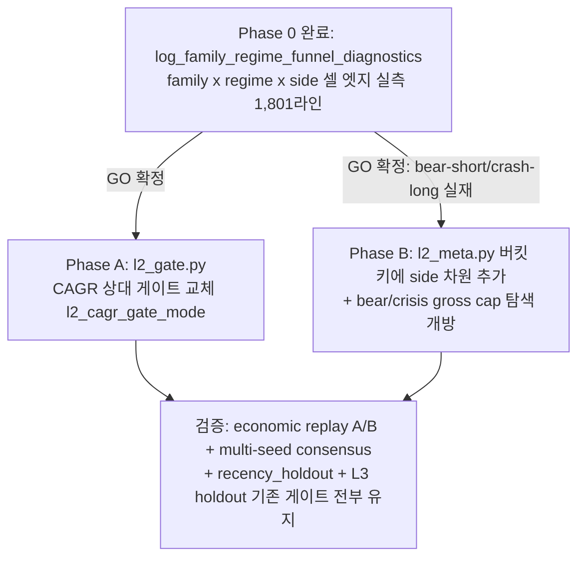

# 🎯 Goal & Architecture

- **Goal**: "알파 부재" 진단을 (a) 진짜 부재와 (b) L1-검증 알파의 깔때기 소각으로 **계측 분리**(Phase 0)한 뒤, 실측 근거로 정상장 게이트 교체(Phase A)와 regime×side 커버리지 개방(Phase B, 실측 GO 확정)을 수행해 L2/L3가 정상장+crisis 모두에서 자산증식 champion을 찾을 수 있는 구조로 개편한다.

# ✅ Phase 0 실측 결과 (2026-07-21 완료 — `L2_FUNNEL_ATTR=1 --phase l1 --seed 42`, cold L1, 1,801 계측 라인)

구현: `signal_selection.py::log_family_regime_funnel_diagnostics`(기존 고아 함수 `compute_family_regime_edge_diagnostics(split_side=True)` 배선) + `pipeline.py` outer fold 루프 env-gated 호출. `/check` PASS. 부수 수정: `signal_selection.py` bare `__name__` logger → `opt_main_futures` 컨벤션(4번째 landmine 사례).

## 판정 1 — "crisis에서 발화 자체가 없다" 가설 **반증**
L1 이벤트 regime 분포(전 TF/fold 합산, 371k 이벤트): bull_q 27.6% / bull_v 10.1% / bear_q 7.1% / bear_v 4.4% / **transition 35.2%** / **crash 15.7%**. crash·bear에서도 이벤트는 충분히 발생 — kill site는 L1 이벤트 생성이 아니라 **L1 pooled admission → L2 mu/sizing 단계**.

## 판정 2 — 원래 가설 "crash에서 트렌드 숏" **반증**, 대신 두 개의 더 강한 실측 엣지 발견
(수치: 이벤트가중 mean gross bps / fold×tf 셀 LCB 중앙값. 비용 기준선 `l1_breakeven_floor_bps`≈7.5bps 대비 판독)

**(A) bear_q/bear_v에서 거의 전 family의 SHORT가 강한 양수 엣지** — "하락장 자산증식"의 실측 근거:
| 셀 | mean_bps | lcb_med | n_events | pos-LCB 셀 비율 |
|---|---|---|---|---|
| bear_v `dual_momentum` short | **+635** | **+254** | 484 | 4/6 |
| bear_q `trend_donchian` short | +261 | +214 | 213 | 2/3 |
| bear_q `mtf_fusion` short | +212 | +215 | 321 | 2/4 |
| bear_q `dual_momentum` short | +190 | +172 | 967 | 5/6 |
| bear_q `btc_regime_pullback` short | +175 | +180 | 1,978 | 6/10 |
| bear_v `btc_regime_pullback` short | +141 | +120 | 2,552 | 6/8 |
| bear_v `taker_imbalance_momentum` short | +45 | +161 | 689 | 2/2 |

**(B) crash에서는 숏이 아니라 LONG-리버설이 엣지** (Page-CUSUM crash 마킹이 급락 후행이므로 crash-바≈바닥권, mean-reversion long이 정합적):
| 셀 | mean_bps | lcb_med | n_events |
|---|---|---|---|
| crash `btc_regime_pullback` long | **+330** | +36 | 5,942 |
| crash `mtf_fusion` long | +300 | +1.3 | 2,951 |
| crash `trend_pullback_continuation` long | +148 | -51 | 10,478 |
| crash `taker_imbalance_momentum` long | +130 | +78 | 1,858 |
| (대조) crash `trend_donchian` short | **-149** | -259 | 591 |

**(C) transition(이벤트 최대 비중 35.2%)에서도 short 계열 우세**: `dual_momentum` short +304(lcb +23), `trend_pullback` short +123(lcb +30), `residual_reversion` short +56(lcb +64).

## 판정 3 — 종합: **알파는 실재하며 regime×side 조건부다. 병목은 L1 pooled admission과 L2의 side-무시 버킷이 이 조건부 구조를 평균으로 뭉개는 것.**
- L1 `compute_symbol_strategy_evidence`는 regime/side-pooled LCB로 admission — bear-short +200bps 엣지가 bull-long 노이즈와 합산 희석.
- L2 버킷 라우팅 키는 (regime, family, TF)로 side 차원이 없음 — bear에서 long/short가 같은 버킷에 섞임.
- 이 결론은 2026-06-25 Stage A 실측(조건부 버킷 causal corr +0.14~+0.33, 8/8 양수, "조건부 라우팅 실재 확정")과 정확히 합치 — 본 spec Phase B는 그때 예고된 Stage B의 데이터 확정판.

## Phase B GO 판정: **GO (근거 확보)** — 단 방향 수정: "crash 트렌드 숏 허용" 폐기 → **(regime, family, TF, side) 4-키 버킷 라우팅** 채택.

- **핵심 코드 증거 (spec 근거, 재검증 완료)**:
  1. `hard_eligible=True` 신호(ETH trend_donchian 219bps 등)가 `observed_active_in_holdout=False` — 발화 소각 지점 미계측.
  2. ~~whitelist가 crash에서 트렌드 소거~~ — **Phase 0 조사로 오진 정정**: `regime_signal_gating_enabled=False`(기본값, 미override)라 trend는 애초에 소거되지 않음. 실제 kill site는 L1 pooled admission + L2 side-무시 버킷(Phase 0 판정 3 참조).
  3. `l2_min_cagr=0.30` 절대 하드플로어가 실패 1위(107~113/120 trial 차단) — L3 윈도우 regime-mix가 바뀔 때마다 재발하는 매직넘버.
  4. crisis 노출 클램프: `apply_regime_risk_cap`(awf_sim.py:3872, cfg `l2_regime_crisis_gross_cap=0.25`) — 완벽한 숏 book이어도 0.25x gross로는 복리 불가.
  5. reversal kill-switch 반증(2026-07-02, 방어 OFF baseline이 8개 방어 variant 전부보다 우수)은 crisis 방어 완화의 실측 지지 근거.

- **과거 반증 3건과의 구분 (재시도 아님을 명시)**: 본 spec의 역경-regime 축은 ①신규 crisis 전용 신호 추가(기각됨) ②방어 레버 추가(반증됨) ③archetype IC 자동 조건화(반증됨)가 아니라, **이미 L1을 통과한 기존 신호의 배분 버킷을 (regime, family, TF, side) 셀로 세분화해 실측 엣지가 있는 셀만 활성화**하는 제4의 축이다. Phase 0 실측(bear-short/crash-long LCB>0, n 수백~수천)으로 GO 확정 — 2026-06-25 Stage A(조건부 버킷 실재)의 연장.

- **Alternatives & Trade-offs**:
  | 옵션 | 기각/채택 사유 |
  |---|---|
  | 실측 없이 whitelist/게이트 즉시 변경 | 과거 cost-drag 오진(2차 증상 수술) 재발 위험 — 기각, measure-first 채택 (grill-me 확정) |
  | `l2_min_cagr` 값만 완화(0.30→0.10) | 또 다른 매직넘버, regime-mix 변화 시 재발 — 기각 |
  | **[채택]** 상대(EW-baseline uplift) CAGR 게이트 + `max(0,·)` 양수 하한 | 기존 sharpe_uplift/growth_uplift 게이트와 정합, 절대 매직넘버 제거, 음수 CAGR champion은 여전히 차단 |
  | crisis risk budget(MDD 21%/CAGR -5%) 완화 | 방어 침식 — 기각. **불변식: risk budget은 고정, exposure 노브만 탐색 개방** |

- **Mermaid Diagram**:


# ⚡ Performance & Resource Budget

- Phase 0 (구현·실측 완료): env hook `L2_FUNNEL_ATTR=1` opt-in, 미설정 시 zero-cost. O(E·B) 셀별 bootstrap — cold L1 실행에서 wall-time 영향 무시 가능 수준 확인.
- Phase A: 게이트 산식 교체 — trial당 O(1). wall-time 회귀 없음(performance.md §4 15% 규칙).
- Phase B: 버킷 side 분해로 버킷 수 최대 2배(regime×family×TF×side) — 기존 per-TF fit edge hoisting 캐시(ADR_20260721_L2_PER_TF_EDGE_HOISTING) 경로 재사용, 예상 오버헤드 <5%. 초과 시 최적화 후 진행.
- 메모리: 신규 대형 배열 없음. RSS 12GB 예산 불변.

# ⚙️ Logical Rules, State Machine & Resilience

### Phase 0 — Funnel Attribution (구현·실측 완료, as-built)
- 원안(신규 `funnel_attribution.py` 모듈 + panel-레벨 waterfall + crash counterfactual)은 조사 중 **기존 고아 함수 발견으로 대폭 단순화**: `signal_selection.py::compute_family_regime_edge_diagnostics(split_side=True)`(과거 measure-first spec 산출물, 호출부 0개)가 필요한 계측(family×regime×side 셀별 gross 엣지 + moving-block bootstrap LCB)을 이미 구현하고 있었음.
- as-built: `signal_selection.py::log_family_regime_funnel_diagnostics()` 신설(래퍼: raw regime 커버리지 + 셀 통계 + side 분해를 `[EVAL] [FUNNEL-RAW/-CELL/-SIDE]` 태그로 방출, 예외 시 `[SYS] degraded` 후 계속) → `pipeline.py` outer fold 루프에서 `L2_FUNNEL_ATTR=1` env-gated 호출.
- 실측 데이터·판정은 상단 "✅ Phase 0 실측 결과" 섹션 참조. **[LIMIT-02]** 이 수치는 L1 OOS(outer fold) gross 진단 — tradability 증명이 아니며, Phase B 최종 판정은 economic replay + multi-seed consensus + L3 holdout이 담당(게이트 완화 아님).

### GO/NO-GO 판정 (확정)
- **Phase B GO 확정**: bear_q/bear_v short 셀 다수 LCB +120~254bps(비용 7.5bps 대비 압도적), crash long-리버설 셀 LCB +36~78bps, n_events 수백~수천. 원안의 crash-숏 counterfactual 기준은 데이터로 방향 정정(crash 숏 mean -149bps → 폐기).
- Phase A는 무조건 진행(grill-me 확정).

### Phase A — CAGR 상대 게이트
- `l2_cagr_gate_mode: Literal["absolute","relative"] = "relative"` (고정, 비탐색; "absolute"는 롤백 경로).
- relative 산식: threshold $= \max(0,\ \text{cagr\_baseline\_ew} + \text{l2\_min\_cagr\_uplift})$, 제약값 $=$ threshold − cagr_hybrid.
- **[LIMIT-03]** `max(0,·)` 하한으로 baseline이 음수여도 음수-CAGR champion은 절대 불가(자산증식 목표 불변).
- `l2_min_cagr_uplift: float = 0.05` (고정, 비탐색 — 기존 `l2_min_sharpe_uplift=0.05`와 동일 규약).
- Optuna slot 11(`cagr`)·promotion slot 3 동일 산식으로 교체(이중 정의 금지). `evaluate_layer2_gate`에 `cagr_baseline: float | None = None` kwarg 추가 — None이면 absolute 모드로 폴백(fail-safe, 기존 호출부 무손상).

### Phase B — Regime×Side 조건부 라우팅 (Phase 0 실측 GO 확정, 설계 개정판)
- **B1. 버킷 키 side 차원 확장**: `l2_meta.py`의 regime 버킷 키 (regime, family, TF) → **(regime, family, TF, side)** 4-키로 확장. fit/cal edge, `sign_consistent`, reliability 산출을 side(-1/+1) 분해로 수행 — bear에서 short-버킷만 살아남고 long-버킷이 차단되는 것이 **하드코딩 화이트리스트 없이 데이터-드리븐으로 자동 결정**됨. crash long-리버설도 동일 메커니즘으로 자동 활성(신규 신호·규칙 신설 없음). 원래 B1(crash 숏 whitelist 예외, `apply_crash_short_exception`)은 Phase 0 실측(crash 숏 mean -149bps)으로 **폐기**.
- **B1 게이팅 flag**: `l2_regime_bucket_side_split_enabled: bool = False`(기본 off) — economic replay A/B(on/off)로 검증 후 승격. 셀 표본 반감 위험은 기존 `sign_consistent`+reliability 최소표본 로직이 자동 방어(표본 부족 셀은 pooled 폴백, 기존 `l2_regime_pooled_is_passthrough` 계약 유지).
- **B2. 역경-regime exposure 탐색 개방**: `l2_regime_crisis_gross_cap` [0.25, 0.85] **및 `l2_regime_bear_gross_cap` [0.35, 0.85]**를 L2_SEARCH_SPACE에 추가 — bear-short LCB +120~254bps 실측으로 bear cap(0.35)도 병목 후보로 승격. **[LIMIT-04] 불변식: crisis risk budget(`l2_max_mdd_abs×(1−l2_deploy_crisis_mdd_margin)`=21% MDD, `l2_min_crisis_cagr=-0.05`, `l2_deploy_crisis_mdd_margin`)은 전부 고정·비탐색 유지** — 노출이 탐색 대상, 위험 예산이 바운드.
- **[LIMIT-01] (개정)** `rule_signals.py`/`signals/rules.py` whitelist는 이번 spec에서 **불변**(regime_signal_gating_enabled=False 기본값 확인, trend는 애초에 소거되지 않았음 — Phase 0 조사에서 확인된 오진 정정). 모듈 이중화 이슈는 소멸.
- **[LIMIT-05]** overlay `crisis_gross_floor`(0.10)는 L2 sim 경로에 미적용(awf_sim은 `apply_regime_risk_cap`만 사용, grep 실증)이므로 이번 범위 밖.
- **[LIMIT-06] 과거 반증과의 관계**: 2026-06-09 "archetype 자동 regime 조건화 반증"은 L1 신호 자체를 regime으로 조건화(IC 악화)한 것. 본 B1은 L2 배분 버킷의 side 분해이며, 2026-06-25 Stage A GO(조건부 버킷 실재 확정)의 연장 — 충돌 없음. 단 최종 판정은 economic replay+multi-seed consensus가 담당.

### Resilience
- Phase 0 전 함수는 예외 시 빈 리포트 반환+`[SYS]` warning(진단이 파이프라인을 죽이면 안 됨 — 기존 L2RuntimeProbe degraded 패턴).
- Phase B flag off 시 바이트 단위 기존 동작 동일(회귀 테스트로 보증).

# 🔌 Integration & Connection Plan

| # | File | Anchor | Change | 상태 |
|---|---|---|---|---|
| 1 | `src/domain/futures/strategy/tiered_workflow/signal_selection.py` | `compute_family_regime_edge_diagnostics` 직후 | `log_family_regime_funnel_diagnostics()` 신설 + bare logger → `opt_main_futures` 컨벤션 수정 | ✅ 완료 |
| 2 | `src/domain/futures/strategy/tiered_workflow/pipeline.py` | outer fold 루프 `outer_event_frames.append` 직후 | `L2_FUNNEL_ATTR=1` env-gated 호출 배선 | ✅ 완료 |
| 3 | `src/domain/futures/strategy/tiered_workflow/dataclasses.py` | `Layer2AllocationConfig` (`l2_min_cagr` 인근 554행) | `l2_cagr_gate_mode: str = "relative"`, `l2_min_cagr_uplift: float = 0.05` 추가(+`from_params` 파싱, mode 값 검증 `{"absolute","relative"}`) | Phase A |
| 4 | `src/domain/futures/strategy/tiered_workflow/l2_gate.py` | `evaluate_layer2_gate` signature + slot 11 + promotion slot 3 | `cagr_baseline` kwarg + 순수함수 `_cagr_gate_constraint()` 신설, 양 slot 동일 산식 | Phase A |
| 5 | `src/domain/futures/optimization/workflow.py` | `gate = evaluate_layer2_gate(` 호출부 | `cagr_baseline=float(cagr_baseline)` 전달 | Phase A |
| 6 | `src/domain/futures/strategy/tiered_workflow/l2_meta.py` | regime 버킷 키 구성부(`compute_regime_bucket_reliability` 계열) | (regime, family, TF) → (regime, family, TF, side) 4-키 확장, `l2_regime_bucket_side_split_enabled` flag 분기, 표본부족 셀 pooled 폴백 유지 | Phase B |
| 7 | `src/domain/futures/strategy/tiered_workflow/dataclasses.py` | `Layer2AllocationConfig` regime cap 인근 672행 | `l2_regime_bucket_side_split_enabled: bool = False` 추가 | Phase B |
| 8 | `src/domain/futures/optimization/l2_search_space.py` | L2_SEARCH_SPACE 정의 | `l2_regime_crisis_gross_cap` [0.25, 0.85], `l2_regime_bear_gross_cap` [0.35, 0.85] 탐색 항목 추가 | Phase B |

- **구현 순서 강제**: ~~Phase 0~~(완료) → Phase A 구현·`/check` → economic replay 실측 → Phase B 구현(flag off 회귀 보증) → flag on A/B replay → multi-seed consensus 종단 검증. Phase B flag 기본값은 A/B 검증 전까지 False 유지.

# ✍️ Contract Changes

```python
# ✅ 구현 완료 — src/domain/futures/strategy/tiered_workflow/signal_selection.py
def log_family_regime_funnel_diagnostics(
    *,
    realized_event_results: pd.DataFrame,
    cfg: CandidateStrategyConfig,
    fold_id: int,
    seed: int,
    timeframe: str = "",
) -> None:
    """family x regime x side 깔때기 실측 로그. 게이트 무영향, 예외 시 degraded."""
```

```python
# Phase A — src/domain/futures/strategy/tiered_workflow/l2_gate.py
def _cagr_gate_constraint(
    *,
    cagr_hybrid: float,
    cagr_baseline: float | None,
    mode: str,                 # "absolute" | "relative"
    l2_min_cagr: float,
    l2_min_cagr_uplift: float,
) -> float:
    """relative: max(0, baseline+uplift) - cagr. baseline None → absolute 폴백."""

def evaluate_layer2_gate(*, ..., cagr_baseline: float | None = None, ...) -> Layer2GateEvaluation: ...
```

```python
# Phase A/B — dataclasses.py Layer2AllocationConfig 추가 필드
l2_cagr_gate_mode: str = "relative"                # fixed, non-searchable, {"absolute","relative"}
l2_min_cagr_uplift: float = 0.05                   # fixed, non-searchable
l2_regime_bucket_side_split_enabled: bool = False  # Phase B flag, A/B 검증 전 False
```

```python
# Phase B — src/domain/futures/strategy/tiered_workflow/l2_meta.py
# 기존 버킷 키 (regime, family, tf)를 사용하는 reliability/edge 산출 함수군에
# side 차원 추가. 정확한 함수 시그니처는 Phase B 착수 시 l2_meta.py 현행 계약
# (compute_regime_bucket_reliability 계열, RegimeBucketReliability dataclass의
# regime/family/tf 필드)을 기준으로 side: int 필드 추가 형태로 확정한다.
# 불변식: flag=False 시 기존 3-키 경로와 바이트 동일 결과(회귀 테스트 보증).
```

# 🧪 TDD Test Scenario Matrix & Mocks

### ✅ Phase 0 (구현·통과 완료 — `test_signal_selection.py::TestLogFamilyRegimeFunnelDiagnostics`)
- `test_log_funnel_diagnostics_emits_raw_cell_and_side_lines` (happy)
- `test_log_funnel_diagnostics_empty_frame_logs_no_data` (edge)
- `test_log_funnel_diagnostics_below_min_bars_logs_status` (edge)
- `test_log_funnel_diagnostics_internal_error_degrades_without_raising` (error)

### Phase A (구현 예정)
- Scenario 1 (Happy): `test_cagr_gate_constraint_relative_mode_uses_baseline_plus_uplift` — parametrize: (baseline 0.10, cagr 0.12)→차단 / (0.10, 0.20)→통과.
- Scenario 2 (Edge, [LIMIT-03]): `test_cagr_gate_constraint_relative_negative_baseline_floors_at_zero` — baseline=-0.20 → threshold=0, cagr -0.01 차단/+0.01 통과. `test_cagr_gate_constraint_none_baseline_falls_back_to_absolute`.
- Scenario 3 (Error): `test_layer2_allocation_config_rejects_invalid_cagr_gate_mode` — `pytest.raises(ValueError, match="l2_cagr_gate_mode")`.
- Scenario 4 (Integration): `test_evaluate_layer2_gate_relative_mode_wired_from_config` — slot 11/promotion slot 3 동일 산식 검증.

```python
# tests/unit/domain/futures/strategy/tiered_workflow/test_l2_gate.py (append)
import pytest
from src.domain.futures.strategy.tiered_workflow.l2_gate import _cagr_gate_constraint


class TestCagrGateConstraint:
    @pytest.mark.parametrize(
        ("baseline", "cagr", "should_block"),
        [
            (0.10, 0.12, True),    # threshold 0.15 미달
            (0.10, 0.20, False),   # 통과
            (-0.20, -0.01, True),  # [LIMIT-03] 음수 baseline → threshold 0
            (-0.20, 0.01, False),
        ],
    )
    def test_cagr_gate_constraint_relative_mode_uses_baseline_plus_uplift(self, baseline, cagr, should_block):
        # Act
        value = _cagr_gate_constraint(
            cagr_hybrid=cagr, cagr_baseline=baseline, mode="relative",
            l2_min_cagr=0.30, l2_min_cagr_uplift=0.05,
        )

        # Assert
        assert (value > 0.0) is should_block

    def test_cagr_gate_constraint_none_baseline_falls_back_to_absolute(self):
        # Act
        value = _cagr_gate_constraint(
            cagr_hybrid=0.20, cagr_baseline=None, mode="relative",
            l2_min_cagr=0.30, l2_min_cagr_uplift=0.05,
        )

        # Assert — absolute: 0.30 - 0.20 = 0.10 > 0
        assert value == pytest.approx(0.10)
```

### Phase B (구현 예정)
- Scenario 1 (Happy): `test_regime_bucket_side_split_separates_short_and_long_edges` — 합성 데이터: bear에서 short 엣지 양수/long 음수 → side-split on 시 short 버킷만 활성.
- Scenario 2 (Edge): `test_regime_bucket_side_split_low_sample_falls_back_to_pooled` — 셀 표본 < 최소치 → pooled 폴백(기존 `l2_regime_pooled_is_passthrough` 계약 유지).
- Scenario 3 (회귀, 핵심 불변식): `test_regime_bucket_side_split_disabled_matches_legacy_output` — flag=False 시 기존 3-키 결과와 완전 동일(array_equal).
- Scenario 4 (Integration): `test_l2_search_space_includes_bear_and_crisis_gross_cap` — 탐색공간에 두 cap 범위 포함 검증.

## Machine-Readable Contract
`docs/specs/alpha-funnel-regime-coverage_contract.json` 참조.
