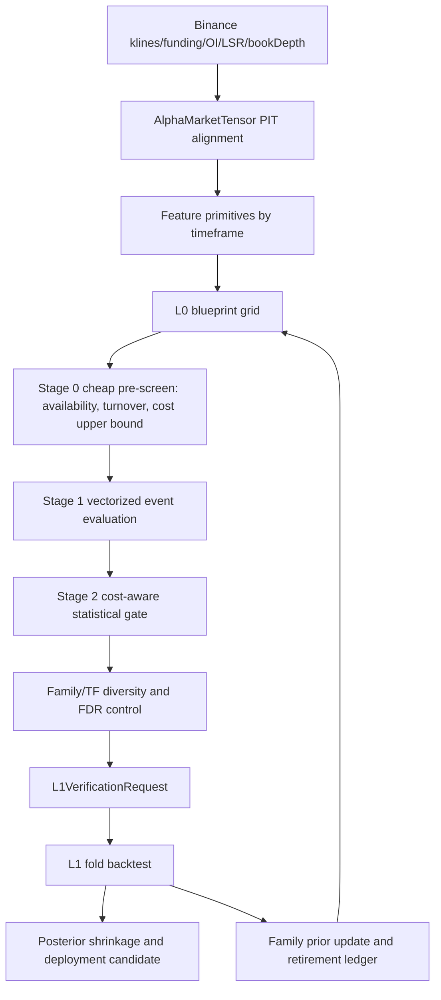
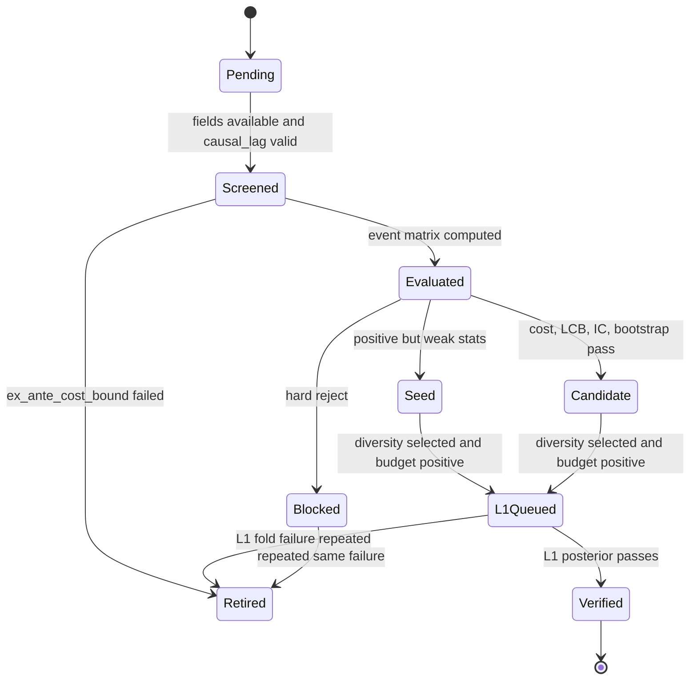

# 🎯 Goal
L0는 Binance Futures 가용 데이터로 비용 이전 예측력이 있는 다수의 alpha 후보를 만들고, L1은 동일한 비용·시간축·검증 계약으로 backtest 검증 가능한 후보만 승격한다.

# 🧩 Core Data Shapes

## Input Evidence

| Shape | Field | Type | Rule |
|---|---|---:|---|
| `AlphaMarketTensor` | `timestamp_ns` | `int64[T]` | strictly increasing, UTC epoch |
| `AlphaMarketTensor` | `symbol` | `tuple[str, ...]` | active futures universe |
| `AlphaMarketTensor` | `open/high/low/close` | `float64[T,N]` | klines, PIT aligned |
| `AlphaMarketTensor` | `volume/quote_volume/n_trades/taker_buy_base/taker_buy_quote` | `float64[T,N]` | klines full-field extraction |
| `AlphaMarketTensor` | `funding_rate` | `float64[T,N]` | release timestamp aligned; forward fill only until tolerance |
| `AlphaMarketTensor` | `open_interest/long_short_ratio` | `float64[T,N]` | Vision metrics from 2020-09-01 |
| `AlphaMarketTensor` | `book_spread_bps/depth_imbalance/depth_slope` | `float64[T,N]` | bookDepth from 2020; no Roll spread after 2020 |
| `AlphaMarketTensor` | `active_mask/warm_mask/entry_block_mask/kill_mask` | `bool[T,N]` | all signal and label masks must include these |

## Signal Blueprint

| Shape | Field | Type | Rule |
|---|---|---:|---|
| `AlphaSignalBlueprint` | `family` | `str` | stable family id; registered in both rule registries |
| `AlphaSignalBlueprint` | `variant` | `str` | parameterized variant id; timeframe suffix normalized |
| `AlphaSignalBlueprint` | `archetype` | `trend | mean_reversion | carry | flow | cross_sectional | hedge` | must map to exit policy |
| `AlphaSignalBlueprint` | `timeframe` | `str` | generated from adaptive grid, not hard-coded to 4/6/8/12h |
| `AlphaSignalBlueprint` | `required_fields` | `tuple[str, ...]` | fail-closed if any field unavailable |
| `AlphaSignalBlueprint` | `causal_lag_bars` | `int` | minimum 1; signal at `t` executes no earlier than `t+lag` |
| `AlphaSignalBlueprint` | `lookback_bars` | `tuple[int, ...]` | scaled by timeframe; bounded search domain |
| `AlphaSignalBlueprint` | `holding_bars` | `int` | used by block bootstrap and cost model |
| `AlphaSignalBlueprint` | `max_turnover_per_year` | `float` | family-specific cost realism limit |
| `AlphaSignalBlueprint` | `entry_mode` | `sparse | continuous | cross_sectional_rank` | sparse required for high-cost families |
| `AlphaSignalBlueprint` | `side_rule_id` | `str` | deterministic side transform |
| `AlphaSignalBlueprint` | `exit_policy_id` | `str` | deterministic L1 exit geometry |

## L0 Search Cell

| Shape | Field | Type | Rule |
|---|---|---:|---|
| `L0SearchCell` | `blueprint_id` | `str` | deterministic hash of family, variant, timeframe, params |
| `L0SearchCell` | `tf_minutes` | `int` | allowed grid: 30m, 1h, 2h, 3h, 4h, 6h, 8h, 12h, 1d |
| `L0SearchCell` | `symbol_scope` | `global | cluster | symbol` | cluster requires stable liquidity/sector bucket |
| `L0SearchCell` | `cost_floor_bps` | `float` | ex-ante minimum expected round-trip+funding cost |
| `L0SearchCell` | `expected_event_rate` | `float` | pre-gate turnover estimate |
| `L0SearchCell` | `family_prior_score` | `float` | empirical-Bayes prior from previous L0/L1 evidence |
| `L0SearchCell` | `status` | `pending | screened | gated | l1_queued | retired` | monotonic state transition |

## Gate Evidence V2

| Shape | Field | Type | Rule |
|---|---|---:|---|
| `AlphaGateEvidenceV2` | `n_events/effective_n` | `int/float` | sparse entries only; effective_n adjusted for overlap |
| `AlphaGateEvidenceV2` | `mean_gross_bps/mean_cost_bps/mean_net_bps` | `float` | all event-level means; no total-vs-mean unit mix |
| `AlphaGateEvidenceV2` | `gross_lcb_bps/net_lcb_bps` | `float` | block-bootstrap lower confidence bounds |
| `AlphaGateEvidenceV2` | `rank_ic/rank_ic_tstat` | `float` | Spearman IC and Fisher-z t-stat |
| `AlphaGateEvidenceV2` | `cost_drag_ratio` | `float` | `mean_cost_bps / max(abs(mean_gross_bps), eps)` |
| `AlphaGateEvidenceV2` | `turnover_per_year` | `float` | bars-per-year from timeframe SSOT |
| `AlphaGateEvidenceV2` | `event_hit_rate/payoff_skew` | `float` | prevents mean-only acceptance |
| `AlphaGateEvidenceV2` | `regime_edge_bps` | `dict[str,float]` | minimum bull/bear/crash diagnostics |
| `AlphaGateEvidenceV2` | `xs_spread_lcb_bps` | `float | None` | required for cross-sectional families |
| `AlphaGateEvidenceV2` | `liquidity_cost_stress_bps` | `float` | spread/depth stress from bookDepth |

## L1 Verification Request

| Shape | Field | Type | Rule |
|---|---|---:|---|
| `L1VerificationRequest` | `panel_id` | `str` | maps exactly to selected L0 panel |
| `L1VerificationRequest` | `prior_mu_bps/prior_sigma_bps` | `float` | from L0 evidence with shrinkage |
| `L1VerificationRequest` | `allocated_fold_budget` | `int` | quality-proportional, non-positive score gets zero |
| `L1VerificationRequest` | `validation_timeframes` | `tuple[str, ...]` | includes native and at least one neighboring TF when available |
| `L1VerificationRequest` | `cost_policy_id` | `str` | same stress cost policy as L0 |
| `L1VerificationRequest` | `handoff_invariant` | `bool` | true only if not blocked and selected by diversity+budget |

# ⚙️ Algorithmic Rules & State Machine

## Observed Failure Modes

| Evidence | Value | Design Implication |
|---|---:|---|
| rows / families | 28 / 20 | current catalog is narrow relative to available data |
| `gate_passed` / `selected_for_l1` | 1 / 3 | seed handoff exists, but verified alpha is weak |
| `cost_drag_ratio > 1` | 17 / 28 | many signals are mathematically dead after costs |
| `abs(rank_ic) < 0.02` | 9 / 28 | score ordering often does not predict forward return |
| positive `mean_gross_bps` / positive `mean_net_bps` / positive `block_lcb_bps` | 21 / 8 / 3 | edge mostly disappears after cost and uncertainty |
| archetype median net | trend `-8.574`, cross-sectional `-27.630`, hedge `-5.815` bps | family design must reduce turnover and increase gross selectivity |

## Data Flow

## L0 Search Strategy

1. `brute force` 허용 범위: feature primitive 계산은 `O(T*N*F)`로 vectorized cache를 공유하는 경우만 허용한다.
2. 금지 범위: 모든 family×parameter×TF×symbol을 full L1 backtest로 넘기는 방식은 금지한다.
3. 기본 절차: `cheap pre-screen -> event evaluation -> statistical gate -> diversity -> L1 budget`.
4. coarse-to-fine: 넓은 grid는 거친 parameter만 평가하고, `gross_lcb_bps > cost_floor_bps` 및 `rank_ic_tstat > 1.0` 후보 주변만 세밀화한다.
5. early retirement: 같은 `(family, timeframe, direction)`이 `cost_drag_ratio > 1` 또는 `net_lcb_bps < -cost_floor_bps`로 반복 실패하면 해당 cell은 cooldown 처리한다.
6. effective tests: family/TF 내부 상관행렬로 `M_eff`를 계산하고 BH/FDR는 raw count가 아니라 `M_eff` 기준으로 적용한다.
7. priority score:

`priority = 0.35*net_lcb_bps + 0.25*mean_net_bps + 0.20*rank_ic_tstat + 0.10*xs_spread_lcb_bps - 0.10*cost_drag_penalty`

## Gate Mathematics

### Event Return

`gross_bps[t,n] = side[t,n] * log(close[t+h,n] / close[t+lag,n]) * 10000`

`cost_bps[t,n] = round_trip_fee_bps + spread_bps[t,n] + slippage_bps[t,n] + funding_cost_bps[t:t+h,n]`

`net_bps[t,n] = gross_bps[t,n] - cost_bps[t,n]`

### Cost Survival

Hard reject if:

`mean_gross_bps <= 0`

`mean_cost_bps / max(abs(mean_gross_bps), eps) > 0.60`

`turnover_per_year > family_max_turnover`

For high-turnover families, require:

`gross_lcb_bps > mean_cost_bps + liquidity_cost_stress_bps`

### IC Survival

Soft reject if:

`abs(rank_ic) < 1 / sqrt(max(n_events - 3, 1))`

Candidate tier requires:

`rank_ic_tstat >= 2.0` or `net_lcb_bps >= min_conviction_lcb_bps and bootstrap_agree = true`

### Cross-Sectional Survival

For `cross_sectional` archetype:

`xs_spread_bps[t] = mean(net_bps[t, top_quantile]) - mean(net_bps[t, bottom_quantile])`

Require:

`xs_spread_lcb_bps > 0`

`beta_to_btc_abs <= beta_cap`

`per_bar_symbol_count >= 5`

## Recommended Alpha Families

| Family | Data | Timeframe | Direction | Rationale |
|---|---|---|---|---|
| `sparse_breakout_retest_v2` | OHLCV, volume, book spread | 2h, 4h, 8h, 12h, 1d | trend | current best row is breakout retest; improve with sparse retest and spread compression filter |
| `trend_pullback_quality_v2` | OHLCV, ATR, volume | 4h, 8h, 12h, 1d | trend | positive gross exists; require HTF trend and low realized vol pullback |
| `residual_momentum_xs` | OHLCV, BTC beta residual | 4h, 8h, 12h, 1d | cross-sectional | reduce market beta; rank residual winners vs losers |
| `funding_contra_carry_sparse` | funding, OI, LSR, taker flow | 8h, 12h, 1d | carry/flow | fade crowded funding only when OI/LSR confirms crowding and event rate is low |
| `oi_price_divergence_unwind` | close, OI, volume, LSR | 2h, 4h, 8h | flow | crowded long/short unwind after price-OI divergence |
| `taker_flow_exhaustion` | taker buy base/quote, volume, close | 1h, 2h, 4h | flow | current taker momentum overtrades; use exhaustion reversal with sparse edge trigger |
| `liquidity_vacuum_breakout` | bookDepth spread/depth, OHLCV | 1h, 2h, 4h | trend | trade only when spread/depth regime supports impulse continuation |
| `volatility_contraction_expansion` | OHLCV, book spread | 2h, 4h, 8h | trend | replace generic vol breakout with compression + expansion + cost filter |
| `btc_regime_relative_strength` | BTC close, symbol close, funding | 4h, 8h, 12h | hedge/trend | long symbols with positive residual strength only in BTC supportive regime |
| `mean_reversion_after_liquidation_proxy` | return shock, taker imbalance, OI drop | 1h, 2h, 4h | mean_reversion | liquidation proxy after extreme move and OI contraction |

## Timeframe Policy

| Layer | Policy |
|---|---|
| Base data | keep 1m/1h source if available; derive decision TF deterministically |
| L0 TF grid | 30m/1h/2h for microstructure-flow, 3h/4h/6h/8h for swing, 12h/1d for carry/trend |
| Native gate | every generated TF must pass L0 gate; no HTF bypass to L1 |
| Neighbor confirmation | candidate TF `k` is corroborated by adjacent TFs, not by arbitrary fixed 4/6/8/12h set |
| Bars per year | always resolved by `_bars_per_year_for_tf(tf)` SSOT |

## State Machine

# ⚠️ Constraints & Edge Cases

- Look-ahead 방지: all feature windows use data `<= t`; labels start at `t + causal_lag_bars`; funding/OI/LSR/bookDepth use release-aligned `merge_asof` with tolerance.
- HTF bypass 금지: native TF와 derived TF 모두 `CheapGateEvidence`를 생성하고 hard reject가 L1로 전달되지 않아야 한다.
- Unit consistency: `mean_gross_bps`, `mean_cost_bps`, `mean_net_bps`는 모두 event mean; total cost field를 gate 비교에 쓰지 않는다.
- Cost realism: high-turnover signal은 spread/depth stress cost를 포함한 `gross_lcb_bps > cost` 조건 없이는 seed도 금지한다.
- Multiple testing: L0 대량 탐색은 허용하되 `M_eff`, BH/FDR, family retirement, holdout episode deflation 없이는 L1 budget을 늘리지 않는다.
- Sparse entry: continuous score를 매 bar 거래로 해석하지 않는다; entry mask는 flat-to-active 또는 direct reversal만 event로 계산한다.
- Cross-sectional alpha: per-bar symbol count 부족, BTC beta 과다, liquidity bucket 편중이면 hard reject한다.
- Data availability: OI/LSR는 2020-09-01 이후만 신뢰한다; bookDepth는 2020 이후 사용하고 2020 이후 Roll spread fallback은 금지한다.
- 24/7 futures: funding timestamp, weekend liquidity, liquidation-like gap, taker fee, tick/lot constraints를 L1에서 동일하게 반영한다.
- Compute budget: precompute primitives once per TF; feature tensor는 `float32` 저장 가능하지만 returns, costs, covariance, compounding은 `float64`로 계산한다.
