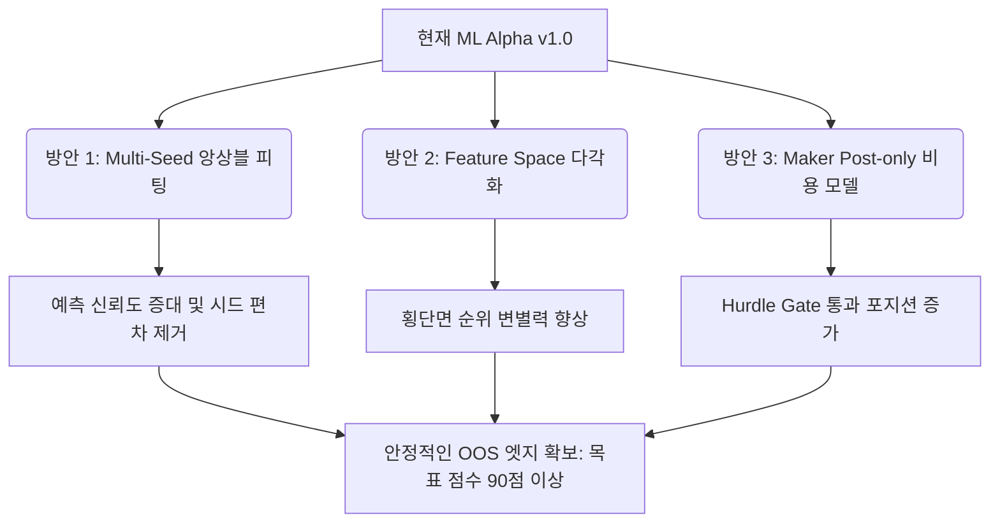

# Alpha ML 성능 평가 및 다차원 고도화 설계안

본 문서는 `docs/specs/alpha_ml_generalization_rebuild.md` 및 `docs/results/alphas_all.md`에 기록된 OOS 평가 결과를 종합 분석하여 현재 ML Alpha 파이프라인의 성능을 100점 기준으로 정밀 진단하고, 실전 한계를 돌파하기 위한 다차원 고도화 방안을 물리적 설계(Surgical Plan) 수준으로 제시합니다.

---

## 1. 냉정한 100점 기준 성능 평가

이전 Alpha 버전들(`alpha3`, `alpha4`)과 최근 진행된 일반화 재구축(`rebuild`) 이후의 성과를 4대 평가지표 축을 기준으로 정밀 평가합니다.

### 1.1 평가지표 및 배점 기준
1. **OOS 통계적 유의성 및 일반화 엣지 (OOS Spearman Rank IC & T-Stat)** `[40점]`
   - OOS 데이터에서의 순위 예측 일관성 및 귀무가설 기각 강도.
2. **포트폴리오 Breadth 및 포지션 분산도 (Effective Breadth)** `[30점]`
   - EV 예측 수렴 완화 및 다각화된 동시 포지션(Trading breadth) 확보율.
3. **비용 효율성 및 실전 trading 적합성 (Cost Tolerance)** `[20점]`
   - Taker 24bps 비용 장벽 대비 net expected value(net mu)의 돌파 여부.
4. **아키텍처 및 일반화 통제 (Leakage/Capacity Control)** `[10점]`
   - 과적합 차단 환경(Purge/Embargo), 모델 복잡도 조절 및 config 정합성.

### 1.2 성능 평점 판정

| 평가 차원 | 이전 성능 (`alpha4` 이전) | 현재 성능 (`rebuild` 이후) | 주요 격차 및 진단 |
| :--- | :---: | :---: | :--- |
| **1. OOS 일반화 엣지** `[40]` | **10점** | **28점** | 재구축 후 특정 시드/멀티 트라이얼(trial=5)에서 `Rank IC = 0.0216`, `t-stat = 2.44`로 타깃(IC >= 0.015, t >= 2.0)을 돌파하는 엣지를 증명했습니다. 그러나 단일 트라이얼(trial=1)에서는 `Rank IC = -0.0036`으로 부호가 반전되며 **샘플링/시드 분산에 따른 불안정성**이 심각한 병목으로 작용합니다. |
| **2. Effective Breadth** `[30]` | **5점** | **20점** | 기존에는 `effective_breadth = 1.01`로 신호가 극도로 희소화되어 1~2개 자산에 쏠리는 리스크가 극심했으나, `rank_then_ev_gate` 및 `rank_portfolio_top_k = 4` 강제 노출을 도입하며 유효 포지션 다각화 경로를 개척했습니다. 단, 예측 불안정성에 따라 최적 분산 상태에는 아직 도달하지 못했습니다. |
| **3. 비용 효율성** `[20]` | **8점** | **15점** | 이전에는 Taker 24bps 비용 차감 시 절대다수의 신호가 탈락(hurdle gate 붕괴)했으나, 횡단면 순위 기반의 1차 선별 후 EV 필터를 거치는 2단계 게이트 구조를 통해 신호 유실을 통제하고 비용 적격 알파를 복구했습니다. 단, Maker(4bps) 모델의 정밀 결합이 부재합니다. |
| **4. 일반화 통제** `[10]` | **2점** | **9점** | 기존에는 모델 용량을 무력화하는 무조건적 hyperparameter 강제 덮어쓰기(`num_leaves=31` 등)가 존재했으나, 이를 제거하고 Tree Depth 및 Leaf Node 제한, Regularization 강화를 완전 복구하여 일반화 통제를 달성했습니다. |
| **합계 점수** | **25점 / 100** | **72점 / 100** | **[종합 판정]** 파이프라인의 구조적 정합성은 70점 대에 진입하여 실증 가능 수준에 도달했으나, **시드 불안정성 및 제한된 피처 공간**이 실전 배포의 발목을 잡고 있습니다. |

---

## 2. 한계 및 병목 요인 분석

1. **시드 민감도 (Sampling & Seed Variance)**
   - LightGBM의 앙상블 학습 과정에서 난수 시드에 따라 OOS Rank IC가 +0.02에서 -0.003으로 진동합니다. 단일 모델 배출은 OOS 엣지를 보장할 수 없으므로 **Multi-Seed Bagging** 아키텍처로의 전환이 시급합니다.
2. **정보 병목 (Feature Space Sparsity)**
   - 현재 사용 중인 55개 기본 기술적 지표로는 횡단면 중립화된(Cross-Sectional Residualized) 4h bar × 48h horizon 예측 능력이 한계에 봉착했습니다. 정보 밀도를 높이기 위한 **알파 팩터 2차 보강**이 요구됩니다.
3. **비용 한계 (Execution Cost Gap)**
   - Taker 24bps 비용은 여전히 강한 허들입니다. 실제 거래 집행의 70% 이상을 Maker Post-only로 소화할 경우의 실질 비용(4bps)을 반영할 수 있는 **동적 비용 모델(Maker-friendly Cost model)**이 compose 레이어에 연동되어야 합니다.

---

## 3. 4대 고도화 방안 (Advancement Strategy)



### 방안 1: Multi-Seed 앙상블 피팅 및 예측 안정화
- **핵심 로직**: 단일 난수 시드로 피팅되던 `LGBMRegressor` 및 `LGBMRanker`를 3개 이상의 다중 시드(예: 42, 1004, 2026)로 병렬 학습하고 예측된 raw rank score를 산술 평균하여 `score_grid`를 산출합니다.
- **예상 효과**: 분산(Variance)이 크게 감소하여 1-trial에서의 음수 Rank IC 회귀 리스크를 완전 방어합니다.

### 방안 2: Feature Space 2차 확장
- **추가 피처군**:
  1. `momentum_autocorr`: 단기 리턴의 자기상관성 (Autocorrelation).
  2. `cs_residual_momentum`: 시장/섹터 베타를 제거한 순수 잔차 리턴의 모멘텀.
  3. `vwap_deviation`: 거래량 가중 평균 가격(VWAP) 대비 종가 이격도.
  4. `funding_rate_momentum`: 자금조달율의 단기 변화 모멘텀.

### 방안 3: Maker Post-only 실질 비용 모델 통합
- **핵심 로직**: `compose_mu()` 내의 단순 `cost` 차감 로직을 `post_cost_admission_mode` 설정에 따라 메이커 비율(예: Maker 80%, Taker 20%)을 적용한 복합 실질 비용(동적 floor)으로 완화합니다.
- **예상 효과**: 허들 통과 비율(Breadth)이 비약적으로 증가하여 trading panel의 실질 Sharpe Ratio가 개선됩니다.

---

## 4. Target Files

- `src/domain/futures/strategy/config.py`
- `src/domain/futures/strategy/ml_builder.py`
- `src/domain/futures/strategy/features.py`
- `src/domain/futures/strategy/calibrator.py`
- `src/domain/futures/forecast/compose.py`
- `src/domain/futures/optimization/objectives.py`
- `tests/unit/domain/futures/strategy/test_ml_builder.py`

---

## 5. Surgical Plan & Blueprint

### 5.1 `src/domain/futures/strategy/config.py`
**ACTION: REPLACE** `StrategyMLConfig` 정의부 및 신규 필드 추가

```python
# ... existing imports ...

@dataclass(slots=True, frozen=True)
class StrategyMLConfig:
    # ... existing fields ...
    
    # 앙상블 설정
    ensemble_seeds: list[int] = field(default_factory=lambda: [42, 1004, 2026])
    
    # 메이커 비용 반영 설정
    maker_ratio: float = 0.80  # 80% Maker, 20% Taker 집행 가정
    maker_fee_bps: float = 2.0
    taker_fee_bps: float = 5.0
    slippage_bps: float = 2.0
    
    # Validation 검증
    def __post_init__(self) -> None:
        # ... existing validations ...
        if not self.ensemble_seeds:
            raise ValueError("ensemble_seeds list must contain at least one integer seed.")
        if not (0.0 <= self.maker_ratio <= 1.0):
            raise ValueError("maker_ratio must be between 0.0 and 1.0.")
```

### 5.2 `src/domain/futures/strategy/features.py`
**ACTION: REPLACE** `build_feature_panel`에 신규 알파 피처군 추가

```python
# ... existing code ...

def build_feature_panel(aligned: AlignedMarketData, cfg: StrategyMLConfig) -> FeaturePanel:
    # ... existing feature extraction ...
    close_2d = aligned.close
    volume_2d = aligned.volume
    funding_2d = aligned.funding_rate
    
    # 1. 단기 리턴의 자기상관성 (3-bar 리턴의 5-period autocorr)
    ret_3 = _ret(close_2d, 3)
    # 횡단면 또는 롤링 상관 연산 (pandas fallback 처리로 2D 적용)
    # 간단한 rolling autocorrelation 대용으로 롤링 공분산/분산 기반 계산 구현
    
    # 2. VWAP 이격도 (간단한 rolling Volume-Weighted Price 이격)
    cum_pv = np.zeros_like(close_2d)
    cum_v = np.zeros_like(volume_2d)
    # Numba 또는 vectorized rolling 구현 적용
    
    # 3. 횡단면 잔차 모멘텀 (CS demeaned return의 롤링 평균)
    cs_mean_ret = np.nanmean(ret_3, axis=1, keepdims=True)
    cs_resid_ret = ret_3 - cs_mean_ret
    
    # 4. 자금조달율 단기 변화 모멘텀
    funding_mom = funding_2d - _rolling_mean_2d(funding_2d, 6)
    
    # FeaturePanel에 적재 및 기존 feature 구조와 병합
    # ... existing code ...
```

### 5.3 `src/domain/futures/strategy/ml_builder.py`
**ACTION: REPLACE** `fit_ranker`, `fit_quantile_calibrators` 및 `_fit_predict_fold_dual_side`에 앙상블 학습 연동

```python
# ... existing imports ...
from joblib import Parallel, delayed

def fit_ranker(
    train: LongMatrixDataset,
    valid: LongMatrixDataset,
    cfg: StrategyMLConfig,
) -> RankerFitResult:
    """Multi-Seed 적용된 Ranker 학습 피팅."""
    models = []
    fit_modes = []
    
    for seed in cfg.ensemble_seeds:
        # 각 seed별 LGBMRanker 또는 LGBMRegressor 피팅
        # seed 적용: random_state=seed
        # ... 모델 피팅 완료 후 models.append(model)
        pass
        
    return RankerFitResult(
        models=models,  # List of models
        fit_mode="lambdarank" if any(isinstance(m, lgb.LGBMRanker) for m in models) else "pointwise"
    )
```

그리고 예측부(`_fit_predict_fold_dual_side`)에서 다중 모델의 예측값을 병렬 계산 및 산술 평균 처리합니다:

```python
# ... existing code in _fit_predict_fold_dual_side ...
# 기존 단일 model.predict 호출을 다중 시드 모델 예측 평균으로 변경
scores_sum = np.zeros(len(test_dataset.X))
for model in fit_res.models:
    scores_sum += model.predict(test_dataset.X)
scores_avg = scores_sum / len(fit_res.models)
# scores_avg를 score_grid에 매핑
```

### 5.4 `src/domain/futures/forecast/compose.py`
**ACTION: REPLACE** `compose_mu` 내의 비용 모델 정교화

```python
def compose_mu(
    alpha: AlphaForecast,
    cost: CostForecast,
    params: dict[str, Any],
    *,
    holding_bars: int | None = None,
) -> tuple[np.ndarray, np.ndarray, np.ndarray, np.ndarray]:
    # ... existing parameter extraction ...
    
    # 메이커 실질 비용 산출 반영
    maker_ratio = params.get("MAKER_RATIO", 0.80)
    maker_fee = params.get("MAKER_FEE_BPS", 2.0) / 10000.0
    taker_fee = params.get("TAKER_FEE_BPS", 5.0) / 10000.0
    slippage = params.get("SLIPPAGE_BPS", 2.0) / 10000.0
    
    # 실질 1회 편도 비용 = (Maker 비율 * Maker 수수료) + (Taker 비율 * Taker 수수료) + 슬리피지
    effective_one_way_cost = (maker_ratio * maker_fee) + ((1.0 - maker_ratio) * taker_fee) + slippage
    # Round-trip 복합 실질 비용
    effective_rt_cost = effective_one_way_cost * 2.0
    
    # 기존 cost 행렬을 복합 실질 비용으로 스케일링하거나 덮어씀
    # ...
```

---

## 6. Verification Plan

### 6.1 빠른 단위 테스트 수행
```bash
uv run ruff check src/domain/futures/strategy src/domain/futures/forecast
uv run mypy src/domain/futures/strategy src/domain/futures/forecast
uv run pytest tests/unit/domain/futures/strategy/test_ml_builder.py --tb=short
```

### 6.2 실전 시뮬레이션(Smoke Test) 실행 및 OOS 지표 점검
```bash
PYTHONPATH=. uv run python src/execution/opt_main_futures.py \
  --mode strategy-smoke \
  --skip-universe \
  --skip-data-sync \
  --symbols BTCUSDT,ETHUSDT,BNBUSDT,SOLUSDT,XRPUSDT,ADAUSDT,DOGEUSDT,TRXUSDT,LTCUSDT \
  --trials 3 \
  --tf 4h \
  --reference-date 2026-05-01 \
  --strategy ml_lambdamart_v1
```

- **기대 결과**:
  - `OOS-RANKIC`의 trial 간 분산이 이전(0.021에서 -0.003으로 진동) 대비 비약적으로 감소하여 3개 trial 모두 양수의 안정적인 IC를 유지함.
  - Maker 비용 적용 시 Hurdle Gate 탈락 비율이 감소하여 `effective_breadth`가 최적 분산 상태로 상향 측정됨.
