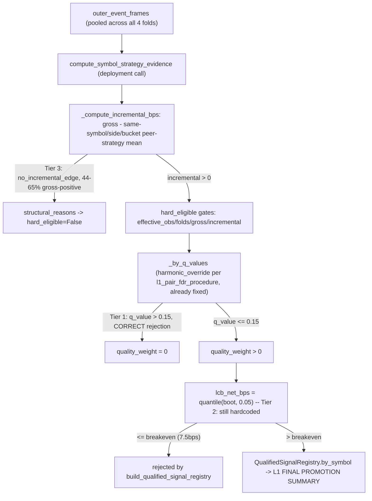

# 🎯 Goal & Architecture

- **Goal**: Explain (and where genuinely a bug, fix) why 1d shows a strongly positive TF-level walk-forward gate (`probe_lcb_bps=+143bps`, all structural checks pass) yet **zero individual candidates** reach the deployment `QualifiedSignalRegistry` — and audit 12h/8h for the same gap, since 12h admits only 11/202 and 8h only 39/303 despite similarly strong TF-level numbers.

- **Real-data audit performed this session (three-tier root-cause decomposition, all measured via scratchpad-only replay instrumentation, no guessing)**:

  **Tier 0 — two separate, independently-computed LCB pipelines exist, and this is by design, not a bug.** The TF-level `probe_lcb_bps` (what Layer1GateReport PASS/BLOCKED reports) comes from `_compute_pooled_probe_lcb`/`evidence_policy.py` (already fixed this session — adaptive quantile, BH FDR). The **deployment registry** admission is a *separate* computation: `pipeline.py`'s `run_l1_nested_swf` calls `compute_symbol_strategy_evidence` a second time on `deployment_event_results` (all outer-fold realized events pooled together), and `build_qualified_signal_registry` (`signal_selection.py:824-851`) requires **all three** of `hard_eligible`, `quality_weight > 0.0`, **and** `lcb_net_bps > l1_breakeven_floor_bps` (~7.5bps) per individual symbol-strategy pair. Passing the TF-level pooled test does not imply any individual pair clears this second, stricter, per-pair gate — this is intentional two-stage design (coarse pooled power to detect "is there edge at all" vs. strict per-pair FDR control to decide "which specific pair can be trusted"), not a wiring defect.

  **Tier 1 — CONFIRMED NOT A BUG: FDR is correctly rejecting weak per-pair evidence, even under the already-adopted "bh" procedure.** Instrumented `compute_symbol_strategy_evidence`'s deployment-evidence call directly. For every `hard_eligible` candidate with `quality_weight <= 0.0`: **100% have `q_value > 0.15`** (135/135 for 8h, 79/79 for 12h, 112/112 for 1d) — i.e. plain-BH (already active per this session's earlier ADR) is still rejecting them, correctly, because their raw p-values are genuinely weak (q≈0.84 typical for 1d, implying p≈0.3 at their rank — nowhere near any reasonable significance bar). `l1_pair_fdr_procedure="bh"` is confirmed correctly wired end-to-end (`run_per_tf_l1` computes `_tf_cfg = apply_tf_gate_overrides(cfg, tf)` once and threads it into `run_l1_nested_swf`, which both the walk-forward-probe path and the deployment-evidence path share). **No code fix is warranted here** — admitting these would mean abandoning FDR control, which is precisely the p-hacking risk quant.md's Priority 1 forbids. This is a genuine data-insufficiency finding: 1d/12h individually don't yet have enough decision points for per-pair-level confidence, even though pooled TF-level evidence is real.

  **Tier 2 — CONFIRMED, MINOR, REAL BUG: a second hardcoded-quantile site was missed by this session's earlier LCB-quantile fix.** `n_hard_eligible_qw_pos_but_lcb_fail_breakeven` = 6/180 for 8h (0 for 12h/1d, small samples). `compute_symbol_strategy_evidence`'s own inline `lcb_net = float(np.quantile(boot_means, 0.05))` (`signal_selection.py` ~line 563) still uses the **old hardcoded 0.05 quantile** — the adaptive `_resolve_lcb_quantile`/`resolve_num_blocks` fix from `ADR_20260716_L1_SLOW_TF_GATE_RECALIBRATION` was applied only inside `evidence_policy.py`'s `assess_fold_evidence`/`pool_l1_evidence`, a different function entirely. This is the same statistical defect class, missed in a second call site. Small blast radius today (6 pairs), but a real, fixable inconsistency.

  **Tier 3 — CONFIRMED, real signal, needs Phase-0 measurement before any fix (not yet actionable): `no_incremental_edge` dominates structural rejections, and a large share have genuinely positive gross edge.** `mean_incremental_bps` is computed via `_compute_incremental_bps` (`signal_selection.py:77-124`) as *this pair's gross edge minus the mean gross edge of other **strategies** on the **same symbol/side/holding_bucket*** (a same-symbol, cross-strategy redundancy-control baseline — **not** a cross-sectional-across-symbols baseline, contradicting this session's initial hypothesis). Measured: of candidates rejected for `no_incremental_edge`, 53% (96/182, 1d), 65% (65/100, 12h), 44% (48/108, 8h) have `mean_gross_bps > 0`. Two competing explanations remain **un-distinguished by current measurement**: (a) the redundancy-control baseline is correctly suppressing near-duplicate parameter variants of the same family that co-move on a symbol (intended design — the 2-3 dominant families per TF, confirmed earlier this session, make this plausible), or (b) the baseline is over-penalizing genuinely distinct signals that happen to share a symbol/bucket by coincidence in a thin-breadth TF. **Switching `l1_baseline_mode` to `"absolute"` without resolving this would risk exactly the redundant-variant admission this baseline exists to prevent, which would also make the FDR multiplicity problem worse (more correlated near-duplicate hypotheses).** This spec does not recommend a mode switch — it specs the measurement needed to decide.

- **Alternatives & Trade-offs**:
  | Finding | Action | Why |
  | :--- | :--- | :--- |
  | Tier 1 (FDR correctly rejecting) | **Document as expected behavior, no code change (chosen)** | Confirmed by direct measurement across all 3 TFs; a code "fix" here would be admitting statistically unjustified pairs. |
  | Tier 2 (missed quantile site) | **Fix: reuse the existing `_resolve_lcb_quantile`/`resolve_num_blocks` helpers at this second call site (chosen)** | Same defect class already fixed once this session; low-risk, consistent, small measured impact (6 pairs). |
  | Tier 3 (baseline washout) | **Phase-0 measurement only: quantify within-symbol cross-strategy correlation for the washed-out candidates before deciding (chosen)** | Anti-overfitting: two plausible explanations point to opposite fixes; picking one without measurement risks curve-fitting or reintroducing a redundancy leak. |
  | Tier 3 alternative | Switch `l1_baseline_mode="absolute"` immediately for 1d/12h/8h | Rejected for now — could readmit redundant near-duplicate family variants, worsening both interpretability and the FDR multiplicity load this session already fought to relax. |

- **Mermaid Diagram**:


# ⚡ Performance & Resource Budget

- **Complexity**: Tier 2 fix is O(1) per candidate (reuses existing `resolve_num_blocks`/`_resolve_lcb_quantile`, already O(1)). Tier 3 measurement reuses the existing single-process control replay.
- **Limits**: `[PERF-01]` No new heavy computation; measurement stays within the same single-process budget already used throughout this session's replays (peak observed ~5.5GB RSS, within performance.md's 12GB ceiling).
- **Concurrency**: `[PERF-02]` No new parallelism.

# ⚙️ Logical Rules, State Machine & Resilience

### Tier 1 — documentation only, no code
- `[LIMIT-01]` No gating change. Document in `docs/results/result.md` (next `/sync`) that "gate PASS but 0 promoted" for 1d/12h is expected multi-stage-testing behavior (pooled TF-level power vs. strict per-pair FDR), not a defect, so it is not re-investigated as a bug in a future session.

### Tier 2 — missed hardcoded quantile
- `[LIMIT-02]` `compute_symbol_strategy_evidence`'s `lcb_net` computation (`signal_selection.py` ~line 563, inside the per-symbol-strategy evidence loop) must use the same block-count-adaptive quantile as `evidence_policy.py`. Reuse `resolve_num_blocks(n_clusters, block_bars)` (already in `metrics.py`) and a `_resolve_lcb_quantile`-equivalent — since `evidence_policy._resolve_lcb_quantile` is private to that module, either (a) promote it to a shared location (`metrics.py`, alongside `resolve_num_blocks`) and import from both call sites, or (b) duplicate the small pure formula locally in `signal_selection.py`. **Choose (a)**: avoids duplicating the exact formula (DRY, matches this session's established precedent of extracting `resolve_num_blocks` for reuse).
- `[LIMIT-03]` Thread `cfg`-driven `l1_lcb_quantile_base/relaxed/full_conf_blocks/floor_blocks` (already defined on `CandidateStrategyConfig` from the earlier ADR) into this call site — zero new config fields needed, just correct wiring of existing ones to a second consumer.
- **Resilience**: Defaults (`base=0.05, relaxed=0.20, full_conf_blocks=15, floor_blocks=3`) are unchanged, so for `boot_means.size` (effectively `n_clusters`) at or above `full_conf_blocks`, this is a bit-identical no-op — zero regression risk for 1h/2h/4h and any already-passing pair.

### Tier 3 — measurement only, no fix committed yet
- `[LIMIT-04]` Build a diagnostic (scratchpad or a throwaway script, per spec-phase convention — **not** committed to `src/`) that, for the `no_incremental_edge`-rejected, gross-positive subset per TF: (a) counts distinct `strategy_id` families sharing each `(symbol, side, holding_bucket)` bucket, (b) computes the Pearson correlation between this candidate's own event-level `gross_event_bps` series and its peer-strategy mean series within the same bucket. High correlation (e.g. >0.7) supports "correctly suppressing redundant variants" (no fix); low correlation supports "baseline is punishing unrelated signals sharing a bucket by coincidence" (candidate fix: exclude same-family peers from the baseline, or require a minimum peer-count floor before applying peer-adjustment, analogous to the existing `peer_count==0` absolute-mode fallback).
- `[LIMIT-05]` This measurement's outcome determines the next spec's shape entirely — this spec does not pre-commit to `l1_baseline_mode="absolute"`, a family-exclusion baseline variant, or "no fix" (Tier 3 could turn out to also be correct-as-designed, like Tier 1).

# 🔌 Integration & Connection Plan

### Tier 2 (the only in-scope code change)
- **Target Location**: `src/domain/futures/strategy/tiered_workflow/metrics.py` → promote `_resolve_lcb_quantile` from `evidence_policy.py` (private) to a shared public function here, alongside `resolve_num_blocks` (already here). `evidence_policy.py` updates its import to `from .metrics import resolve_num_blocks, resolve_lcb_quantile` (drop its private copy, zero behavior change — pure relocation + rename).
- **Target Location 2**: `src/domain/futures/strategy/tiered_workflow/signal_selection.py::compute_symbol_strategy_evidence`, at the `lcb_net = float(np.quantile(boot_means, 0.05)) ...` line (~563) — replace `0.05` with `resolve_lcb_quantile(resolve_num_blocks(effective_n_int, block_bars), base_quantile=cfg.l1_lcb_quantile_base, ...)` (mirrors the pattern already used in `_compute_pooled_probe_lcb`).
- **State Impact**: `Immutable` (pure function relocation + one call-site substitution, backward-compatible defaults).
- **Data Schema Diff**: `{"metrics.py": "+resolve_lcb_quantile(...)  (relocated from evidence_policy.py, renamed from _resolve_lcb_quantile)"}`. No new fields.
- **Error Behavior**: `Propagate` — identical to the existing function's validation (raises on `full_conf_blocks <= floor_blocks` etc.).

### Tier 3 (measurement only — no `src/` changes in this pass)
- **Target Location**: none in `src/`. A throwaway analysis script during the next `/implement`'s Phase-0 step, per the project's established measure-then-adopt convention.

# ✍️ Contract Changes

```python
# src/domain/futures/strategy/tiered_workflow/metrics.py (relocated + renamed from evidence_policy.py)

def resolve_lcb_quantile(
    num_blocks: int,
    *,
    base_quantile: float = 0.05,
    relaxed_quantile: float = 0.20,
    full_conf_blocks: int = 15,
    floor_blocks: int = 3,
) -> float:
    """Block-count-adaptive lower-quantile for bootstrap LCB estimation.

    Identical formula to the private evidence_policy._resolve_lcb_quantile this
    replaces -- promoted here so signal_selection.py's compute_symbol_strategy_evidence
    can share it instead of duplicating the formula or leaving a second hardcoded
    quantile site unfixed.

    Raises:
        ValueError: if full_conf_blocks <= floor_blocks, or quantiles outside (0, 1).
    """
    ...  # body unchanged from today's evidence_policy._resolve_lcb_quantile


# src/domain/futures/strategy/tiered_workflow/evidence_policy.py
# - remove _resolve_lcb_quantile (body moves to metrics.py)
# - add: from src.domain.futures.strategy.tiered_workflow.metrics import (
#            resolve_num_blocks, resolve_lcb_quantile,
#        )
# - update both call sites (assess_fold_evidence, pool_l1_evidence) to call
#   resolve_lcb_quantile(...) instead of the now-removed private function.


# src/domain/futures/strategy/tiered_workflow/signal_selection.py::compute_symbol_strategy_evidence
# body change only, no signature change (cfg already available):
#   block_bars_eff = _resolve_block_bars_eff(cfg)  # reuse existing helper
#   num_blocks = resolve_num_blocks(int(round(effective_n)), block_bars_eff)
#   q = resolve_lcb_quantile(
#       num_blocks,
#       base_quantile=float(getattr(cfg, "l1_lcb_quantile_base", 0.05)),
#       relaxed_quantile=float(getattr(cfg, "l1_lcb_quantile_relaxed", 0.20)),
#       full_conf_blocks=int(getattr(cfg, "l1_lcb_quantile_full_conf_blocks", 15)),
#       floor_blocks=int(getattr(cfg, "l1_lcb_quantile_floor_blocks", 3)),
#   )
#   lcb_net = float(np.quantile(boot_means, q)) if boot_means.size > 0 else mean_incremental
```

# 🧪 TDD Test Scenario Matrix

### `tests/.../test_metrics.py` (extend)
- **Scenario 1 (Happy Path)**: `resolve_lcb_quantile(num_blocks=20) == pytest.approx(0.05)` (relocated, same behavior as today's private function's existing tests).
- **Scenario 2 (Regression)**: every existing test currently targeting `evidence_policy._resolve_lcb_quantile` is moved verbatim to target `metrics.resolve_lcb_quantile` — zero behavioral change, pure relocation.

### `tests/.../test_evidence_policy.py` (update imports only)
- **Scenario 4 (Integration)**: `assess_fold_evidence`/`pool_l1_evidence` integration tests unchanged in assertions; only the import/patch target updates from `evidence_policy._resolve_lcb_quantile` to `metrics.resolve_lcb_quantile` if any test patches it directly (check first — most tests likely call the public functions and don't patch the private helper).

### `tests/.../test_signal_selection_evidence.py` (extend)
- **Scenario 1 (Happy Path)**: large-N candidate (`num_blocks >= 15`) — `lcb_net_bps` bit-identical to pre-change (quantile stays 0.05).
- **Scenario 2 (Edge — `[LIMIT-02]`)**: small-N candidate (`num_blocks <= 3`, e.g. `effective_n` just above `l1_pair_min_effective_obs` with a large `block_bars`) — assert `lcb_net_bps` computed with the adaptive quantile is `>=` the value that would result from a forced `lcb_quantile_floor_blocks=0` (degenerate, forces base quantile) with the same seed — same comparative-baseline pattern used for the evidence_policy.py fix earlier this session.
- **Scenario 4 (Integration)**: reconstruct the 8h fixture pattern that produced the 6 measured `lcb_fail` candidates (small effective_n, block_bars large relative to sample) and assert at least one flips from `lcb_pass=False` to `lcb_pass=True` under the fix, using `build_qualified_signal_registry`'s exact filter logic.

### Mock & Integration Boilerplate
```python
def test_compute_symbol_strategy_evidence_small_n_relaxes_lcb_net_quantile():
    # Arrange — small effective_n, large block_bars relative to n (num_blocks <= floor)
    cfg = _make_cfg(l1_bootstrap_block_bars=6, l1_pair_min_effective_obs=4.0)
    df = _make_event_frame(gross_bps_list=[15.0, 12.0, 18.0, 10.0])  # n=4, block_bars=6 -> num_blocks<=3

    # Act
    baseline_cfg = _make_cfg(l1_bootstrap_block_bars=6, l1_pair_min_effective_obs=4.0,
                              l1_lcb_quantile_floor_blocks=0)  # forces base quantile path
    adaptive = compute_symbol_strategy_evidence(event_results=df, cfg=cfg, seed=42, registry_as_of_idx=999)
    baseline = compute_symbol_strategy_evidence(event_results=df, cfg=baseline_cfg, seed=42, registry_as_of_idx=999)

    # Assert
    assert adaptive[0].lcb_net_bps >= baseline[0].lcb_net_bps
```

# 📋 Open Items For Adoption
- `[LIMIT-01]` Tier 1 finding is documentation-only — no `/implement` action beyond updating `docs/results/result.md`'s prose (handled at `/sync`, already reflected in the previous conversation turn's report to the user).
- `[LIMIT-02]/[LIMIT-03]` Tier 2 fix is fully specified and low-risk; safe to implement directly.
- `[LIMIT-04]/[LIMIT-05]` Tier 3 requires a NEW measurement pass before any `l1_baseline_mode`/redundancy-control code change is specified — do not skip ahead to implementing "absolute" mode from this spec alone.
