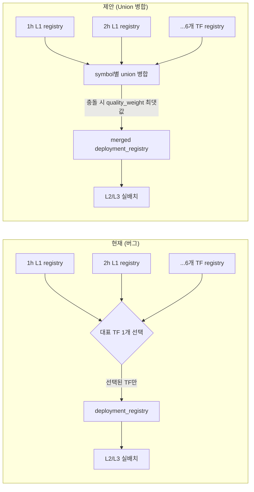

# 🎯 Goal & Architecture

## Goal
L1이 TF(1h/2h/4h/6h/8h/12h/1d)마다 독립적으로 검증한 `QualifiedSignalRegistry`(hard_eligible 신호 목록) 중, 현재는 "대표 TF 1개"만 골라 L2/L3로 넘기고 **나머지 TF에서 이미 검증된 신호는 전부 폐기**하는 구조적 결함을 제거한다. 모든 deployable TF의 qualified 신호를 union 병합해 실전 배치에 반영되도록 한다.

## Why this and not a gate-threshold fix
2026-07-21 L3 홀드아웃(BLOCKED, CAGR -0.2%)의 1차 조사에서 "L3 게이트가 crisis 구간에 관대해야 하는가"를 검토했으나, 사용자가 정확히 지적한 대로 **게이트 임계값 조정은 결과에 임계값을 끼워맞추는 것**이지 근본 해결이 아니다. 대신 `[L1-MAJOR-REGISTRY-CENSUS]` 로그를 직접 조사한 결과, 이번 L3 실행에서 실제로 신호 자체가 부재한 게 아니라 **이미 검증된 신호가 아키텍처 결함으로 사용되지 못한 사례**를 발견했다:

```
ETHUSDT/dual_momentum:      registry_mean_incremental_bps=128.077  hard_eligible=True  observed_active_in_holdout=False
ETHUSDT/trend_donchian:     registry_mean_incremental_bps=219.445  hard_eligible=True  observed_active_in_holdout=False
ETHUSDT/btc_regime_pullback: registry_mean_incremental_bps=96.769  hard_eligible=True  observed_active_in_holdout=False
ETHUSDT/mtf_fusion:         registry_mean_incremental_bps=101.381  hard_eligible=True  observed_active_in_holdout=False
BTCUSDT/trend_donchian:     registry_mean_incremental_bps=106.220  hard_eligible=True  observed_active_in_holdout=False
```
ETHUSDT는 4개의 hard_eligible 전략이 등록돼 있음에도 L3 홀드아웃 전체 6개월간 `mu_bull=0.0%, avg_mult=0.000`(완전 비활성)이었다. 이는 "알파가 없다"가 아니라 "있는 알파를 꺼내 쓰지 못한다"는 뜻이다.

## Root Cause (코드 확인 완료)
`src/domain/futures/strategy/tiered_workflow/pipeline.py`:
- `_select_representative_l1_registry()`(4072-4091): TF별 `Layer1Result.deployment_registry` 중 `_resolve_selected_l1_tf()`가 고른 **단일 TF의 registry만** 반환.
- `_aggregate_per_tf_l1()`(4094-4168): `oos_stacked`은 모든 TF를 `tf::key` 접두사로 정상 병합(4125-4129)하지만, 실제 배치 판단에 쓰이는 `deployment_registry`(4133-4136)는 위 단일-TF 함수 결과를 그대로 씀 — **다중 TF 신호 병합 파이프라인 안에 정작 "배치용 신호 목록"만 병합이 안 되는 비대칭 버그**.
- 이 갭은 `docs/decisions/decisions_archive.md`(2026-07-0x, BTC/ETH reversal-lag 조사 Track2)에서 이미 "후속 이슈"로 발견됐으나 미수정 상태로 남아있었다.

## "하락장/crisis에서도 수익낼 수 있어야 하지 않나"에 대한 답변
- 원칙적으로 맞다 — 이 코드베이스의 전략군(`dual_momentum`, `trend_donchian`, `trend_ma`, `mtf_fusion` 등)은 전부 방향성(long/short) 트렌드 시스템이라 이론상 하락 추세에서 숏으로 수익을 낼 수 있다.
- 다만 이미 두 갈래로 시도되고 **경제적 replay로 반증됨**(재시도 비권장):
  - `project_reversal_kill_economic_disproof_2026_07_02`: crisis 구간에서 reversal kill-switch를 켠 8개 variant 전부가 baseline_off보다 열등했음(실제 위기 홀드아웃 replay).
  - `project_metrics_cache_never_materialized_2026_07_02`(L1 비추세 신호 다양화): `residual_reversion`/`funding_extreme_reversal` 등 신규 역추세 신호가 admission gate는 통과했으나 economic replay에서 CAGR -17.0%로 전부 기각.
- 따라서 "새 역추세/방어 신호를 발명"하는 방향은 이미 소진된 경로다. 반면 이번에 발견한 **"이미 검증된 기존 신호가 버그로 버려짐"**은 전혀 새로운, 아직 시도되지 않은, 저위험 경로다 — 이 spec의 범위를 여기에 한정한다.

## Alternatives & Trade-offs
| 대안 | 설명 | 장점 | 단점 |
|---|---|---|---|
| **A. Union 병합 (채택)** | 모든 deployable TF의 `by_symbol`을 심볼별로 concat, 동일 key 충돌 시 quality_weight 최댓값 유지 | 최소 변경, 기존 L2 신호결합(`_combine_sleeve_signals_to_symbol`)이 이미 심볼당 다중 evidence 처리 — 신규 수학 없음 | 동일 (symbol,strategy_id,activation_context)가 TF마다 다른 값으로 검증되면 낮은 쪽 정보 손실(다만 이미 quality_weight로 랭킹된 대체 가능한 정보) |
| B. `SignalSourceKey`에 `native_tf` 추가 | 스키마 자체에 TF를 넣어 충돌 원천 차단 | 가장 명시적/안전 | `SignalSourceKey`를 참조하는 모든 다운스트림(census, replay matching 등) 리팩터링 필요 — Tier 3 범위 초과 |
| C. representative TF 선택 휴리스틱 개선 | "버려지는 신호의 총 mean_incremental_bps"를 대표 TF 선정 기준에 반영 | 변경 범위 최소 | 근본 결함(다른 TF 신호 폐기) 자체는 남음 — 완화책일 뿐 |

**선정: A.** quant.md §0(로직 강건성 > 지표) 및 §6 우선순위상 근본 결함을 제거하면서 변경 범위를 최소화한다.

## Mermaid: 현재 vs 제안



# ⚡ Performance & Resource Budget
- 병합 대상은 이미 메모리에 상주하는 소규모 dict(`by_symbol`: 심볼당 수~수십 개 `SymbolStrategyEvidence` 튜플) — 신규 I/O·재계산 없음. 복잡도 `O(symbols × mean_strategies_per_tf × n_tfs)`, 통상 100여 심볼 × TF 7개 × 심볼당 수 개 전략 수준으로 <1ms, 완전 무시 가능.
- RSS 영향 없음 — 신규 배열 복제 없이 기존 튜플을 concat만 함(`performance.md` §2 "No Unnecessary Panel Deepcopy" 준수).
- L1 per-TF 캐시(`logs/futures/optimization/l1_result_cache/*.pkl`)는 TF별 `Layer1Result`를 캐싱하며 이 값 자체는 변경되지 않는다 — `_aggregate_per_tf_l1`은 캐시 로드 이후 순수 병합만 수행하므로 **캐시 무효화 불필요, 캐시 히트율 영향 없음**.

# ⚙️ Logical Rules, State Machine & Resilience
- **[LIMIT-01] 키 충돌**: 동일 `(symbol, strategy_id, activation_context)`가 2개 이상 TF에서 `hard_eligible=True`로 존재하면 `quality_weight`가 더 큰 evidence만 유지하고 낮은 쪽은 버린다. 버려질 때 `[ALGO] event=registry_merge_conflict symbol=... strategy=... kept_tf=... kept_qw=... dropped_tf=... dropped_qw=...` DEBUG 로그를 남긴다(`logging.md` 태그 규약 준수).
- **[LIMIT-02] 전 TF not-deployable**: 모든 TF가 `_is_deployable_per_tf_result()==False`면 병합 결과도 `None` — 기존 `_select_representative_l1_registry`의 반환 계약과 동일하게 유지(하위 호환).
- **[LIMIT-03] 메타 필드 재계산**: 병합 후 `trade_scope_count`는 병합된 `by_symbol` 전체 evidence 개수로 재계산, `registry_version`은 참여한 모든 TF의 `registry_version`을 `"+".join(sorted(set(...)))`로 구성해 병합 출처를 추적 가능하게 한다.
- **상태 불변**: `gate_passed`(즉 L1 하드 게이트 통과 여부, `_is_deployable_per_tf_result` 기반)는 이번 변경으로 바뀌지 않는다 — 오직 "게이트를 통과한 뒤 실제로 어떤 신호를 쓸지"만 바뀐다. 회귀 위험을 게이트 판정 로직 밖으로 격리.
- **Resilience**: 병합 함수는 순수 함수(부작용 없음), 입력이 빈 dict거나 단일 TF만 있어도(과거처럼 동작) 정상 동작 — 기존 단일-TF 경로의 특수 케이스로 자연 포함된다.

# 🔌 Integration & Connection Plan
- **Target**: `src/domain/futures/strategy/tiered_workflow/pipeline.py`
  - 신규 함수 `_merge_deployment_registries_across_tf()`를 `_select_representative_l1_registry()`(라인 4072) 바로 아래에 추가.
  - `_aggregate_per_tf_l1()`(라인 4094-4168) 내 `deployment_registry = _select_representative_l1_registry(...)` 호출(라인 4133-4136)만 신규 함수 호출로 교체.
  - `_select_representative_l1_registry()` 자체는 삭제하지 않는다 — 라인 4087-4088(`selected_tf`/`selected` 계산, `gate_passed` 판정용)에서 여전히 필요.
- **State Impact**: `Layer1Result.deployment_registry` 필드의 내용만 변경(더 많은 심볼/전략 포함), 필드 타입·계약은 동일(`QualifiedSignalRegistry | None`) — 하위 호환 100%, 호출부(`L2`/`L3`) 코드 수정 불필요.
- **Error Behavior**: 병합 중 예외 발생 여지 없음(순수 dict/tuple 연산) — 별도 예외 처리 불필요.

# ✍️ Contract Changes

```python
# src/domain/futures/strategy/tiered_workflow/pipeline.py

def _merge_deployment_registries_across_tf(
    per_tf_l1: dict[str, PerTfL1Result],
) -> QualifiedSignalRegistry | None:
    """Union-merge QualifiedSignalRegistry.by_symbol across all deployable per-TF L1 results.

    [ADR_TBD_L1_MULTI_TF_REGISTRY_MERGE] 대표 TF 1개만 반영하던 기존 방식 대신
    deployable한 모든 TF의 qualified 신호를 심볼별로 union 병합한다. 동일
    (symbol, strategy_id, activation_context) 충돌 시 quality_weight가 더 큰
    evidence를 유지한다. 어떤 TF도 deployable하지 않으면 None을 반환한다.
    """
```
- Import 변경 없음(`QualifiedSignalRegistry`, `PerTfL1Result`는 이미 동일 파일에서 import/정의됨).
- `_aggregate_per_tf_l1()`의 반환 타입(`Layer1Result`)과 필드 계약은 변경 없음.

# 🧪 TDD Test Scenario Matrix & Mocks

| # | Scope | Scenario | 목적 |
|---|---|---|---|
| 1 | unit | `test_merge_deployment_registries_across_tf_unions_distinct_symbols` | 2개 TF, 서로 다른 심볼/전략 조합 → 병합 결과가 정확히 union과 일치 |
| 2 | unit | `test_merge_deployment_registries_across_tf_keeps_higher_quality_weight_on_conflict` | 동일 key가 두 TF에 다른 quality_weight로 존재 → 높은 쪽만 유지, 로그 이벤트 확인([LIMIT-01]) |
| 3 | unit | `test_merge_deployment_registries_across_tf_returns_none_when_no_tf_deployable` | 전 TF not-deployable → None 반환([LIMIT-02], 기존 동작과 동일) |
| 4 | integration | `test_aggregate_per_tf_l1_uses_merged_registry_not_single_tf` | `_aggregate_per_tf_l1()` 호출 시 반환된 `Layer1Result.deployment_registry`가 병합 함수 결과와 일치(단일 TF 결과가 아님을 확인) |

**Skeleton Mock Boilerplate**:
```python
import pytest

from src.domain.futures.strategy.candidate_contracts import (
    QualifiedSignalRegistry,
    SignalSourceKey,
    SymbolStrategyEvidence,
)
from src.domain.futures.strategy.tiered_workflow.pipeline import (
    _merge_deployment_registries_across_tf,
    _aggregate_per_tf_l1,
)


def _make_evidence(symbol: str, strategy_id: str, quality_weight: float) -> SymbolStrategyEvidence:
    return SymbolStrategyEvidence(
        key=SignalSourceKey(symbol=symbol, strategy_id=strategy_id, activation_context="default"),
        mean_gross_bps=10.0,
        mean_incremental_bps=10.0,
        p_value=0.01,
        q_value=0.01,
        positive_fold_ratio=0.8,
        n_obs=100,
        effective_n=100.0,
        n_folds=4,
        quality_weight=quality_weight,
        hard_eligible=True,
        structural_reasons=(),
        diagnostic_flags=(),
        lcb_net_bps=5.0,
    )


def _make_registry(entries: dict[str, list[SymbolStrategyEvidence]]) -> QualifiedSignalRegistry:
    return QualifiedSignalRegistry(
        by_symbol=entries,
        ready_symbols=tuple(entries.keys()),
        trade_scope_count=sum(len(v) for v in entries.values()),
        registry_version="test-v1",
    )


def test_merge_deployment_registries_across_tf_unions_distinct_symbols():
    # Arrange
    reg_1h = _make_registry({"BTCUSDT": [_make_evidence("BTCUSDT", "dual_momentum", 0.8)]})
    reg_8h = _make_registry({"ETHUSDT": [_make_evidence("ETHUSDT", "trend_donchian", 0.6)]})
    per_tf_l1 = _build_per_tf_l1_fixture({"1h": reg_1h, "8h": reg_8h})  # 프로젝트 fixture 헬퍼로 대체

    # Act
    merged = _merge_deployment_registries_across_tf(per_tf_l1)

    # Assert
    assert merged is not None
    assert set(merged.by_symbol.keys()) == {"BTCUSDT", "ETHUSDT"}


def test_merge_deployment_registries_across_tf_keeps_higher_quality_weight_on_conflict():
    # Arrange
    reg_1h = _make_registry({"BTCUSDT": [_make_evidence("BTCUSDT", "dual_momentum", 0.4)]})
    reg_8h = _make_registry({"BTCUSDT": [_make_evidence("BTCUSDT", "dual_momentum", 0.9)]})
    per_tf_l1 = _build_per_tf_l1_fixture({"1h": reg_1h, "8h": reg_8h})

    # Act
    merged = _merge_deployment_registries_across_tf(per_tf_l1)

    # Assert
    assert merged is not None
    kept = merged.by_symbol["BTCUSDT"]
    assert len(kept) == 1
    assert kept[0].quality_weight == pytest.approx(0.9)


def test_merge_deployment_registries_across_tf_returns_none_when_no_tf_deployable():
    # Arrange
    per_tf_l1 = _build_per_tf_l1_fixture({}, all_not_deployable=True)

    # Act
    merged = _merge_deployment_registries_across_tf(per_tf_l1)

    # Assert
    assert merged is None
```

## 다음 세션 실측 절차 (본 spec 구현 완료 후)
1. `/implement` → L1.5 로컬 체크 → `/check`(신규 함수 커버리지 Core >= 85%).
2. **재실행 필수**(기존 로그 재판정만으로는 검증 불가 — 신호 자체가 새로 활성화되므로): `uv run python src/execution/opt_main_futures.py --phase l3 --trials 120 --timeframe 4h --sync skip --seed 42`.
3. 확인 지표: `[L1-MAJOR-REGISTRY-CENSUS]`에서 ETHUSDT `observed_active_in_holdout` True 전환 여부, L3 `total_return`/`Sharpe` 변화, L2 champion 지표 회귀 여부(기존 CAGR +33.2% 등이 크게 훼손되지 않는지).
4. 결과를 `docs/results/result.md`에 갱신하고 `docs/decisions/decisions.md`에 5줄 이내 ADR 기록.
