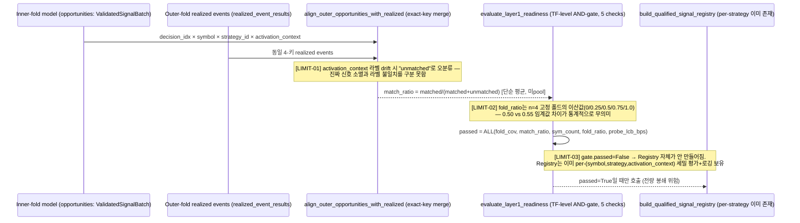

# 🎯 Goal & Architecture

- **Goal**: L1의 역할을 "L0가 넘긴 후보들 중 통계적으로 재현되는 것만 걸러 자산증식에 실제로 기여하는 전략을 확정한다"로 재정의하고, 현재 `evaluate_layer1_readiness()`의 3가지 수학적/공학적 결함(측정 아티팩트를 성과로 오인, 소표본 이산 통계량을 연속 임계값처럼 취급, 개별 전략 증거를 전체-TF 거부권으로 뭉갬)을 근본 수정한다.
- **선행 진단 근거**: 오늘 세션 실측(`4h_1783927361`)에서 4h/6h가 `match_ratio`(0.500/0.750, 임계 0.90)로 봉쇄됨을 확인했으나, 코드 추적 결과 이 지표 자체가 **경제적 유의성이 아니라 정확-키 조인(exact-key join) 성공률**임이 드러남 — 재설계 없이 임계값만 조정하는 것은 근본원인을 놔둔 채 증상만 가리는 것이므로 반려.



# ⚙️ Logical Rules & State Machine

## [LIMIT-01] `match_ratio`는 성과 지표가 아니라 정확-키 조인 성공률

- **현재 계산**(`signal_selection.py:264-281` `align_outer_opportunities_with_realized`): `opportunities`(inner-fold에서 산출된 예측)와 `realized_event_results`(outer OOS 실현 이벤트)를 `(decision_idx, symbol, strategy_id, activation_context)` **4개 키의 정확 일치**로 병합(`how="left", indicator=True`). `activation_context`는 `l1_activation_match_regime=True`(기본값)일 때만 키에 포함됨(`signal_selection.py:265-266`).
- **수학적 문제**: `unmatched_count`는 "그 (decision_idx, symbol, strategy_id) 조합에 실현 이벤트가 아예 없었다"(진짜 신호 소멸/커버리지 부재)와 "실현 이벤트는 있는데 `activation_context` 문자열이 inner-fold 산출 시점과 outer 실현 시점 사이에 달라졌다"(레짐/셀 라벨링 drift, 순수 조인 아티팩트)를 **구분하지 못하고 동일하게 카운트**한다. 후자는 모델 실패가 아니라 파이프라인의 라벨 재계산 불안정성일 뿐이다.
- **Rule**: `align_outer_opportunities_with_realized()`에 3-키(activation_context 제외) merge를 추가로 수행 — 4-키 unmatched 중 3-키로는 매치되는 것을 `label_drift_unmatched_count`로 별도 계상. `Layer1FoldReadiness`에 `label_drift_unmatched_count: int` 필드 추가(additive). `realized_match_ratio`는 `matched / (matched + true_unmatched)`로 재정의(라벨 drift는 분모에서 제외 — 조인 아티팩트를 성과 미달로 벌점 주지 않음).

## [LIMIT-02] `fold_ratio`는 n=4 고정 폴드의 이산 통계량 — 임계값 비교가 통계적으로 무의미

- **현재**: `wf_n_folds: int = 4`(`config.py:495`, 전 TF 공통 고정값) → `fold_ratio = ready_fold_count / len(fold_reports)`(`signal_selection.py:1975`)는 `{0, 0.25, 0.5, 0.75, 1.0}` 중 하나만 가능. `_DEFAULT_PER_TF_GATE_OVERRIDES`가 TF별로 0.40~0.60 사이 값을 지정하지만, n=4에서 0.40과 0.60은 **똑같이 "2/4 통과 필요"로 반올림되는 임계값**이라 TF별 차별화가 실제로는 작동하지 않는다(1d만 예외: 0.60 요구 시 3/4 필요, 실질적 차이 있음).
- **비교 사례(이미 존재하는 올바른 패턴)**: 같은 함수의 `probe_lcb_bps`는 `_compute_pooled_probe_lcb()`(`signal_selection.py:1926`)를 통해 **폴드별 요약값 평균이 아니라, 통과 폴드들의 raw `probe_series_bps`를 전부 pool한 뒤 moving-block bootstrap으로 5th-percentile LCB를 계산**하는 연속 통계량이다. `fold_ratio`/`match_ratio`만 이 패턴을 따르지 않고 폴드 단위 이산 카운트/평균에 머물러 있다 — 동일 함수 내 일관성 결여.
- **Rule**: `fold_ratio`를 하드 게이트에서 **진단 전용(diagnostic-only)**으로 강등한다(`Layer1GateReport`에는 유지하되 `passed` 계산에서 제외, `checks` 튜플에는 `blocking=False` 플래그와 함께 계속 기록). 대신 `match_ratio`를 [LIMIT-01]로 정제된 `matched`/`true_unmatched` **원시 카운트를 전 폴드에서 pool**한 뒤 Wilson score interval 하한(`wilson_lower_bound(matched, matched+true_unmatched, confidence=0.90)`)으로 재계산 — `probe_lcb_bps`와 동일한 "pool 후 신뢰구간" 패턴 적용.

## [LIMIT-03] TF 전체를 한 번에 거부하는 단일 AND-게이트가 이미 존재하는 per-strategy 증거 체계를 봉쇄

- **현재**: `evaluate_layer1_readiness()`가 `fold_cov`/`match_ratio`/`sym_count`/`fold_ratio`/`probe_lcb_bps` 5개를 전부 통과해야 `gate_report.passed=True`가 되고, 그래야만 `build_qualified_signal_registry()`가 호출됨(`pipeline.py:1626-1627`, `if gate_report.passed:`). 즉 **TF 안의 우량 전략(예: 4h의 macd_4h net_lcb +39bps, mtf_fusion 4h 변형 +54~57bps)까지 전부 함께 봉쇄**된다.
- **이미 존재하는 세밀 체계**: `build_qualified_signal_registry()`는 이미 `(symbol, strategy_id, activation_context)` 단위로 `hard_eligible`/`quality_weight`/`lcb_net_bps > breakeven` 3중 조건을 개별 평가하고, 통과/실패 사유를 `[L1-REGISTRY-REJECT]` 로그로 이미 상세 기록 중이다(`signal_selection.py:773-789`). **재설계할 새 메커니즘이 필요한 게 아니라, 이미 있는 메커니즘이 실행될 기회를 얻지 못하고 있을 뿐**이다.
- **분류**: `fold_cov`(데이터 자체의 폴드 커버리지)와 `sym_count`(유효 심볼 수)는 "이 TF에서 통계적으로 유의미한 그 무엇이라도 계산 가능한가"를 묻는 **구조적 전제조건**이라 TF 전체 하드 게이트로 유지해야 한다(개별 전략으로 쪼갤 대상이 아님 — 애초에 표본이 없으면 어떤 전략도 평가 불가). `probe_lcb_bps`(pooled, 이미 연속통계량)는 "이 TF에 조금이라도 경제적 유의성이 있는가"를 묻는 **저비용 사전 회로차단기(circuit breaker)**로 유지 — per-strategy 평가를 시도할 가치가 있는지의 문턱.
- **Rule**: `Layer1GateReport`에 `structural_passed: bool`(fold_cov, sym_count, probe_lcb_bps 3개 AND)과 `advisory_checks: tuple[Layer1GateCheck, ...]`(match_ratio[재정의], fold_ratio, 둘 다 `blocking=False`)를 분리 도입. `pipeline.py`의 `if gate_report.passed:`를 `if gate_report.structural_passed:`로 교체(하위호환: `passed` 필드 자체는 유지하되 semantics를 "structural_passed AND all advisory"에서 "structural_passed만"으로 문서화 갱신). match_ratio/fold_ratio 위반은 `build_qualified_signal_registry()` 호출 시 **cfg를 통해 quality_weight 페널티로 전달**(예: `probe_prior_map`과 유사하게 TF 단위 penalty factor를 개별 전략의 `quality_weight`에 곱연산) — 완전히 무시하는 게 아니라 "TF 전체 거부권"에서 "개별 전략 우선순위 감점"으로 강도를 낮춘다.

# 🔌 Integration & Connection Plan

| Fix | Target Location | Anchor | State Impact | Data Schema Diff |
|---|---|---|---|---|
| LIMIT-01 | `src/domain/futures/strategy/tiered_workflow/signal_selection.py` > `align_outer_opportunities_with_realized()` (라인 229-281) | 4-키 병합 실패분에 대해 3-키(activation_context 제외) 재병합 추가, `label_drift_unmatched_count` 산출 | `Immutable` (순수 함수, 반환 타입에 필드 추가) | `{"+return.label_drift_unmatched_count": "int"}` |
| LIMIT-01 | `src/domain/futures/strategy/candidate_contracts.py` > `Layer1FoldReadiness` (라인 515-539) | 필드 추가 | `Immutable` (frozen dataclass) | `{"+label_drift_unmatched_count": "int = 0"}` |
| LIMIT-02 | `src/domain/futures/strategy/tiered_workflow/signal_selection.py` > `evaluate_layer1_readiness()` (라인 1954-2046 부근) | `match_ratio` 계산부를 pooled matched/true_unmatched 카운트 + Wilson LCB로 교체, `fold_ratio` 체크를 `blocking=False`로 강등 | `Immutable` (순수 함수) | `{"~match_ratio_computation": "per-fold mean → pooled Wilson LCB", "~fold_ratio.blocking": "True→False"}` |
| LIMIT-02 | `src/domain/futures/strategy/candidate_contracts.py` > `Layer1GateCheck` (라인 629-636) | `blocking: bool = True` 필드 추가(하위호환 기본값) | `Immutable` | `{"+blocking": "bool = True"}` |
| LIMIT-03 | `src/domain/futures/strategy/candidate_contracts.py` > `Layer1GateReport` (라인 639-643) | `structural_passed`/`advisory_checks` 필드 추가 | `Immutable` | `{"+structural_passed": "bool", "+advisory_checks": "tuple[Layer1GateCheck,...]"}` |
| LIMIT-03 | `src/domain/futures/strategy/tiered_workflow/pipeline.py` (라인 1626 부근) | `if gate_report.passed:` → `if gate_report.structural_passed:` | `Mutable` (게이트 통과 조건 완화 — 실제 배포 후보 집합이 늘어날 수 있음) | 없음(제어흐름) |
| LIMIT-03 | `src/domain/futures/strategy/tiered_workflow/signal_selection.py` > `build_qualified_signal_registry()` (라인 748-789 부근) | `advisory_penalty: float = 1.0` 파라미터 추가(additive, keyword-only), `quality_weight *= advisory_penalty` | `Immutable` (파라미터 추가, 기본값 1.0=무변화) | `{"+build_qualified_signal_registry.advisory_penalty": "float = 1.0"}` |

- **Error Behavior**: 전부 `Propagate` 없음. LIMIT-03의 게이트 완화는 **행동 변화**이므로 별도 feature flag(`l1_structural_gate_only: bool = False`, 기본값 False=기존 동작 유지)로 감싸 opt-in 배포 — 프로덕션 영향 없이 실측 검증 후 기본값 전환을 별도 결정한다.

# ✍️ Contract Changes

```python
# --- LIMIT-01: signal_selection.py ---
def align_outer_opportunities_with_realized(
    *,
    opportunities: ValidatedSignalBatch,
    realized_event_results: pd.DataFrame,
    activation_match_regime: bool,
) -> tuple[pd.DataFrame, int, int]:  # ~return: 기존 (merged, unmatched_count) → (merged, true_unmatched_count, label_drift_unmatched_count)
    ...
    merge_keys_full = ["decision_idx", "symbol", "strategy_id"]
    if activation_match_regime:
        merge_keys_full.append("activation_context")
    merged_full = opp_frame.merge(realized[merge_cols], on=merge_keys_full, how="left", indicator=True)
    unmatched_full = merged_full.loc[merged_full["_merge"] != "both"]
    if activation_match_regime and not unmatched_full.empty:
        # 3-key(활성화 컨텍스트 제외) 재병합으로 label-drift 여부 판별
        merge_keys_3 = ["decision_idx", "symbol", "strategy_id"]
        rematch = unmatched_full[merge_keys_3].merge(
            realized[[*merge_keys_3, "realized_side_adjusted_gross_bps"]], on=merge_keys_3, how="inner"
        )
        label_drift_unmatched_count = int(len(rematch))
    else:
        label_drift_unmatched_count = 0
    true_unmatched_count = int((merged_full["_merge"] != "both").sum()) - label_drift_unmatched_count
    matched = merged_full.loc[merged_full["_merge"] == "both"].drop(columns="_merge").copy()
    return matched, true_unmatched_count, label_drift_unmatched_count


# --- src/domain/futures/strategy/candidate_contracts.py ---
@dataclass(slots=True, frozen=True, init=False)
class Layer1FoldReadiness:
    ...
    label_drift_unmatched_count: int = 0  # [ADR_20260713_L1_READINESS_GATE_REDESIGN]


@dataclass(slots=True, frozen=True)
class Layer1GateCheck:
    key: str
    value: float
    threshold: float
    comparator: GateComparator
    passed: bool
    blocker: str | None = None
    blocking: bool = True  # [ADR_20260713_L1_READINESS_GATE_REDESIGN] False → advisory only, doesn't affect structural_passed


@dataclass(slots=True, frozen=True)
class Layer1GateReport:
    checks: tuple[Layer1GateCheck, ...]
    passed: bool
    blockers: tuple[str, ...]
    structural_passed: bool = True   # [ADR_20260713_L1_READINESS_GATE_REDESIGN] fold_cov ∧ sym_count ∧ probe_lcb_bps only
    advisory_checks: tuple[Layer1GateCheck, ...] = ()  # match_ratio(재정의) + fold_ratio


# --- signal_selection.py: evaluate_layer1_readiness (발췌 재작성) ---
def _wilson_lower_bound(successes: int, n: int, confidence: float = 0.90) -> float:
    """Wilson score interval lower bound for a binomial proportion. n=0 → 0.0."""
    if n <= 0:
        return 0.0
    from scipy.stats import norm
    z = float(norm.ppf(1.0 - (1.0 - confidence) / 2.0))
    p_hat = successes / n
    denom = 1.0 + z**2 / n
    center = p_hat + z**2 / (2 * n)
    margin = z * ((p_hat * (1 - p_hat) / n + z**2 / (4 * n**2)) ** 0.5)
    return max(0.0, (center - margin) / denom)


def build_qualified_signal_registry(
    *,
    evidence: tuple[SymbolStrategyEvidence, ...],
    symbols: tuple[str, ...],
    min_signals_per_symbol: int,
    registry_version: str,
    cfg: CandidateStrategyConfig | None = None,
    probe_prior_map: dict[tuple[str, str, str], float] | None = None,
    advisory_penalty: float = 1.0,  # [ADR_20260713_L1_READINESS_GATE_REDESIGN] additive, default=no-op
) -> QualifiedSignalRegistry:
    ...
    quality_weight = float(getattr(item, "quality_weight", getattr(item, "reliability", 0.0))) * advisory_penalty
    ...
```

# 🧪 TDD Test Scenario Matrix

### LIMIT-01 (match_ratio 조인 정제)
- **Scenario 1 (Happy Path)**: 4-키 전부 일치하는 opportunity 1건 → `true_unmatched_count=0, label_drift_unmatched_count=0`.
- **Scenario 2 (Edge Cases)**: opportunity와 realized가 `(decision_idx, symbol, strategy_id)`는 일치하나 `activation_context`만 다른 경우 → `label_drift_unmatched_count=1, true_unmatched_count=0` (기존엔 `unmatched_count=1`로 뭉뚱그려졌던 것이 정확히 분리됨을 assert).
- **Scenario 3 (Error Handling)**: `realized_event_results`에 `activation_context` 컬럼 자체가 없는 경우(구버전 프레임) — 폴백으로 `"all"` 채움(기존 동작 유지) assert.
- **Scenario 4 (Integration)**: `evaluate_layer1_readiness()` 호출 시 `label_drift_unmatched_count`가 분모에서 제외되어 `match_ratio`가 기존보다 같거나 높게 나오는지 assert(라벨 drift가 있는 fixture로 구성).

```python
def test_align_opportunities_separates_label_drift_from_true_unmatched():
    # Arrange: 1 opportunity matches on (decision_idx, symbol, strategy_id) but activation_context differs
    opp = _make_opportunity_batch(decision_idx=10, symbol="BTCUSDT", strategy_id="trend_ma:x", activation_context="bull_quiet")
    realized = _make_realized_frame(decision_idx=10, symbol="BTCUSDT", strategy_id="trend_ma:x", activation_context="bull_volatile")

    matched, true_unmatched, label_drift = align_outer_opportunities_with_realized(
        opportunities=opp, realized_event_results=realized, activation_match_regime=True,
    )

    assert true_unmatched == 0
    assert label_drift == 1
    assert matched.empty  # 4-key strict match still fails at the returned "matched" level
```

### LIMIT-02 (fold_ratio 강등 + match_ratio pooling)
- **Scenario 1 (Happy Path)**: 4개 폴드 전부 `matched=100, true_unmatched=0` → pooled Wilson LCB ≈ 1.0(높은 신뢰).
- **Scenario 2 (Edge Cases)** `[LIMIT-02]`: n=4 폴드 중 1개만 `ready=True`인 경우, `fold_ratio` 체크는 `Layer1GateCheck(blocking=False)`로 기록되고 `Layer1GateReport.structural_passed` 계산에 영향 없음을 assert.
- **Scenario 4 (Integration)**: `Layer1GateReport.checks`에서 `key=="fold_ratio"`인 항목의 `blocking is False`, `key=="match_ratio"`인 항목은 `blocking is True`(구조 아님, quality지만 pooled 통계로 여전히 hard) — 실제로는 advisory_checks로 옮겨졌으므로 `checks`(구조적)에는 없고 `advisory_checks`에만 존재함을 assert.

```python
def test_fold_ratio_check_is_advisory_not_blocking():
    report = evaluate_layer1_readiness(fold_reports=_mixed_pass_fail_folds(), fold_cov=0.9, trade_scope_count=50, cfg=_cfg(), seed=1)

    fold_ratio_check = next(c for c in report.advisory_checks if c.key == "fold_ratio")
    assert fold_ratio_check.blocking is False
    assert report.structural_passed is True  # fold_cov/sym_count/probe_lcb_bps 독립적으로 판정
```

### LIMIT-03 (구조적/자문 게이트 분리 + per-strategy 페널티 전파)
- **Scenario 1 (Happy Path)**: `structural_passed=True, advisory 전부 pass` → 기존과 동일하게 registry 빌드.
- **Scenario 2 (Edge Cases)** `[LIMIT-03]`: `structural_passed=True`지만 `match_ratio` advisory 미달 → `l1_structural_gate_only=True`일 때 registry가 여전히 빌드되되 `advisory_penalty<1.0`이 적용돼 해당 TF의 모든 전략 `quality_weight`가 감점됨을 assert(완전 봉쇄 아님, 확률적 강도 조절).
- **Scenario 3 (Error Handling)**: `structural_passed=False`(예: `sym_count` 미달) → `l1_structural_gate_only` 값과 무관하게 registry 전혀 안 빌드됨(기존과 동일, 구조적 결함은 완화 대상 아님) assert.
- **Scenario 4 (Integration)**: `pipeline.py`의 `run_tiered_pipeline()`을 `l1_structural_gate_only=True`로 호출해 4h 픽스처(오늘 실측 `match_ratio:0.500, fold_ratio:0.250` 재현) 투입 시 `deployment_registry`가 `None`이 아니게 되는지, 그리고 그 안의 `macd_4h`/`mtf_fusion` 항목이 실제로 `ready_symbols`에 포함되는지 assert.

```python
def test_advisory_failure_applies_quality_penalty_not_full_block(mocker):
    cfg = _cfg(l1_structural_gate_only=True)
    gate_report = _gate_report(structural_passed=True, advisory_match_ratio_passed=False)
    spy = mocker.spy(module, "build_qualified_signal_registry")

    result = run_per_tf_l1(tf="4h", ..., cfg=cfg)  # gate_report 결과 주입 fixture

    spy.assert_called_once()
    _, kwargs = spy.call_args
    assert kwargs["advisory_penalty"] < 1.0

def test_structural_failure_still_blocks_registry_regardless_of_flag():
    cfg = _cfg(l1_structural_gate_only=True)
    gate_report = _gate_report(structural_passed=False)

    result = run_per_tf_l1(tf="1h", ..., cfg=cfg)

    assert result.l1_result.deployment_registry is None
```

# 📋 배포 전략 (리스크 관리)

- **Phase 0 (이번 스펙, 기본 off)**: `l1_structural_gate_only`/pooled match_ratio/label-drift 계측 전부 구현하되 **기본값은 기존 동작 유지**(`l1_structural_gate_only=False`) — 순수 계측 추가, 배포 후보 집합 불변.
- **Phase 1 (실측)**: `l1_structural_gate_only=True`로 4h/6h를 재실행해 `label_drift_unmatched_count` 비중을 확인 — 만약 이게 크면([LIMIT-01] 가설 강화, "라벨 drift가 진짜 원인") registry에 실제로 살아나는 전략(macd_4h 등)의 실측 성과(walk-forward 재현 여부)를 확인 후 기본값 전환 여부 결정.
- **Phase 2 (별도 결정)**: Phase 1 실측이 긍정적이면 `l1_structural_gate_only` 기본값을 True로 전환 — 이 스펙 범위 밖, 별도 ADR로 기록.

한계: `l1_activation_match_regime=False`로 두면 애초에 activation_context가 키에서 빠지므로 LIMIT-01 자체가 발생하지 않는다 — 그 경우 왜 True가 기본값인지(레짐별 성과 분리가 필요한 이유)는 이 스펙에서 재검토하지 않음, 기존 결정 존중.
