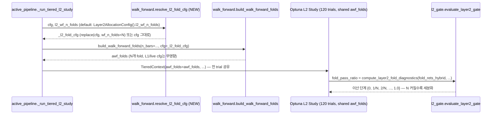

# 🎯 Goal & Architecture

- **Goal**: L2 walk-forward를 4-fold → L2 전용으로 분리된(configurable) fold 개수로 세분화해, `fold_pass_ratio`(현재 {0,25,50,75,100%} 5개 값만 가능한 이산 지표)가 단일 노이즈성 fold 하나로 25%p씩 요동치는 취약성을 줄인다. L1/live 실행 등 `cfg.wf_n_folds`를 공유하는 다른 소비처에는 전혀 영향을 주지 않는 방식으로 분리한다.

- **선행 spec과의 관계**: `ADR_20260718_L2_DEPLOYMENT_MARGIN_CAGR_GATE`(margin decouple/searchable화)를 구현·재검증한 결과, CAGR 게이트는 여전히 BLOCKED(재실행: CAGR 13.3%, MDD 9.4% — 오히려 레버리지를 거의 안 쓴 국소해로 수렴)였고 `[L2-SELECTION] feasible trials 없음 → fallback`이 margin 수정 전/후 **동일하게 재현**됐다. 두 번의 독립적인(서로 다른 파라미터 국소해를 가진) production 재실행에서 **`fold_pass_ratio`가 공통적으로 50%(2/4)에 고정**되고, 특히 **2025-05-30~2025-08-09 구간(Fold #2)은 두 실행 모두에서 실패**했다 — margin 튜닝으로는 우회 불가능한, 별개의 구조적 병목이 있다는 뜻. 이번 spec은 그 병목(fold 측정의 이산성/취약성)을 근본적으로 다룬다.

- **근거 (실측, 코드 확인)**:
  - `compute_layer2_fold_diagnostics`(risk_deployment.py:475)의 fold "pass" 판정은 `deployed.cagr > 0.0`인 **엄격한 이진 판정**이다. 최신 재실행의 Fold #4(2025-10-20~2025-12-30)는 CAGR=**-0.0%**(사실상 노이즈 수준의 근소한 미달)로 실패 처리됐다 — 이 한 fold가 뒤집히면 `fold_pass_ratio`가 75%(gate 통과)에서 50%(gate 실패)로 25%p 급변한다.
  - `wf_n_folds=4`(`CandidateStrategyConfig`, config.py:513)는 **L1(`build_l1_swf_folds`는 별도 함수라 무관하지만, `active_pipeline.py:1548`의 `build_walk_forward_folds(cfg=cfg)`는 live 실행 경로·ablation 스크립트·`strategy_runtime/bridge.py`와 동일 `cfg` 객체를 공유**한다 — 전역 기본값을 직접 올리면 L2뿐 아니라 이 소비처들에 의도치 않은 영향이 퍼진다(회귀 리스크).
  - 과거(margin-fix 이전) 200-trial reference study 재쿼리: `cagr_hybrid>=30%`를 만족하는 trial은 예외 없이 `fold_pass_ratio>=60%`도 동시에 만족했다(12~20/200 전부 일치) — 즉 "좋은" 파라미터 조합은 fold도 자연히 통과하는 경우가 많음에도, **production 재실행(n=120)에서는 두 번 다 그런 조합을 못 찾고 fallback**했다. 이는 fold 측정의 이산성이 이미 좁은 joint-feasible 영역을 실질적으로 더 좁혀(운 나쁜 champion을 무작위로 탈락시켜) 검색을 어렵게 만들고 있다는 정황.
  - `build_walk_forward_folds`(walk_forward.py:186)의 fold 분할 로직은 `oos_len // n_folds`로 fold 개수에 대해 이미 일반화되어 있다 — n_folds를 늘리는 데 walk_forward.py 자체의 로직 변경은 불필요, 순수 설정값 문제.

- **Alternatives & Trade-offs**:
  1. **[선택] L2 전용 `l2_wf_n_folds` 필드 신설, 특정 호출부에서만 `dataclasses.replace(cfg, wf_n_folds=...)`로 국소 override.** L1/live/ablation 등 다른 소비처의 `cfg.wf_n_folds`는 전혀 건드리지 않음 — 이전 spec의 margin decouple과 동일한 안전 패턴(공유 필드를 관심사별로 분리) 재사용.
  2. **[기각] `CandidateStrategyConfig.wf_n_folds`의 전역 기본값을 직접 상향.** live 실행 경로(`active_pipeline.py`가 실거래에도 쓰이는 함수라면) 및 ablation 스크립트까지 영향 범위가 퍼져 회귀 리스크가 통제 불가능. Directory Isolation 밖의 다른 팀 코드를 건드리지 않는다는 원칙에도 위배.
  3. **[기각] fold pass 기준값 자체를 완화(예: `cagr > -0.01`).** 게이트를 통과시키기 위해 임의의 tolerance band를 발명하는 것은 quant.md #1(anti-overfitting/curve-fitting 금지)에 정면으로 위배 — "통과 기준을 낮추는" 것과 "측정을 더 세밀하게 하는" 것은 다르다. 세분화(옵션1)는 판정 기준을 그대로 두고 표본 수만 늘리는 것이라 통계적으로 더 정당하다.
  4. **[기각] Optuna 탐색공간에 `l2_wf_n_folds`를 편입.** fold 구조는 모든 trial이 동일하게 공유해야 공정한 비교가 가능(현재 아키텍처가 `awf_folds`를 study 전체에서 1회만 빌드해 재사용하는 이유이기도 함, `ADR_20260718_L2_PHASE_PERF_OPTIMIZATION`의 캐싱 설계와도 정합). trial마다 fold가 달라지면 캐시 무효화 비용이 trial 수만큼 증가하고, walk-forward 비교의 fairness 자체가 깨진다.
  5. **[후속 과제, 스코프 외] L1 신호의 비-추세 다양화.** memory 기록(`project_metrics_cache_never_materialized_2026_07_02`)상 이미 economic replay로 반증되어 기각된 경로 — 재시도하지 않음.

- **Mermaid Diagram**:


# ⚡ Performance & Resource Budget

- **Complexity**: `build_walk_forward_folds`는 이미 `n_folds`에 대해 O(n_folds) 순회 — fold 개수를 늘려도 알고리즘 복잡도 등급 불변, walk_forward.py 로직 변경 없음(순수 설정 전달).
- **[PERF-01]** fold 개수 증가는 fold당 OOS 구간이 짧아지는 트레이드오프를 수반 — purge/embargo bar 수(`resolve_purge_and_embargo_bars`, holding horizon 기반 고정값)가 fold당 상대적으로 더 큰 비중을 차지하게 된다. 예: 현재 fold당 ~213 bars(8h, 71일) → 8-fold면 ~105 bars/fold로 절반, purge/embargo가 각 fold 경계마다 반복 소모되므로 유효 OOS bar 비율이 감소. `[LIMIT-02]`로 하한(최소 fold당 유효 OOS bar 수)을 명시한다.
- **[PERF-02]** `awf_folds`는 study 전체에서 1회만 빌드되어 모든 trial이 공유(`ADR_20260718_L2_PHASE_PERF_OPTIMIZATION` 캐싱 설계 그대로 유지) — fold 개수를 늘려도 per-trial 비용은 증가하지 않음. 다만 fold 수가 늘면 `evaluate_l2_trial`이 fold별로 반복하는 루프(`compute_layer2_fold_diagnostics`, `_run_awf_simulation`의 fold attribution 등)의 상수 비용이 fold 수에 비례해 소폭 증가 — trial당 이미 관측된 ~1.5s/trial 대비 큰 증가는 예상되지 않으나(O(n_folds) 선형이고 fold당 데이터는 줄어듦), Measurement Plan에서 wall-time 회귀 여부(15% 룰, `performance.md` §4)를 반드시 확인한다.
- GPU/VRAM 영향 없음.

# ⚙️ Logical Rules, State Machine & Resilience

- **[LIMIT-01] L1/live 경로 완전 비영향 불변식**: `l2_wf_n_folds` override는 오직 `active_pipeline._run_tiered_l2_study` 내부의 L2 fold 빌드 호출 1곳에서만 적용된다. `cfg` 원본 객체는 `dataclasses.replace`로 파생된 **새 객체**를 지역 변수(`_l2_fold_cfg`)에만 대입하고, 원본 `cfg`는 함수 내 다른 모든 용도(L1 관련 호출, signal_batch 예측 등)에 그대로 사용된다. `build_l1_swf_folds`는애초에 `cfg` 파라미터를 받지 않으므로(별도 `n_folds` 인자) 이 변경과 무관 — 회귀 불가능함을 코드 구조로 보장.
- **[LIMIT-02] fold당 최소 유효 OOS bar 수 하한**: `l2_wf_n_folds`를 과도하게 늘리면 fold당 OOS 구간이 purge/embargo 대비 지나치게 짧아져 개별 fold의 CAGR/Sharpe 추정치 자체가 통계적으로 무의미해질 수 있다(측정 세분화가 오히려 개별 fold의 노이즈를 늘리는 역효과). `Layer2AllocationConfig.from_mapping`에서 `l2_wf_n_folds`를 `>= 2`로만 검증하고, 실제 fold당 bar 수 하한은 **탐색이 아닌 Measurement Plan(아래)에서 실측**으로 정한다 — 이론값을 임의로 하드코딩하지 않는다(quant.md #1: 근거 없는 매직넘버 금지).
- **[LIMIT-03] `awf_folds` 명시적 override 우선순위 확인**: `TieredContext.awf_folds`가 이미 채워져 있으면(`active_pipeline.py`의 정상 경로) `workflow.py`의 `_resolve_l2_signal_batch_and_folds`/`ctx.cfg` 기반 fallback 빌드는 트리거되지 않는다(`ctx.awf_folds or build_walk_forward_folds(...)` short-circuit). 따라서 이번 spec은 **오직 `active_pipeline.py:1548`(유일한 실질 진입점)만 수정**하면 충분 — `workflow.py`/`pipeline.py`의 fallback 경로는 건드리지 않는다(불필요한 중복 변경 방지, Focused Changes 원칙).
- **Resilience**: `l2_wf_n_folds=None`(기본, `_run_tiered_l2_study` 파라미터) → `Layer2AllocationConfig().l2_wf_n_folds`(기본값 4, 현재 동작과 완전 동일)로 폴백 → `resolve_l2_fold_cfg`가 `cfg.wf_n_folds`와 값이 같으면 원본 `cfg` 그대로 반환(불필요한 객체 생성 없음) — 하위호환 100%, 기존 어떤 호출부도 수정 없이 그대로 동작.

## 📐 Measurement Plan (구현 후 필수 검증)

이 spec은 "N을 늘리면 도움이 될 것"이라는 가설에 기반한다 — 구현 자체는 안전(no-op 기본값)하지만, 효과 여부는 **실측 없이는 알 수 없다**. 아래를 반드시 실행한다.

| 실험 | 설정 | 확인 지표 |
| :--- | :--- | :--- |
| Baseline | `l2_wf_n_folds=4`(현재) | `fold_pass_ratio` 분포, gate-pass 여부, wall-time |
| 세분화 A | `l2_wf_n_folds=6` | 동일 seed=42, n_trials=120 재실행 — fold당 유효 bar 수, `fold_pass_ratio` 분포 변화 |
| 세분화 B | `l2_wf_n_folds=8` | 동일 — Fold #2 구간(2025-05-30~2025-08-09)이 세분화됐을 때 그 안에서도 전 구간이 손실인지, 일부 구간만 나쁜지 직접 확인(가설: "나쁜 하위 구간"만 국소적으로 존재한다면 세분화가 효과적) |
| Perf 회귀 | 각 설정 | wall-time이 baseline 대비 15% 이상 증가하면 `performance.md` §4 기준으로 즉시 중단·최적화 |

**판정 기준**: (a) `fold_pass_ratio`가 세분화 후에도 여전히 낮은 이산값에 몰려 있다면(예: 4/8=50%가 반복) → 가설 기각, 근본원인이 fold 세분화가 아니라 L1 신호 자체의 시기별 불안정성 문제로 재진단 필요. (b) 세분화 후 fold-pass ratio가 완만하게 분포하고 champion 선정 성공률(feasible/gate-pass trial 수)이 개선되면 → 채택, 기본값을 baseline보다 높은 값으로 전환 검토.

# 🔌 Integration & Connection Plan

| # | Target Location | Anchor | State Impact | Data Schema Diff |
|---|---|---|---|---|
| 1 | `src/domain/futures/strategy/walk_forward.py` | 모듈 상단 import(`from dataclasses import dataclass` → `dataclass, replace` 추가), `build_walk_forward_folds`/`build_l2_simulation_folds` 함수 인접에 신규 함수 추가 | Immutable (pure function) | `+def resolve_l2_fold_cfg(cfg: CandidateStrategyConfig, l2_wf_n_folds: int \| None) -> CandidateStrategyConfig` |
| 2 | `src/domain/futures/strategy/tiered_workflow/dataclasses.py` > `Layer2AllocationConfig` | 필드 선언부(`l2_deploy_crisis_mdd_margin` 등 D3 섹션 인접), `from_mapping` | Immutable (frozen dataclass 필드 추가) | `+l2_wf_n_folds: int = 4` (기본값 = 현재 전역 `CandidateStrategyConfig.wf_n_folds`와 동일, no-op). `from_mapping`에 `>= 2` 검증 추가(기존 `l2_deploy_mdd_margin` range-check 패턴과 동일 스타일) |
| 3 | `src/application/futures/runner/active_pipeline.py` > `_run_tiered_l2_study` | 함수 시그니처(신규 kwarg 추가) 및 L2 fold 빌드 호출부(`_awf_all = build_walk_forward_folds(n_bars=_ho_start_idx, cfg=cfg)`, 함수 내부 라인) | Mutable (awf_folds 산출값이 이후 전체 study의 fold 구조를 결정 — 기존과 동일한 side-effect 클래스, 다만 이제 override 가능) | `+l2_wf_n_folds: int \| None = None` 파라미터. 호출부를 `_l2_fold_cfg = resolve_l2_fold_cfg(cfg, l2_wf_n_folds if l2_wf_n_folds is not None else Layer2AllocationConfig().l2_wf_n_folds); _awf_all = build_walk_forward_folds(n_bars=_ho_start_idx, cfg=_l2_fold_cfg)`로 교체. **`cfg` 자체는 함수 내 다른 용도로 원본 그대로 재사용** — 이 한 곳만 `_l2_fold_cfg`로 치환 |
| **Error Behavior** | 전 항목 | — | `Propagate` — `l2_wf_n_folds < 2`는 `Layer2AllocationConfig.from_mapping`에서 기존 패턴과 동일하게 `ValueError` 전파. `resolve_l2_fold_cfg`는 순수 함수로 예외를 던지지 않음(값 동일 시 원본 반환, 다를 시 `dataclasses.replace` — `CandidateStrategyConfig`가 `frozen=True`이므로 `replace` 실패 케이스 없음). |

# ✍️ Contract Changes

```python
# src/domain/futures/strategy/walk_forward.py
from __future__ import annotations

import itertools
from dataclasses import dataclass, replace  # replace 추가
from typing import TYPE_CHECKING, Literal, cast
...

def resolve_l2_fold_cfg(
    cfg: CandidateStrategyConfig,
    l2_wf_n_folds: int | None,
) -> CandidateStrategyConfig:
    """L2 전용 walk-forward fold 개수 override.

    L1(`build_l1_swf_folds`, cfg 미의존)·live 실행·ablation 등 `cfg.wf_n_folds`를
    공유하는 다른 소비처는 이 함수를 거치지 않으므로 영향받지 않는다.
    l2_wf_n_folds가 None이거나 cfg.wf_n_folds와 동일하면 cfg를 그대로 반환한다
    (불필요한 객체 생성 방지, 완전한 하위호환).
    """
    if l2_wf_n_folds is None or int(l2_wf_n_folds) == int(cfg.wf_n_folds):
        return cfg
    if int(l2_wf_n_folds) < 2:
        raise ValueError(f"l2_wf_n_folds must be >= 2, got {l2_wf_n_folds}")
    return replace(cfg, wf_n_folds=int(l2_wf_n_folds))
```

```python
# src/domain/futures/strategy/tiered_workflow/dataclasses.py (Layer2AllocationConfig, 필드 추가)
l2_wf_n_folds: int = 4

# from_mapping(...) 내부, 기존 l2_deploy_mdd_margin 검증 패턴과 동일하게:
_l2_wf_n_folds = cls._as_int(params.get("l2_wf_n_folds", _dc.l2_wf_n_folds), _dc.l2_wf_n_folds)
if _l2_wf_n_folds < 2:
    raise ValueError(f"l2_wf_n_folds must be >= 2, got {_l2_wf_n_folds}")
# cls(...) 생성 인자에 추가:
l2_wf_n_folds=_l2_wf_n_folds,
```

```python
# src/application/futures/runner/active_pipeline.py (_run_tiered_l2_study, 발췌)
def _run_tiered_l2_study(
    *,
    signal_batch: Any,
    aligned: Any,
    cfg: Any,
    window: Any,
    caps: Any,
    tf: str,
    n_trials: int,
    seed: int,
    l2_sim_cache: Any = None,
    crisis_rets: NDArray[np.float64] | None = None,
    crisis_replay_ctx: Any | None = None,
    l2_wf_n_folds: int | None = None,  # NEW
) -> Any:
    """Optuna objective_l2_growth로 best l2_params 탐색."""
    ...
    from src.domain.futures.strategy.tiered_workflow.dataclasses import Layer2AllocationConfig
    from src.domain.futures.strategy.walk_forward import build_walk_forward_folds, resolve_l2_fold_cfg

    ...
    _ho_ts = pd.Timestamp(window.holdout_start).tz_localize(None)
    _ho_start_idx = int(np.searchsorted(aligned.datetimes, np.datetime64(_ho_ts, "ns")))
    _effective_n_folds = l2_wf_n_folds if l2_wf_n_folds is not None else Layer2AllocationConfig().l2_wf_n_folds
    _l2_fold_cfg = resolve_l2_fold_cfg(cfg, _effective_n_folds)
    _awf_all = build_walk_forward_folds(n_bars=_ho_start_idx, cfg=_l2_fold_cfg)
    # 이하 기존 로직 그대로 (cfg가 아닌 _l2_fold_cfg를 쓴 것은 이 한 줄뿐)
```

# 🧪 TDD Test Scenario Matrix

- **Scenario 1 (Happy Path)**:
  - `test_resolve_l2_fold_cfg_overrides_wf_n_folds_only`: `cfg=CandidateStrategyConfig(wf_n_folds=4, ...)`에 `l2_wf_n_folds=8`로 호출 → 반환 객체의 `wf_n_folds==8`, 그 외 모든 필드는 원본 `cfg`와 동일(`dataclasses.asdict` 비교 또는 `replace` 자체가 나머지 필드 불변임을 신뢰).
  - `test_layer2_allocation_config_from_mapping_reads_l2_wf_n_folds`: `params={"l2_wf_n_folds": 6}`로 `from_mapping` 호출 → `config.l2_wf_n_folds == 6`.
  - `test_run_tiered_l2_study_uses_override_fold_cfg_not_original_cfg`: `_run_tiered_l2_study(..., l2_wf_n_folds=8)` 호출 시(내부 `build_walk_forward_folds`를 mock/spy) `cfg=` 인자로 전달된 객체의 `wf_n_folds==8`이고, **원본 `cfg` 객체 자체는 변경되지 않았음**(`is not` 비교로 새 객체임을 확인)을 검증.
- **Scenario 2 (Edge Cases)**: `[LIMIT-01]`/`[LIMIT-02]`
  - `test_resolve_l2_fold_cfg_returns_original_when_none`: `l2_wf_n_folds=None` → 반환값이 `cfg`와 **동일 객체(`is` 비교)** — 불필요한 복사 없음.
  - `test_resolve_l2_fold_cfg_returns_original_when_equal`: `l2_wf_n_folds=cfg.wf_n_folds`(동일값) → 마찬가지로 원본 객체 그대로 반환.
  - `test_build_l1_swf_folds_unaffected_by_l2_override`: `resolve_l2_fold_cfg`로 생성한 override cfg가 `build_l1_swf_folds` 호출부(별도 `n_folds` 인자를 받는 함수)에 전혀 전달되지 않음을 코드 경로 확인(정적 검증 성격의 회귀 가드 — `_run_tiered_l2_study` 내에서 `build_l1_swf_folds` 호출이 없음을 assert, 또는 L1 관련 호출부가 여전히 원본 `cfg`를 참조함을 mock spy로 확인).
- **Scenario 3 (Error Handling)**:
  - `test_resolve_l2_fold_cfg_rejects_n_folds_below_two`: `l2_wf_n_folds=1` → `ValueError` (`match="l2_wf_n_folds must be >= 2"`).
  - `test_layer2_allocation_config_from_mapping_rejects_l2_wf_n_folds_below_two`: `params={"l2_wf_n_folds": 0}` → `ValueError`.
  - `test_layer2_allocation_config_from_mapping_legacy_params_without_l2_wf_n_folds_uses_default`: 신규 키 없는 구버전 `params` dict → 예외 없이 `l2_wf_n_folds==4`(기본값)로 복원(하위호환).
- **Scenario 4 (Integration Verification)**:
  - `test_run_tiered_l2_study_defaults_to_layer2_allocation_config_value`: `l2_wf_n_folds=None`(미지정) 호출 시 `build_walk_forward_folds`에 전달되는 `cfg.wf_n_folds`가 `Layer2AllocationConfig().l2_wf_n_folds`(기본 4)와 일치함을 검증 — 기존 프로덕션 경로가 수정 없이 동일 동작함을 보장하는 회귀 테스트.
  - `test_run_tiered_l2_study_wall_time_within_perf_budget`(수동/스크립트 성격, pytest 마킹은 `@pytest.mark.slow` 등으로 격리): `l2_wf_n_folds=8`로 실제(또는 축소 규모) 실행 시 wall-time이 baseline 대비 15% 이내임을 확인 — Measurement Plan의 Perf 회귀 항목과 연결.

- **Mock & Integration Boilerplate**:
```python
# tests/unit/domain/futures/strategy/test_walk_forward.py (발췌, 신규 또는 기존 파일에 추가)
def test_resolve_l2_fold_cfg_overrides_wf_n_folds_only():
    # Arrange
    cfg = CandidateStrategyConfig(wf_n_folds=4)

    # Act
    overridden = resolve_l2_fold_cfg(cfg, 8)
    unchanged = resolve_l2_fold_cfg(cfg, None)

    # Assert
    assert overridden.wf_n_folds == 8
    assert overridden is not cfg
    assert unchanged is cfg


# tests/unit/application/futures/runner/test_active_pipeline.py (발췌)
def test_run_tiered_l2_study_uses_override_fold_cfg_not_original_cfg(mocker):
    # Arrange
    cfg = CandidateStrategyConfig(wf_n_folds=4)
    spy = mocker.patch(
        "src.application.futures.runner.active_pipeline.build_walk_forward_folds",
        return_value=(),
    )
    # ... 나머지 의존성 mock (signal_batch, aligned, window, caps 등)

    # Act
    _run_tiered_l2_study(..., cfg=cfg, l2_wf_n_folds=8)

    # Assert
    called_cfg = spy.call_args.kwargs["cfg"]
    assert called_cfg.wf_n_folds == 8
    assert cfg.wf_n_folds == 4  # 원본 불변
```

# 📎 관련 문서
- `docs/architecture/layer2.md` — Leverage Calibration(§2)은 이전 spec에서 갱신 완료. 이번 변경은 fold *측정* 방법론이라 아키텍처 수식에는 영향 없음 — §5 Configurable Parameters 표에 `l2_wf_n_folds` 1줄만 추가 검토(sync 단계).
- `docs/decisions/decisions.md` — `ADR_20260718_L2_DEPLOYMENT_MARGIN_CAGR_GATE`(margin decouple, 선행 구현) — 이번 spec이 그 재검증에서 발견한 잔여 병목(fold_pass_ratio 이산성)을 다룸.
- `.claude/rules/quant.md` §5 (Walk-forward & Validation Workflow) — fold 세분화는 이 섹션의 "표준 walk-forward"에 해당, Purged/Embargoed는 겹치는 홀딩 기간이 있는 ML 라벨링에만 필요(현재 L2는 비-ML 규칙기반 전략이라 §5 exemption 대상, 세분화가 새로운 leakage를 유발하지 않음).
