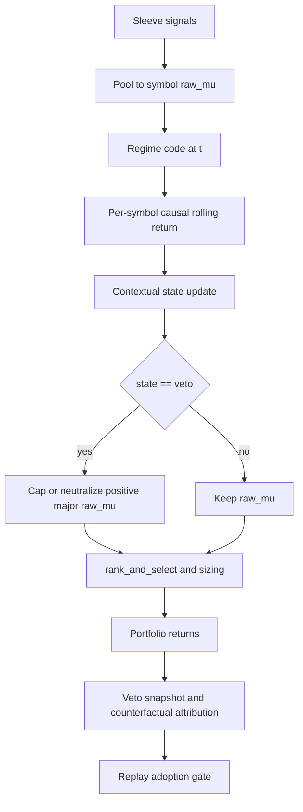
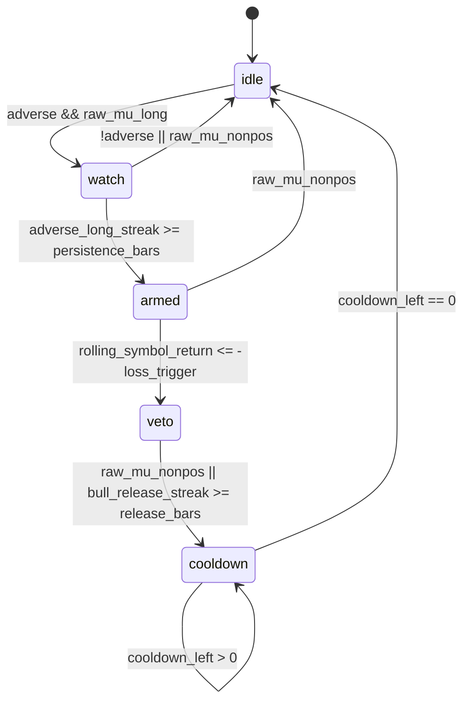

# 🎯 Goal
BTC/ETH holdout long 고착을 줄이되 fit/cal 정상 수익을 보존하기 위해, 단순 adverse-regime veto를 상태 기반 contextual major-long veto로 좁힌다.

# 🧩 Core Data Shapes

## Problem Evidence

| 구간 | 관측 | 의미 |
|---|---|---|
| fit/cal | BTC/ETH adverse regime 반응 lag 0.0~0.9bar, censored 0% | trend ensemble 자체가 구조적으로 느린 것은 아님 |
| holdout | BTC lag 144bar, ETH censored 100% | 대형주와 holdout 가격 패턴 조합에서만 long 고착 발생 |
| replay | L3 CAGR -17.1% -> -7.5%, MDD 26.8% -> 18.2% | major-long neutral은 방어 효과가 있음 |
| replay | L2 CAGR 24.2% -> 23.0%, blocker `fit_net_value_negative` | adverse regime만으로 veto하면 정상 long 수익을 훼손함 |

## `ContextualDirectionalVetoConfig`

| field | type | default | rule |
|---|---|---:|---|
| `enabled` | `bool` | `False` | production 기본 off |
| `symbols` | `tuple[str, ...]` | `("BTCUSDT", "ETHUSDT")` | upper + dedupe |
| `adverse_codes` | `tuple[int, ...]` | `(1, 2)` | compressed regime `1=bear`, `2=crisis` only |
| `long_eps_bps` | `float` | `0.0` | `raw_mu > eps * 1e-4`면 long intent |
| `persistence_bars` | `int` | `3` | adverse + long intent가 연속 관측되어야 arm |
| `loss_lookback_bars` | `int` | `18` | causal rolling symbol return window, 4h 기준 3일 |
| `loss_trigger_bps` | `float` | `150.0` | rolling realized return <= -threshold |
| `action` | `Literal["cap_mu", "zero_mu", "drop_long"]` | `"cap_mu"` | 첫 후보는 soft neutral |
| `cap_mu_bps` | `float` | `0.0` | `cap_mu`일 때 positive `raw_mu` 상한 |
| `release_raw_mu_nonpos` | `bool` | `True` | signal이 스스로 비우면 release |
| `release_regime_bull_bars` | `int` | `2` | bull regime 연속 관측 시 release |
| `cooldown_bars` | `int` | `3` | release 후 재진입 억제 |
| `max_fit_net_value_loss` | `float` | `0.0` | fit/cal net veto value 음수면 채택 금지 |
| `max_fit_false_positive_rate` | `float` | `0.50` | 기존 gate 유지 |
| `min_l3_total_return_delta` | `float` | `0.02` | holdout 개선 최소 폭 |
| `max_l2_cagr_delta_loss` | `float` | `0.005` | fit/cal CAGR 손상 상한 |

## `ContextualDirectionalVetoState`

| field | type | meaning |
|---|---|---|
| `symbol` | `str` | state key |
| `state` | `Literal["idle", "watch", "armed", "veto", "cooldown"]` | per-symbol finite state |
| `adverse_long_streak` | `int` | `regime in adverse_codes and raw_mu > eps` 연속 횟수 |
| `bull_release_streak` | `int` | release용 bull regime 연속 횟수 |
| `cooldown_left` | `int` | veto 해제 후 재발동 억제 |
| `rolling_symbol_return` | `float` | causal close return sum over `[t-loss_lookback, t)` |
| `entry_t` | `int | None` | current veto episode 시작 rebalance index |
| `last_action` | `Literal["none", "cap_mu", "zero_mu", "drop_long"]` | applied action |

## `ContextualDirectionalVetoSnapshot`

| field | type | meaning |
|---|---|---|
| `fold_idx` | `int` | AWF fold id |
| `t` | `int` | rebalance bar index |
| `symbol` | `str` | affected major symbol |
| `state_before` | `str` | pre-transition state |
| `state_after` | `str` | post-transition state |
| `regime_code` | `int` | compressed regime at `t` |
| `raw_mu_before` | `float` | pooled symbol signal before veto |
| `raw_mu_after` | `float` | signal after veto |
| `weight_after` | `float` | final portfolio weight after sizing |
| `rolling_symbol_return` | `float` | trigger context |
| `fired` | `bool` | action applied at `t` |
| `release_reason` | `str` | `raw_mu_nonpos`, `bull_regime`, `cooldown`, or empty |
| `counterfactual_long_return` | `float` | realized contribution if long had not been vetoed |
| `actual_symbol_return` | `float` | realized contribution after action |

## `ContextualDirectionalVetoSummary`

| field | type | formula |
|---|---|---|
| `symbol` | `str` | group key |
| `n_obs` | `int` | count snapshots |
| `n_watch` | `int` | state in watch/armed/veto |
| `n_fired` | `int` | fired count |
| `fire_rate` | `float` | `n_fired / max(n_obs, 1)` |
| `false_positive_rate` | `float` | `sum(fired and counterfactual_long_return >= 0) / max(n_fired, 1)` |
| `opportunity_cost` | `float` | `sum(max(counterfactual_long_return, 0) where fired)` |
| `avoided_loss` | `float` | `sum(max(-counterfactual_long_return, 0) where fired)` |
| `net_veto_value` | `float` | `avoided_loss - opportunity_cost` |
| `mean_trigger_loss` | `float` | mean `rolling_symbol_return` when fired |
| `mean_episode_bars` | `float` | average veto episode length |

# ⚙️ Algorithmic Rules & State Machine

## Data Flow

## State Transition

## Trigger Formula

At rebalance bar `t`, for each symbol `s`:

`long_intent_s,t = raw_mu_s,t > long_eps_bps * 1e-4`

`adverse_t = regime_code_t in adverse_codes`

`rolling_symbol_return_s,t = sum(close_return_s,u for u in [t - loss_lookback_bars, t))`

`arm_s,t = adverse_t and long_intent_s,t and adverse_long_streak_s,t >= persistence_bars`

`fire_s,t = arm_s,t and rolling_symbol_return_s,t <= -loss_trigger_bps * 1e-4`

The rolling return window must exclude bar `t -> t+1`. It is trigger context only, not label context.

## Action Rules

1. `cap_mu`: `raw_mu_after = min(raw_mu_before, cap_mu_bps * 1e-4)` when fired.
2. `zero_mu`: `raw_mu_after = 0.0` when fired.
3. `drop_long`: remove symbol from current candidate set when fired.
4. No action may flip a symbol short. This is a long neutralizer, not a short alpha.
5. State is updated per symbol before `rank_and_select`, but counterfactual return is measured after final sizing.

## Replay Variants

| variant | purpose |
|---|---|
| `baseline` | current production behavior |
| `veto_adverse_only` | existing spec, kept as control |
| `contextual_cap_mu` | preferred candidate, lower fit/cal damage |
| `contextual_zero_mu` | stronger neutral candidate |
| `contextual_crisis_only` | false-positive reduction by excluding bear |

## Adoption Gate

Candidate passes only if all conditions hold:

`baseline_parity == True`

`candidate.l2_cagr >= baseline.l2_cagr - max_l2_cagr_delta_loss`

`candidate.l2_average_gross_exposure / max(baseline.l2_average_gross_exposure, eps) >= min_gross_ratio`

`candidate.l2_turnover <= baseline.l2_turnover + max_turnover_delta`

`all(summary.net_veto_value >= -max_fit_net_value_loss for fired summaries in L2)`

`all(summary.false_positive_rate <= max_fit_false_positive_rate for fired summaries in L2)`

`candidate.l3_total_return >= baseline.l3_total_return + min_l3_total_return_delta`

`candidate.l3_mdd <= baseline.l3_mdd`

`candidate.l3_sharpe >= baseline.l3_sharpe`

Major long loss comparison must use negative realized contribution:

`major_long_loss = sum(max(-value, 0) for (symbol, value) in realized_price_long_by_symbol if symbol in symbols)`

The current positive-side sum is not a loss metric and must not be used for adoption.

# ⚠️ Constraints & Edge Cases

- Look-ahead: trigger uses only `raw_mu_t`, `regime_code_t`, and returns ending before `t`; realized `t -> t+1` returns are attribution only.
- Fold boundary: state resets at each AWF fold start; no carry across L2 folds or into L3 unless explicitly modeled by deployment state.
- Missing symbol: missing signal or non-tradeable symbol records snapshot with `was_missing=True`; state should decay to idle without firing.
- Regime source: compressed 3-state codes only; do not recompute regime inside veto logic.
- Fit/cal protection: L2 net veto value and false-positive rate are first-class adoption blockers; L3 improvement alone is insufficient.
- BNB control: BNB remains out of default treatment symbols and continues to be reported in major diagnostics.
- No forced short: negative `raw_mu` is left untouched; veto never creates short exposure.
- Turnover: `cap_mu` is preferred before `drop_long` because hard removal can increase churn and opportunity cost.
- Cost realism: counterfactual return must include funding and an allocated rebalance-cost estimate; otherwise false-positive and net value are biased.
- Numerical guard: all ratios use explicit denominator guards; no uninitialized `np.divide(where=...)` behavior.
- Runtime: per-symbol state is O(number of configured symbols) per rebalance and should stay outside numba kernels.
- CSV traceability: replay CSV must include per-symbol summary fields or a companion detail CSV; otherwise `fit_net_value_negative` cannot be audited after run completion.
