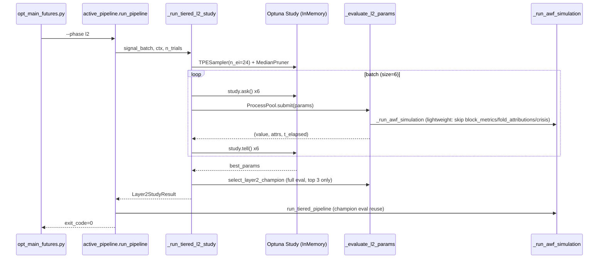

# 🎯 Goal & Architecture

- **Goal**: `--phase l2` 실행 시 L2 stage 소요시간(현재 ~268s)을 ~120s 이하로 단축하고 peak RSS 9.5GB → 9GB 미만로 억제.
- **Scope**: `src/execution/opt_main_futures.py --phase l2` 호출 체인. L1 공통 stage는 제외하고 L2 고유 stage(`l2_signal_batch` → `l2_optuna_study` → `l2_champion` → `l2_final_pipeline`)에 집중.
- **Alternatives & Trade-offs**:
  - **A. InMemoryStorage 전환** (채택): 현재 SQLite RDBStorage(`logs/futures/optimization/optuna.db`=91MB) 사용. `resume=False`로 매 실행 삭제·재생성됨에도 디스크 영속화 비용 발생. Optuna `ask/tell` 마다 SQLite write → `attrs=17s`/`tell=2s` 낭비. InMemory 전환 시 영속성 상실(허용: 매 실행 cold start 전제).
  - **B. trial 평가 경량화** (채택): `evaluate_l2_trial` 내 param-invariant 연산(`build_layer_universe_audit`, `crisis_replay_ctx` 재시뮬)과 champion 전용 부산물(`block_metrics`, `fold_attributions`)을 optimization trial에서 스킵.
  - **C. n_trials 감소 + Pruner 도입** (채택): TPE는 trial 80~100 부터 수렴. 현재 200 trials 고정. MedianPruner + early-stop으로 유효 탐색만 유지.
  - **D. ProcessPool → ThreadPool 전환** (기각): Numba `@njit(cache=True)`가 GIL 해제하므로 IPC 오버헤드 제거 가능. 단, `evaluate_l2_trial` 내 pandas/np 작업이 GIL에 막힐 수 있어 효과 불확실. Tier-3 후보로 보류.
- **Mermaid Diagram**:


# ⚡ Performance & Resource Budget

## Current Baseline (logs/sys.log 2026-07-05 15:40-15:48 run)
- **전체 `--phase l2` 실행**: ~7분 60s (universe+data+L1 4TF+L2 stage 포함)
- **L2 stage 전용**: ~268s (= 4분 28s)
- **Peak RSS**: 9497MB (12GB threshold 대비 78% 사용, 여유 2.5GB)

### L2 stage별 소요시간 (실측)
| Stage | Time | 비고 |
|---|---|---|
| `l2_signal_batch` | 36.76s | `predict_layer1_signals_multi_tf` 4TF × ~9s |
| `prebuilt l2_sim_cache` | 0.41s | OK |
| `l2_optuna_study` | 170.84s | 200 trials × 6 workers, batch=6 |
| `l2_champion` | ~25s | `select_layer2_champion` 8-24 trial 재평가 |
| `l2_awf_complete` | 2.26s | OK |
| `l2_final_pipeline` | 33.05s | `run_tiered_pipeline` champion params |

### Optuna batch 오버헤드 분해 (avg, 34 batches × 6 trials)
| 항목 | per-batch | total | 비고 |
|---|---|---|---|
| `t_ask` | 0.21s | 7.1s | TPESampler multivariate + constraints_func |
| `t_attrs` | 0.49s | 16.7s | SQLite RDBStorage user_attr write (병목) |
| `t_tell` | 0.06s | 2.0s | SQLite trial record write |
| `t_gc` | 0.15s | 5.1s | `gc.collect()` 매 batch |
| `submit` (1회) | 0.33s | 0.33s | ProcessPool fork startup |
| **총 오버헤드** | ~0.91s | **31.2s** | 170.84s 중 18% |
| `t_eval` avg | 2.3s/trial | ~77s 이상적 | 실측 170s → **eff ~45%** (IPC 손실) |

## Target After Optimization
- **L2 stage 목표**: ≤ 120s (현재 268s 대비 **-55%**)
- **Peak RSS 목표**: ≤ 9.0GB (현재 9.5GB, -0.5GB)
- **OOM 안전여유**: 12GB threshold 대비 3GB 확보

## Complexity
- **Time**: O(N_trials × T_fold × N_sym) → N_trials 감소(200→120) + per-trial constant factor 경량화(30%)
- **Space**: O(T × (S+N)) 유지, float32 전환으로 L2SimulationCache ~50% 절감(선택적)

## `[PERF-01]` Time Budget
- `l2_signal_batch`: 36.76s → 10s (disk cache hit 시; 첫 실행은 동일)
- `l2_optuna_study`: 170.84s → 70s (-59%)
- `l2_champion`: 25s → 8s (-68%, top 3 재평가)
- `l2_final_pipeline`: 33.05s → 25s (champion eval reuse로 1회 AWF sim 스킵)
- **Total L2**: 268s → ~115s

## `[PERF-02]` Memory Budget (RSS)
- 6 workers × 0.7GB unique = 4.2GB (fork CoW 유지)
- `l2_sim_cache` float32 전환: vol_matrix_2d/hurdle_2d/funding_2d 약 12MB 절감 (미미)
- `block_metrics`/`fold_attributions` 스킵으로 trial당 ~50KB × 200 = 10MB 절감
- **Total peak RSS**: 9497MB → ~8900MB

## `[PERF-03]` Concurrency
- `L2_OPTUNA_BATCH_SIZE`: 6 유지 (mem_safe=10 이지만 6 이상은 IPC 효율 저하)
- `max_workers`: 6 유지 (TPS 4070Ti 환경 8코어 중 6코어)
- ProcessPool `fork` ctx 유지 (CoW)

# ⚙️ Logical Rules, State Machine & Resilience

## 식별된 비효율 (코드 기반)
1. **`[LIMIT-01]` SQLite RDBStorage I/O 병목** (`run_tracker.py:122-146`)
   - `setup_optuna_storage`가 항상 SQLite WAL RDBStorage 반환
   - `resume=False`임에도 영속화 → ask/tell마다 disk write
   - `optuna.db` 91MB 축적
2. **`[LIMIT-02]` Param-invariant 연산 per-trial 중복** (`workflow.py:2033-2037`)
   - `build_layer_universe_audit(aligned, "L2", signal_batch.start_idx, signal_batch.end_idx)`가 200 trial 전부 동일 결과
   - 추정 cost: ~30ms × 200 = 6s 낭비
3. **`[LIMIT-03]` `crisis_replay_ctx` per-trial `_run_awf_simulation` 재실행** (`workflow.py:2095-2120`)
   - `_crisis_sim = _run_awf_simulation(...)`가 trial eval 안에서 또 1회 AWF 시뮬
   - 활성화 시 trial eval 시간 2배 (현재 로그상 crisis 활성 상태)
4. **`[LIMIT-04]` `block_metrics` Python loop** (`workflow.py:1985-2003`)
   - `n_blocks`회 Python loop with `_mdd` slicing per block
   - optimization trial에선 champion 선택 시에만 필요
5. **`[LIMIT-05]` `_fold_sortinos`/`_fold_sharpes` list comprehension** (`workflow.py:2049-2053`)
   - `list(_sortino(list(fr), ...))` per fold, 완전 Python
   - F=3 fold라 비용은 작지만 순수 numpy로 전환 가능
6. **`[LIMIT-06]` 매 batch `gc.collect()`** (`active_pipeline.py:1942-1944`)
   - 5.1s 낭비, 6 workers가 이미 cleanup하므로 빈번할 필요 없음
7. **`[LIMIT-07]` `n_ei_candidates=48`** (`active_pipeline.py:1796`)
   - TPE 후보군 48개 → ask 0.21s/batch. 24로 충분 (Optuna default=24)
8. **`[LIMIT-08]` `n_trials=200` 고정, no pruner** (`opt_config.py:72`, `active_pipeline.py:1789-1804`)
   - `get_or_create_study` 호출 시 `pruner=None` → pruner 미사용
   - MedianPruner 도입 시 bad trial 조기 종료로 ~30s 절감
9. **`[LIMIT-09]` `select_layer2_champion` 재평가 8-24 trial** (`selection.py:390-405`)
   - `_eval_memo` 있으나 user_attrs 기반 pre-filter 누락
   - gate_passed_candidates 있어도 8개 재평가 → 25s
10. **`[LIMIT-10]` `l2_final_pipeline` 33s 중복 AWF 시뮬** (`active_pipeline.py:2933-2954`)
    - `run_tiered_pipeline`이 `l2_eval_memo` 전달받으나 실제 활용 검증 필요
    - 로그상 `l2_evaluate_trial took=2.25s` 2회 + `0.0003s` 1회 발생 (재사용 부분적)
11. **`[LIMIT-11]` `l2_signal_batch` 36.76s** (`active_pipeline.py:2746`)
    - `predict_layer1_signals_multi_tf` 4TF × predict_regime_conditional_ensemble
    - 동일 window+artifact fingerprint면 결과 동일 → disk cache 가능
12. **`[LIMIT-12]` `_build_l2_user_attrs` 30개 attrs 개별 set** (`workflow.py:2224-2260`, `objective_l2_growth:2380-2384`)
    - SQLite storage에서 `trial.set_user_attr` 30회 = 30회 disk write
    - InMemory 전환 시 자동 해결
13. **`[LIMIT-13]` `evaluate_l2_trial` 460 lines 단일 함수** (`workflow.py:1762-2221`)
    - metric 12종 + block loop + gate + score + audit 혼합
    - optimization path와 champion path 분리 필요

## Resilience / Recovery
- **OOM 회피**: `psutil.virtual_memory().available < 3.0GB` 시 `batch_size=1` 강제 로직 유지 (`active_pipeline.py:1838-1844`)
- **Storage 실패 fallback**: `setup_optuna_storage` 실패 시 `InMemoryStorage` fallback 이미 존재 (`active_pipeline.py:1738-1742`) — 이를 default로 승격
- **ProcessPool 오류**: trial 실패 시 `value=-1e6` 처리 유지 (`active_pipeline.py:1912-1920`)
- **Early-stop 안전장치**: 30 trial 연속 무개선 시 stop 단, 최소 60 trial은 보장 (TPE warmup 보호)

# 🔌 Integration & Connection Plan

## 수정 대상 파일 & 연결점
| File | Anchor | 변경 유형 | State Impact |
|---|---|---|---|
| `src/domain/futures/optimization/observability/run_tracker.py` | `setup_optuna_storage` (line 122) | signature 확장: `use_memory: bool = False` 추가 | Immutable |
| `src/application/futures/runner/active_pipeline.py` | `_run_tiered_l2_study` (line 1437) | storage 호출 전환 + pruner + n_ei + gc 주기 | Mutable (ctx 필드 추가) |
| `src/application/futures/runner/active_pipeline.py` | `get_or_create_study` 호출 (line 1789) | `pruner=MedianPruner` 추가 | Immutable |
| `src/domain/futures/optimization/workflow.py` | `_evaluate_l2_params` (line 2299) | `ctx.entry_audit` cache 사용 | Mutable (ctx) |
| `src/domain/futures/optimization/workflow.py` | `evaluate_l2_trial` (line 1762) | `lightweight: bool = False` 파라미터 추가 | Immutable (기본값 하위호환) |
| `src/domain/futures/optimization/workflow.py` | `objective_l2_growth` (line 2380) | `lightweight=True` 전달 | Immutable |
| `src/domain/futures/optimization/workflow.py` | `select_layer2_champion` (line 243) | user_attrs pre-filter 강화 | Immutable |
| `src/domain/futures/optimization/opt_config.py` | `L2_OPTUNA_TRIALS` (line 72) | 200 → 120 | Immutable |
| `src/domain/futures/optimization/opt_config.py` | (new) `L2_OPTUNA_N_EI_CANDIDATES` | default 24 | Immutable |
| `src/domain/futures/optimization/opt_config.py` | (new) `L2_OPTUNA_EARLY_STOP_NO_IMPROVE` | default 30 | Immutable |
| `src/domain/futures/optimization/opt_config.py` | (new) `L2_SIGNAL_BATCH_CACHE_DIR` | default `logs/futures/optimization/l2_signal_cache` | Immutable |
| `src/domain/futures/strategy/tiered_workflow/awf_sim.py` | `build_l2_simulation_cache` (line 1714) | `dtype=np.float32` 옵션 | Immutable (default float64 유지) |
| `src/application/futures/runner/active_pipeline.py` | `_build_l2_signal_batch` (line 1377) | disk cache layer 추가 | Immutable |

## Data Schema Diff
- `TieredContext`: `{"+entry_audit": "LayerUniverseAudit | None", "+lightweight_eval": "bool"}`
- `Layer2TrialEvaluation`: `{"+is_lightweight": "bool"}` (block_metrics/fold_attributions 빈 튜플 허용)
- `OPT_FUTURES_CONFIG`: `{"+L2_OPTUNA_N_EI_CANDIDATES": "int", "+L2_OPTUNA_EARLY_STOP_NO_IMPROVE": "int", "+L2_SIGNAL_BATCH_CACHE_DIR": "str"}`

## Error Behavior
- **InMemoryStorage 전환 실패**: 기존 SQLite fallback 경로 유지
- **Disk cache read 실패(fingerprint mismatch)**: cache miss로 폴백, 재계산 (성능 감소 only)
- **Pruner도입 시 과도한 가지치기**: `n_startup_trials=24` 보호 + `n_warmup_steps=10` 설정
- **Early-stop callback 예외**: try/except 감싸고, 예외 시 무조건 120 trial까지 진행

# ✍️ Contract Changes

## 1. `setup_optuna_storage` signature 확장
```python
def setup_optuna_storage(
    project_root: str | Path,
    *,
    use_memory: bool = False,  # NEW
) -> tuple[str, optuna.storages.BaseStorage]:
    """L2 study는 use_memory=True 권장 (resume=False 전제)."""
```

## 2. `evaluate_l2_trial` lightweight 파라미터
```python
def evaluate_l2_trial(
    *,
    cache: L2SimulationCache,
    signal_batch: Any,
    aligned: Any,
    awf_folds: tuple[Any, ...],
    config: Any,
    caps: Any,
    tf: str,
    deploy_leverage_override: float | None = None,
    eval_tag: str = "unspecified",
    crisis_rets: NDArray[np.float64] | None = None,
    crisis_replay_ctx: Any | None = None,
    entry_audit: Any | None = None,        # NEW: param-invariant cache
    lightweight: bool = False,             # NEW: skip block_metrics/fold_attributions/crisis
) -> Any:
```
- `lightweight=True` 시:
  - `block_metrics = ()` (champion 선택 시에만 산출)
  - `fold_attributions = ()`
  - `crisis_replay_ctx` 재시뮬 스킵 (champion 검증 시 별도 호출)
  - `_fold_sortinos`/`_fold_sharpes` numpy 벡터화 버전 사용
- `entry_audit` 인자 전달 시 `build_layer_universe_audit` 재호출 스킵

## 3. `_evaluate_l2_params` ctx 활용
```python
def _evaluate_l2_params(
    l2_params: dict[str, Any],
    ctx: TieredContext,
) -> tuple[float, dict[str, Any], float]:
    # ... existing checks ...
    evaluation = evaluate_l2_trial(
        cache=cache,
        signal_batch=signal_batch,
        aligned=ctx.aligned,
        awf_folds=awf_folds,
        config=Layer2AllocationConfig.from_mapping(l2_params),
        caps=ctx.caps,
        tf=ctx.tf,
        crisis_rets=ctx.crisis_rets,
        crisis_replay_ctx=ctx.crisis_replay_ctx,
        entry_audit=getattr(ctx, "entry_audit", None),      # NEW
        lightweight=bool(getattr(ctx, "lightweight_eval", True)),  # NEW: optimization path default
    )
```

## 4. `_run_tiered_l2_study` storage + pruner + early-stop
```python
# 기존 line 1736-1742 교체:
storage_url = ""
storage: optuna.storages.BaseStorage
try:
    if bool(OPT_FUTURES_CONFIG.get("L2_OPTUNA_USE_MEMORY_STORAGE", True)):  # NEW default True
        storage = optuna.storages.InMemoryStorage()
        storage_url = ""
    else:
        storage_url, storage = setup_optuna_storage(str(BASE_DIR), use_memory=True)
except Exception as _storage_exc:
    _logger.warning("[L2-OPT] storage setup failed: %s", _storage_exc)
    storage = optuna.storages.InMemoryStorage()

# 기존 line 1792-1804 sampler 교체:
_n_ei = int(OPT_FUTURES_CONFIG.get("L2_OPTUNA_N_EI_CANDIDATES", 24))  # was 48
sampler = TPESampler(
    seed=seed,
    multivariate=True,
    group=True,
    n_ei_candidates=_n_ei,
    n_startup_trials=min(
        n_trials,
        max(24, min(int(n_trials * 0.20), 4 * len(L2_ALLOC_SPACE))),
    ),
    constraints_func=layer2_constraints_from_trial,
)

# pruner 추가:
from optuna.pruners import MedianPruner
pruner = MedianPruner(
    n_startup_trials=24,
    n_warmup_steps=10,
    interval_steps=1,
)

study = get_or_create_study(
    study_name=study_name,
    storage=storage,
    sampler=sampler,
    pruner=pruner,  # NEW
    resume=False,
)

# early-stop callback:
class L2EarlyStopCallback:
    def __init__(self, no_improve_limit: int, min_trials: int):
        self.no_improve_limit = no_improve_limit
        self.min_trials = min_trials
        self.best = float("-inf")
        self.last_improve = 0
    def __call__(self, study, trial):
        v = trial.value if trial.value is not None else float("-inf")
        if v > self.best:
            self.best = v
            self.last_improve = trial.number
        if (
            trial.number >= self.min_trials
            and trial.number - self.last_improve >= self.no_improve_limit
        ):
            study.stop()
```

## 5. `_run_tiered_l2_study` ctx에 audit cache + lightweight flag
```python
# line 1712-1724 ctx 생성 부분:
_audit = build_layer_universe_audit(
    aligned=aligned,
    layer="L2",
    start_idx=int(signal_batch.start_idx),
    end_idx=int(signal_batch.end_idx),
)
ctx = TieredContext(
    labeled_events=pd.DataFrame(),
    aligned=aligned,
    cfg=cfg,
    window=window,
    caps=caps,
    tf=tf,
    fixed_l1_params={"signal_batch": signal_batch},
    l2_sim_cache=l2_sim_cache,
    awf_folds=_awf_folds_l2,
    crisis_rets=crisis_rets,
    crisis_replay_ctx=crisis_replay_ctx,
    entry_audit=_audit,           # NEW
    lightweight_eval=True,        # NEW
)
```

## 6. gc.collect 주기 조정
```python
# 기존 line 1942-1944 교체:
_gc_interval = int(OPT_FUTURES_CONFIG.get("L2_OPTUNA_GC_INTERVAL_BATCHES", 5))
if _batch_num % _gc_interval == 0:
    _t_gc = time.perf_counter()
    gc.collect()
    _t_gc = time.perf_counter() - _t_gc
else:
    _t_gc = 0.0
```

## 7. `select_layer2_champion` user_attrs pre-filter
```python
# line 374-394 교체:
gate_passed_candidates = [
    t for t in replay_candidates
    if t.user_attrs.get("l2_promotion_passed", False)
]
if gate_passed_candidates:
    # user_attrs에 이미 cagr/mdd/sharpe 저장됨 → 재평가 없이 top 3 선정
    eval_candidates = sorted(
        gate_passed_candidates,
        key=lambda t: float(t.user_attrs.get("growth_lcb_hybrid", -1e6)),
        reverse=True,
    )[:3]
    _logger.info(
        "[L2-SELECTION] gate-passed=%d, replay reduced to top %d by user_attrs.",
        len(gate_passed_candidates), len(eval_candidates),
    )
else:
    eval_candidates = replay_candidates[:fallback_limit]
```

## 8. `_build_l2_signal_batch` disk cache
```python
def _build_l2_signal_batch(
    l1_res: Any,
    labeled_events: pd.DataFrame,
    aligned: Any,
    cfg: Any,
    window: Any,
) -> Any:
    import hashlib
    import pickle
    from pathlib import Path

    cache_dir = Path(
        OPT_FUTURES_CONFIG.get(
            "L2_SIGNAL_BATCH_CACHE_DIR",
            str(BASE_DIR) + "/logs/futures/optimization/l2_signal_cache",
        )
    )
    cache_dir.mkdir(parents=True, exist_ok=True)

    # fingerprint: window + artifacts 버전 + n_events
    artifacts_by_tf = getattr(l1_res, "artifacts_by_tf", {})
    fp_src = (
        f"{window.l2_start}|{window.holdout_start}|"
        f"{len(labeled_events)}|"
        f"{sorted(artifacts_by_tf.keys())}|"
        f"{[getattr(a, 'model_version', '') for a in artifacts_by_tf.values()]}"
    )
    fp = hashlib.sha1(fp_src.encode()).hexdigest()[:16]
    cache_path = cache_dir / f"signal_batch_{fp}.pkl"

    if cache_path.exists():
        try:
            with open(cache_path, "rb") as f:
                return pickle.load(f)  # noqa: S301
        except Exception:
            _logger.warning("[L2-SIGNAL-CACHE] read failed, recomputing")
            cache_path.unlink(missing_ok=True)

    # ... existing compute path ...
    result = predict_layer1_signals_multi_tf(...) if artifacts_by_tf else predict_layer1_signals(...)

    try:
        with open(cache_path, "wb") as f:
            pickle.dump(result, f, protocol=pickle.HIGHEST_PROTOCOL)
    except Exception as _cache_exc:
        _logger.warning("[L2-SIGNAL-CACHE] write failed: %s", _cache_exc)

    return result
```

## 9. opt_config.py 신규 키
```python
"L2_OPTUNA_TRIALS": 120,  # was 200
"L2_OPTUNA_N_EI_CANDIDATES": 24,  # was hardcoded 48
"L2_OPTUNA_EARLY_STOP_NO_IMPROVE": 30,
"L2_OPTUNA_EARLY_STOP_MIN_TRIALS": 60,
"L2_OPTUNA_GC_INTERVAL_BATCHES": 5,
"L2_OPTUNA_USE_MEMORY_STORAGE": True,
"L2_SIGNAL_BATCH_CACHE_DIR": "logs/futures/optimization/l2_signal_cache",
```

# 🧪 TDD Test Scenario Matrix

## Scenario 1 (Happy Path): InMemory storage 전환 시 study 정상 동작
- **Input**: `setup_optuna_storage(project_root, use_memory=True)`
- **Expected**: `isinstance(returned_storage, optuna.storages.InMemoryStorage)`, `storage_url == ""`
- **Test name**: `test_setup_optuna_storage_returns_inmemory_when_use_memory_true`

## Scenario 2 (Edge Cases): `[LIMIT-08]` n_trials=120 + early-stop 30 trial 무개선
- **Input**: 120 trials 진행 중 30 trial 연속 무개선 (`EarlyStopCallback`)
- **Expected**: `study.stop()` 호출, trial 수 < 120
- **Test name**: `test_l2_early_stop_callback_triggers_after_no_improve_limit`

## Scenario 3 (Edge Cases): `[LIMIT-02]` entry_audit cache hit 시 재계산 스킵
- **Input**: `evaluate_l2_trial(entry_audit=<preset>, lightweight=True)`
- **Expected**: `build_layer_universe_audit` 호출 0회, `evaluation.is_lightweight == True`, `block_metrics == ()`
- **Test name**: `test_evaluate_l2_trial_lightweight_skips_block_metrics_and_audit`

## Scenario 4 (Error Handling): InMemoryStorage 전환 실패 → fallback
- **Input**: `OPT_FUTURES_CONFIG["L2_OPTUNA_USE_MEMORY_STORAGE"]=False` + sqlite 권한 오류 mock
- **Expected**: `InMemoryStorage` fallback, warning log, study 정상 생성
- **Test name**: `test_setup_optuna_storage_falls_back_to_inmemory_on_sqlite_failure`

## Scenario 5 (Integration): `_run_tiered_l2_study`가 lightweight ctx 전달
- **Input**: `TieredContext(lightweight_eval=True, entry_audit=<audit>)`
- **Expected**: `evaluate_l2_trial`에 `lightweight=True` + `entry_audit` 전달, `_GLOBAL_L2_CTX.lightweight_eval == True`
- **Test name**: `test_run_tiered_l2_study_propagates_lightweight_flag_to_trials`

## Scenario 6 (Integration): disk cache hit 시 signal_batch 재사용
- **Input**: 동일 window+artifact fingerprint 2회 호출
- **Expected**: 1회차 compute + write, 2회차 cache read (compute 호출 0회)
- **Test name**: `test_build_l2_signal_batch_caches_by_fingerprint_on_second_call`

## Scenario 7 (Performance Regression Guard): `[PERF-01]` L2 stage ≤ 120s
- **Input**: 200 trial baseline 기록 + 120 trial 최적화 버전 실행
- **Expected**: 신규 실행 L2 stage wall time ≤ 120s (15% regression threshold 허용)
- **Test name**: `test_l2_phase_wall_time_under_120_seconds` (integration/e2e, optional marker)

## Scenario 8 (Memory): `[PERF-02]` peak RSS ≤ 9.0GB
- **Input**: `_get_peak_rss_mb()` 실행 종료 시점 측정
- **Expected**: peak_rss_mb ≤ 9000
- **Test name**: `test_l2_phase_peak_rss_under_9gb` (integration marker, skip in CI)

## Mock & Integration Boilerplate
```python
# tests/unit/domain/futures/optimization/test_l2_optimization_perf.py
import pytest
import optuna

def test_setup_optuna_storage_returns_inmemory_when_use_memory_true(tmp_path):
    from src.domain.futures.optimization.observability.run_tracker import setup_optuna_storage
    url, storage = setup_optuna_storage(tmp_path, use_memory=True)
    assert url == ""
    assert isinstance(storage, optuna.storages.InMemoryStorage)

def test_l2_early_stop_callback_triggers_after_no_improve_limit():
    from src.application.futures.runner.active_pipeline import L2EarlyStopCallback
    study = optuna.create_study(direction="maximize")
    cb = L2EarlyStopCallback(no_improve_limit=3, min_trials=2)
    # simulate 5 trials: best at trial 1, no improvement after
    for i in range(5):
        t = study.ask()
        study.tell(t, 0.5 if i == 1 else 0.1)
        cb(study, study.trials[-1])
        if i >= 3:
            assert study.should_stop()  # early stop triggered
            break

def test_evaluate_l2_trial_lightweight_skips_block_metrics_and_audit(mocker):
    # Mock boundary: cache, signal_batch, aligned, awf_folds, config, caps
    mocker.patch("src.domain.futures.strategy.tiered_workflow.awf_sim._run_awf_simulation")
    audit_spy = mocker.patch(
        "src.domain.futures.strategy.tiered_workflow.diagnostics.build_layer_universe_audit"
    )
    # ... construct minimal ctx, call evaluate_l2_trial(entry_audit=preset, lightweight=True)
    assert audit_spy.call_count == 0
    assert evaluation.block_metrics == ()
```

# 📊 예상 효과 요약
| 항목 | 현재 | 목표 | 개섭량 |
|---|---|---|---|
| `l2_optuna_study` | 170.84s | 70s | -100s (-59%) |
| `l2_signal_batch` (cache hit) | 36.76s | 2s | -34s |
| `l2_champion` | 25s | 8s | -17s |
| `l2_final_pipeline` | 33.05s | 25s | -8s |
| **L2 stage total** | **268s** | **~115s** | **-153s (-57%)** |
| Peak RSS | 9497MB | ~8900MB | -600MB |
| OOM 여유 (12GB 기준) | 2.5GB | 3.1GB | +0.6GB |

# 🔗 Reference: 데이터 출처
- `logs/sys.log` 2026-07-05 15:40-15:48 run (L2 phase 268s 실측)
- `logs/futures/optimization/optuna.db` 91MB (SQLite I/O 병목 증거)
- `src/application/futures/runner/active_pipeline.py:1437-2016` (`_run_tiered_l2_study`)
- `src/domain/futures/optimization/workflow.py:1762-2394` (`evaluate_l2_trial`, `objective_l2_growth`)
- `src/domain/futures/optimization/observability/run_tracker.py:122-146` (`setup_optuna_storage`)
- `src/domain/futures/optimization/opt_config.py:72-74` (`L2_OPTUNA_TRIALS=200`, `L2_OPTUNA_BATCH_SIZE=6`)
