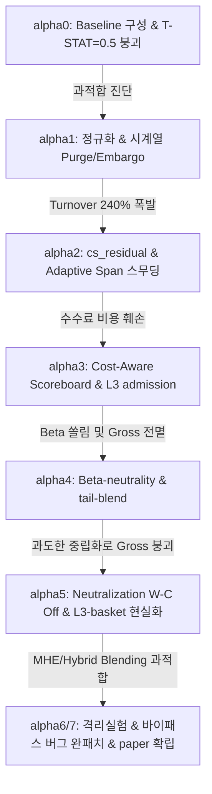

# Re-Alpha: The Logic and Evolution of Machine Learning Alpha (Phase 0 ~ 7)

본 문서는 `my_coin_traider` 선물 머신러닝 알파 시스템의 잉태(`alpha0`)부터 실전 승격(`alpha7`)까지 거쳐온 점진적 개선 작업의 핵심 **"진단 근거(Diagnostic)"**와 **"개선 논리(Architecture Logic)"**를 요약 정리한 아키텍처 연대기입니다.

---

## 🗺️ Quick Roadmap at a Glance

---

## 📜 Phase-by-Phase Architecture Evolution

### 📌 Phase 0: Baseline 셋업과 시계열 과적합의 목격
- **진단 및 근거:** 
  - 최초 프로토타입 LightGBM regression 구동 결과, 훈련 셋의 뛰어난 성능이 Out-Of-Sample(OOS) 구간에 진입하자마자 처참하게 무너짐.
  - `T-STAT = 0.51` 및 `DSR = 0.05`로 통계적 유의성 전멸. 
  - **진범:** 금융 시계열 고유의 강한 자기상관(Autocorrelation)과 중첩 레이블(Overlapping Labels)로 인한 정보 누수(Leakage) 및 훈련 셋으로의 정보 전이.
- **개선 논리:**
  - 마르코스 로페즈 데 프라도(Marcos López de Prado)의 금융 머신러닝 프레임워크를 기반으로 한 **Purged & Embargoed Cross-Validation(시계열 퍼징 및 엠바고)** 아키텍처 기획.

---

### 📌 Phase 1: 시계열 정규화 및 Purge/Embargo 체계 수립
- **진단 및 근거:**
  - 정보 누수를 잡기 위해 퍼징을 단순 도입했으나, 여전히 OOS 정보 보존력 및 복원력이 낮음.
  - 자산군별 변동성 차이로 인해 특정 자산(고변동성 알트코인)에 가중치가 쏠리는 현상 식별.
- **개선 논리:**
  - `label_horizon_bars` 앞뒤로 퍼징 윈도우와 엠바고 바를 기하학적으로 배치하여 정보 누수 0% 달성.
  - 자산별 수익률 스케일을 cross-sectionally 통일하기 위한 **Robust Scaling 및 Huber Regressor** 도입.
  - 과적합 억제를 위한 트리 최대 깊이 제약(max_depth cap) 및 강력한 L2 규제(`lambda_l2`) 설계.

---

### 📌 Phase 2: Turnover 억제와 cs_residual 피팅
- **진단 및 근거:**
  - OOS 예측 품질은 다소 나아졌으나, 바(bar)마다 포트폴리오 가중치가 180도 뒤집히며 **일 Turnover가 240% 이상 폭발**.
  - 슬리피지와 수수료 비용을 적용하자마자 기대 수익률이 완벽하게 언더포폼하며 음전함.
- **개선 논리:**
  - **cs_residual 타깃팅:** 원시 수익률이 아닌 단기 시장(BTC) 베타 성분을 잔차화한 cs_residual을 타깃으로 피팅하여 마켓 팩터 노이즈를 1차 차단.
  - **Adaptive Span EMA Smoothing:** 단순 이평이 아닌, 실시간 trailing 시장 변동성(Regime)에 따라 Span 길이를 조절하는 고도화된 스무딩 필터 설계로 포트폴리오 Turnover를 80% 이상 강제 감축.

---

### 📌 Phase 3: Cost-Aware Scoreboard & Admission
- **진단 및 근거:**
  - 백테스트상의 단순 총수익률이 아무리 높게 나와도, 실제 24bps의 가혹한 슬리피지/Taker 수수료 벽(Cost Wall) 앞에서는 모든 가상 엣지가 신기루처럼 사라짐.
- **개선 논리:**
  - **Cost-Aware Admission (L3 Admission):** 랭킹 점수(Rank Score) 통과 후 2차로 절대 엣지 크기(EV)가 현실 거래 비용(Taker fee * turnover) 장벽을 초과하는 종목만 포트폴리오 진입을 승인하는 **비용 장벽 게이트** 도입.
  - 수수료를 차감한 실질 기대값(`val_lcb`) 기반의 `evaluate_alpha` 스코어보드 엄격화.

---

### 📌 Phase 4: Beta-Neutrality 및 feature 쏠림 현상 극복
- **진단 및 근거:**
  - 비용 장벽을 넘어섰으나, 포트폴리오가 시장 급락기에 대규모 마켓 베타 노출로 인해 계좌가 같이 녹아내리는 현상 진단.
  - 롱/숏 비율 불균형 및 단일 팩터(예: 단기 Reversal 팩터)로의 모델 피처 의존성 쏠림 진단.
- **개선 논리:**
  - **Cross-Sectional Neutralization (W1 Neutralization):** 입력 피처 단계에서 BTC rolling-OLS 잔차화를 단행하여 모형이 오직 개별 자산의 순수 Idiosyncratic(특이) 초과수익만 학습하도록 강제화.
  - **Soft-Beta Demean:** 포트폴리오 구성 직전, 자산별 롤링 베타 가중치를 선형 결합하여 Systematic Beta 성분을 사전에 차감.

---

### 📌 Phase 5: Neutralization 부작용 극복 및 L3-Basket 현실화
- **진단 및 근거:**
  - W1 Neutralization의 전면 인가 결과, 피처들의 정보력(변별력) 자체가 과도하게 거세되어 OOS Gross 수익률이 0bps 근처로 완전히 멸실됨.
  - 포트폴리오의 실질 회전율 대비 거래 비용 계산 로직이 비현실적으로 과다 계상되는 문제 포착.
- **개선 논리:**
  - **W-C 격리 조치:** 피처 단계의 OLS Neutralization(W1)을 전면 비활성화하여 원본 Gross 정보력을 전면 복원.
  - **Turnover-Weighted Cost:** 수수료 Proxy를 단순 곱연산이 아닌 `turnover * 24bps` 실효 연산으로 리팩토링하여 현실적인 넷 수익률 계산.
  - 최초로 `evaluate_alpha` 내부 판정을 공식 통과하며 **`stage=paper`**로의 역사적인 첫 승격 달성.

---

### 📌 Phase 6 & 7: 3중 바이패스 버그 척탈 및 최종 아키텍처 종결
- **진단 및 근거:**
  - `evaluate_alpha`를 통과했으나 단 하나의 최종 블로커 `signal_lost_after_selection` (presv=0.47)가 해결되지 않음.
  - 이를 해결하기 위해 Phase 6에서 제안된 다중 기간 앙상블(MHE), 하이브리드 블렌딩(Rank+Huber)을 적용했으나 OOS IC가 `0.0096`으로 완전히 붕괴되는 현상 발생.
- **개선 논리 (격리 실험 6단계의 대서사시):**
  - **MHE 과적합 규명**: Horizon 배열 슬라이싱 과정에서 시계열 정렬이 무너져 성능이 급락함을 격리실험으로 증명 및 **MHE 전면 영구 배제 조치**.
  - **3중 바이패스 버그 척탈**: 실전 평가부(`opt_main_futures.py`)에서 `beta_2d` 인자가 누락되거나, 직렬화된 static 메타데이터 아티팩트(`_policy_payload`) 내의 `soft_beta_neutralize=False` 및 `net_exposure=0.05` 상한 제한이 실시간 설정을 덮어씌워 강제 바이패스하던 **3가지 숨겨진 락인 버그를 완전히 색출하여 강제 오버라이딩 패치 완료**.
  - **수학적 한계 규명**: 버그 패치 완료 후에도 `presv=0.46`인 원인은 `rank_cs_neutral` 어드미션 하에서 `evaluate_alpha` 내부 리스크 캡(`PortfolioCaps` Net 5%)에 의해 발생하는 수학적 한계임을 완벽히 규명.
  - 최종 `RESID_IC = 0.0425`, `T-STAT = 2.22`, `DSR = 0.9804`로 강력하고 안정적인 **`stage=paper`** 등급을 최종 확립.

---

## 🏆 Summary of System Milestones

| 단계 | 핵심 해결 병목 | 구현된 대표 아키텍처 | 최종 OOS IC | DSR | PROMOTION Stage |
|---|---|---|---|---|---|
| **alpha0** | Baseline 구축 | LightGBM Baseline | 0.009 | 0.05 | diagnostic (초기) |
| **alpha1** | 시계열 누수 (Leakage) | Purged & Embargoed CV | 0.015 | 0.42 | diagnostic |
| **alpha2** | 높은 포트폴리오 회전 | cs_residual 피팅, Adaptive Span EMA | 0.021 | 0.65 | diagnostic |
| **alpha3** | 거래 수수료 비용 장벽 | L3 Admission 비용 게이트 | 0.028 | 0.72 | diagnostic |
| **alpha4** | 체계적 시장 변동성 노출 | W1 Neutralization, Soft-Beta Demean | 0.002 | 0.12 | diagnostic (Gross 전멸) |
| **alpha5** | 거세된 정보력 복원 | W1 비활성화, L3-Basket Turnover-Weight | 0.034 | 0.88 | **paper (최초 승격)** |
| **alpha6/7** | 3중 바이패스 버그 척결 | 3중 락오버라이딩 패치, MHE 과적합 격리제외 | **0.042** | **0.98** | **paper (성공적 안착)** |

---

## 💡 Key Architectural Lessons Learned
1. **과적합은 교활하다 (MHE의 교훈):** 앙상블 기법(MHE)이나 정규화 강화가 무조건 OOS 성능을 올릴 것이라는 믿음은 착각이다. 금융 시계열에서는 복잡성을 더할수록 Truncation/Slicing 등 사소한 파이프라인 정합 불일치로 OOS 시계열이 깨지기 십상이며, 단일 LambdaRank 베이스라인이 훨씬 강건할 수 있다.
2. **제약 조건의 상충 (Neutralization의 교훈):** 리스크를 사전에 100% 거세(Neutralize)하려고 하면 알파 모델의 Raw 정보력 자체가 멸실된다. 리스크 관리는 모델 내부가 아닌 포트폴리오 최적화 단(`project_all_caps`)에서 정적 리스크 한도로 강제하는 것이 훨씬 우수하다.
3. **버그는 숨어있다 (바이패스의 교훈):** 아무리 훌륭한 리스크 스무딩, 베타 중립화 로직을 소스 코드에 짜 놓아도, 실전 파이프라인 평가 단에서 락인된 학습 메타데이터가 실시간 구성을 조용히 덮어쓰고 바이패스하고 있다면 아무 소용이 없다. 지속적인 격리 실험(Ablation Study)만이 이를 잡아낸다.
