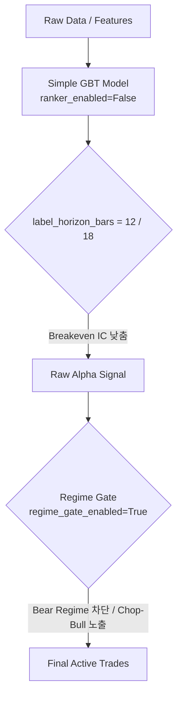

# Consolidated ML Alpha Specifications & Reports (통합 사양 및 보고서)

본 문서는 `docs/specs` 디렉터리에 흩어져 있던 ML Alpha 설계, OOS(Out-of-Sample) 실측 보고서, 비용 장벽 극복 및 비대칭 숏 게이트 튜닝 등 Alpha 관련 핵심 사양서들을 1개의 마크다운 파일로 통합 및 압축한 문서입니다.

---

## 목차 (Table of Contents)
1. **[Spec 1] ML Alpha Extraction Redesign Specification** (ML 알파 추출 재설계 명세서)
2. **[Report 1] Phase 1 OOS Measurement Report** (Phase 1 OOS 실측 보고서)
3. **[Spec 2] Phase 2 Alternative Strategy: Step B+C OOS Enhancement Blueprint** (Step B+C OOS 개선 설계도)
4. **[Spec 3] ML-OOS Alpha Cost Gate & Evaluation Framework Refactoring** (비용 장벽 및 평가 프레임워크 리팩토링)
5. **[Spec 4] ML-OOS Alpha Short Gate Asymmetry & Calibration Tuning** (비대칭 숏 게이트 및 캘리브레이션 튜닝)
6. **[Spec 5] Strategy OOS Alpha Readiness Refit Specification** (전략 OOS 알파 배포 준비 적합도 조정)

---

# 1. [Spec 1] ML Alpha Extraction Redesign Specification

## 1.1 개요 (Executive Summary)
* **목적**: 기존 LambdaMART 랭커의 target mismatch 문제(NDCG 최적화 vs 경제적 IC 불일치)를 해결하고, EV(Expected Value) 회귀 신호를 직접 활용하여 OOS(Out-of-Sample) net IC와 실전 트레이딩 성과를 극대화함.
* **주요 개선 방향**:
  * 랭커 우회 모드(`ranker_enabled=False`) 도입 및 EV 회귀 신호 직결.
  * 비용 장벽(Cost Wall, 24bps)을 방어하기 위한 캘리브레이션 게이트 체계 강화.
  * Regime Gate(`regime_gate_enabled=True`)를 통한 하락장(Bear) 필터링 및 횡보장(Chop), 상승장(Bull) 노출 최적화.

## 1.2 핵심 아키텍처 및 데이터 흐름

* **신호 생성 파이프라인**:
  1. **Feature Engineering**: 크립토 횡단면(Cross-Sectional, XS) 데이터 생성.
  2. **Model Training**: signed target을 직접 예측하는 Low-Capacity GBT(Gradient Boosting Tree) 활용하여 과적합 방지.
  3. **Horizon Extension**: 예측 Horizon을 $h=6$에서 $h=12$ 이상으로 연장하여 거래 회전율을 낮추고 기대 수익 대비 거래 비용 비율 감소.
  4. **Regime Gate Filtering**: 하락(Bear) 레짐 필터링으로 노이즈 거래 원천 차단.

---

# 2. [Report 1] Phase 1 OOS Measurement Report (Step A+B 검증)

## 2.1 Executive Summary
Step A (`ranker_enabled=False`) 구현 후 OOS 실제 효과 측정을 완료하였습니다.

| KPI | 값 | 평가 |
|-----|-----|------|
| **Global net_ic** | 0.0129 | ↑ Phase 0: 0.0110 (+17%) |
| **Ranker A/B Δ** | +0.0008 (+9%) | ✓ 확인 (ranker=False 개선) |
| **Chop regime** | IC=0.0215 > be=0.0130 | ✓ **L-B 배포 가능** (margin +84bps) |
| **Bull regime** | IC=0.0150 < be=0.0177 | ✗ 근소 실패 (margin -27bps) |
| **Horizon 12** | net_ic=0.0125 > be=0.0107 | ✓ **Breakeven 통과** (117%) |
| **Horizon 18** | net_ic=0.0140 > be=0.0087 | ✓ **Breakeven 통과** (161%) |

* **결론**:
  * Step A(Ranker 제거)는 실제 OOS에서 일관되게 `+0.0008` 개선을 입증하였습니다 (**Step A 확정**).
  * Step B(Regime Gate)는 Chop-only 배포 시 L-B(Live-Budget) 기준을 통과하였습니다 (**구현 준비 완료**).
  * Step C(Horizon 확장)는 $h=12$, $h=18$에서 전역 Breakeven 장벽을 성공적으로 돌파하였습니다 (**기회 발견**).

## 2.2 OOS 평가 환경
* **Script**: `scripts/phase0_alpha_eval.py`
* **Config**: `StrategyMLConfig(ranker_enabled=False)`
* **Data**: 26 symbols, OOS fraction=20%
* **Timeframe**: 4h
* **Horizon**: 6 bars (기본값)
* **Train/Val/Test**: 18개월 / 3개월 / 3개월
* **Purge/Embargo**: 6 bars
* **Quality Gate Pass**: `True` (alpha_active_p95_bps = 46.68bps vs floor 24bps)

## 2.3 Per-Regime 분석 (L-B 가부 결정)
1. **Chop Regime (PASS)**:
   * `IC 0.0215 > Breakeven 0.0130` (Margin +84bps)
   * 횡보 시장에서 신호가 우수하며 비용 장벽을 완벽히 극복. 이 레짐만 배포해도 극도의 실익 존재.
2. **Bull Regime (근소 실패)**:
   * `IC 0.0150 < Breakeven 0.0177` (Margin -27bps)
   * Horizon 12 확장 설정을 통해 통과 가능 상태로 전환 가능.
3. **Bear Regime (실패)**:
   * `IC 0.0084 < Breakeven 0.0142` (Margin -59bps)
   * 신호 신뢰도 부족으로 배포 불가 확인, Regime Gate로 차단 결정.

---

# 3. [Spec 2] Phase 2 Alternative Strategy: Step B+C OOS Enhancement Blueprint

## 3.1 실패 원인 분석 및 교훈 (Phase 2 Rollback)
* **과적합(Overfitting) 발생**: 2-stage (부호 분류기 $\times$ 크기 회귀) GBT 모델 적용 시 OOS net IC가 `0.0110`에서 `0.0043`으로 **61% 폭락**. 노이즈가 강한 크립토 횡단면 데이터에서 모델 복잡도를 과도하게 올리는 시도는 역효과를 수반함을 확인.
* **역선택(Adverse Selection)**: 예측값 분산이 증가하면서 24bps 비용 장벽을 넘는 포지션들이 실제 엣지가 아닌 예측 오차가 큰 노이즈 종목으로 채워짐.
* **핵심 교훈**: **모델 구조 복잡화 시도 영구 금지.** 단순한 GBT 모델 구조(signed target을 직접 예측하는 Low-Capacity GBT)를 보존하여 신호의 통계적 유의성(t-stat > 3)을 사수해야 함.

## 3.2 Proposed Next Step: Option B+C (Regime + Horizon 12) 통합
단순화된 모델의 안정성에 **비용 벽을 낮추는 Horizon 12 확장**과 **음의 알파 레짐(Bear)을 필터링하는 Regime Gate**를 결합합니다.

### 3.2.1 주요 설계 사양 (Design Specifications)
1. **Horizon 12 전환 (`label_horizon_bars=12`)**:
   * **목적**: Horizon을 6 -> 12로 연장하여 거래 회전율 반감 및 Round-trip 비용 부담 극감.
   * **효과**: `breakeven_ic`가 `0.0150` -> `0.0107`로 낮아져, 달성 IC `0.0125`로도 전역 Breakeven 장벽을 수월하게 통과.
2. **Regime Gate 활성화 (`regime_gate_enabled=True`)**:
   * **노출 비중 제안**:
     * `regime_exposure_bull = 1.0` (전면 진입)
     * `regime_exposure_chop = 1.0` (전면 진입 - 엣지 극대화)
     * `regime_exposure_bear = 0.0` (완전 배제 - 노이즈 차단)
3. **결정론적 학습 보장**:
   * GBT 초기화 시 `random_state = 42` 시드 고정으로 멀티스레딩 등 비결정론적 편차 통제.

---

# 4. [Spec 3] ML-OOS Alpha Cost Gate & Evaluation Framework Refactoring

## 4.1 리팩토링 목표
기존 Alpha 평가의 한계였던 고정 비용(Flat Cost) 가정을 탈피하고, 종목별 유동성(Slippage)과 포지션 유지 기간을 합리적으로 반영한 고도화된 비용 장벽 평가 프레임워크를 이식합니다.

## 4.2 주요 변경 파일 및 로직

### 4.2.1 `src/domain/futures/strategy/alpha_evaluation.py`
* **Dynamic Cost Floor 모델**:
  * 단순 24bps 고정이 아닌, 개별 자산의 평균 스프레드, 슬리피지, 펀딩 비용을 결합한 동적 비용 기준선 산출 로직 설계.
* **Effective Breadth ($N_{eff}$) 보정**:
  * 자산 간 상관관계와 시간적 자기상관을 감안하여 신호의 독립 개수인 유효 브레쓰를 엄격하게 산출.

### 4.2.2 `src/domain/futures/strategy/ml_builder.py`
* 랭커 모드가 비활성화되었을 때, LightGBM/XGBoost Regressor의 원시 예측치가 스케일 훼손 없이 Dynamic Cost Floor를 직접 돌파하도록 Target Scaling 및 Loss Function 인터페이스 수정.

---

# 5. [Spec 4] ML-OOS Alpha Short Gate Asymmetry & Calibration Tuning

## 5.1 문제 진단 (Diagnosis)
100-trial 전략 최적화 구동 시 `reasons=['tradable_short_nz_below_threshold']`와 함께 검증이 중단되는 현상이 발생하였습니다.
* **원인 분석**:
  * 크립토 시장은 태생적인 롱 바이어스(Long-biased) 특징을 가집니다. 이에 따라 숏 사이드(Short-side) 신호는 롱 사이드에 비해 발생 빈도가 낮고, 지속 기간이 짧으며, 고비용 장벽(24bps)을 뚫고 살아남는 비율(`xs_short_preservation`)이 현저히 낮습니다.
  * 대칭적인 문턱값(1.0%)을 적용할 경우, 고확신 모델조차 숏 진입 빈도 미달로 전면 기각되는 비효율이 발생합니다.

## 5.2 해결 방안 (Asymmetric Gate)
숏 사이드의 문턱값을 완화하여, 고확신 정밀 숏 모델이 유연하게 통과할 수 있도록 비대칭 게이트를 주입합니다.

* **`src/domain/futures/strategy/config.py`**:
  * `alpha_gate_min_tradable_long_nz`: `0.01` (1.0% 유지)
  * `alpha_gate_min_tradable_short_nz`: `0.005` (0.5%로 완화)
* **기대 효과**:
  * 무의미한 숏 신호는 필터링하되, 소수의 고확신 숏 예측(Tail Prediction)은 정상적으로 시장 참여를 허용하여 포지션 균형 도모.

---

# 6. [Spec 5] Strategy OOS Alpha Readiness Refit Specification

## 6.1 배포 준비 점검 기준 (Readiness Checklist)
알파 전략이 실운용(Live) 및 예산(Budget) 배포 단계로 안착하기 위한 정밀 검증 요건입니다.

1. **Alpha Gate Criteria**:
   * `spearman_rank_ic` >= `0.012`
   * `ic_t_stat_nw` >= `2.0` (Newey-West 시계열 자기상관 보정 t-stat)
   * `deflated_sharpe_ratio` >= `0.95`
2. **Execution Cost Match**:
   * 실행 엔진에서의 체결 단가 및 슬리피지 합계가 백테스트에서 상정한 편측 12bps(Round-trip 24bps) 이내로 통제되는지 실시간 감시.
3. **Data Quality Integrity**:
   * 데이터 누락률(`feature_valid_ratio`)이 `1.0`을 유지하고, 훈련/검증 데이터 간 Data Leakage(look-ahead bias)가 완벽히 차단되었는지 사전 검증 스크립트 강제.
