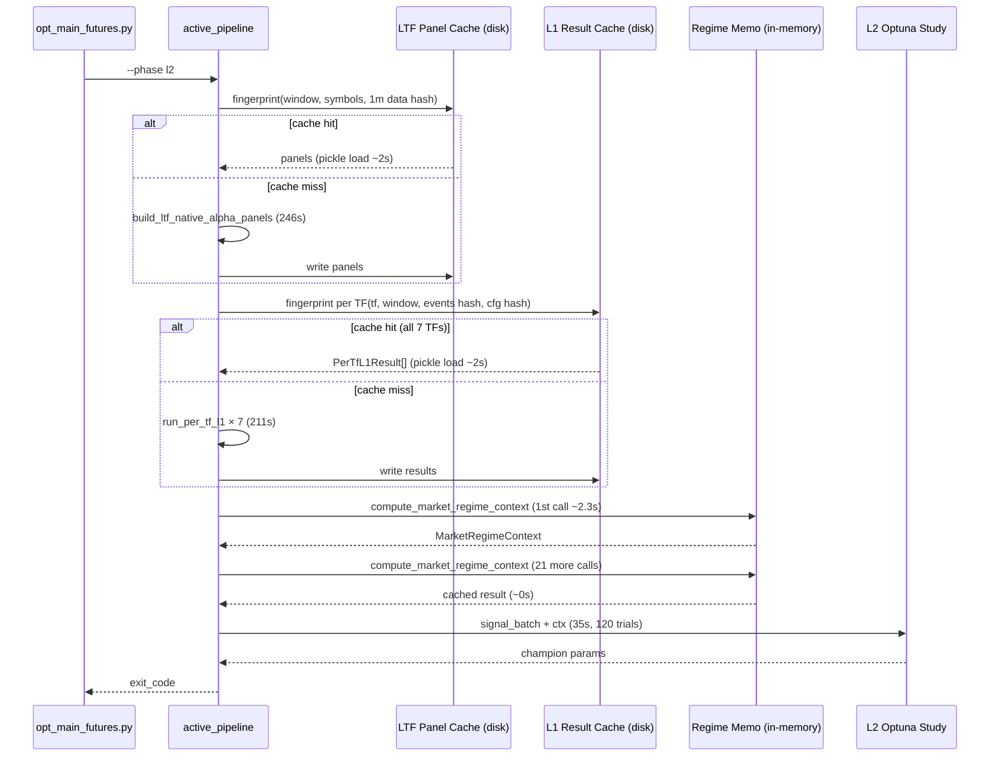

# 🎯 Goal & Architecture

- **Goal**: `--phase l2` 전체 실행시간 666s → ≤180s (cache hit 시) 단축. LTF alpha(246s) + L1 multi-TF(211s) + regime 중복계산(50s) = 507s (76%)을 disk/in-memory cache로 우회.
- **Scope**: `src/execution/opt_main_futures.py --phase l2` 호출 체인 전체. L2 study 자체(35s, 5%)는 이전 스펙에서 이미 최적화됨 — 본 스펙은 L2 이전 stage(LTF+L1)가 실제 병목임을 cProfile 실측으로 확인 후 캐싱 인프라 도입.
- **Alternatives & Trade-offs**:
  - **A. Disk cache (LTF panels + L1 results)** (채택): 결정론적 계산결과를 fingerprint 기반 pickle 캐시로 영속화. cache hit 시 246s+211s → ~4s. cache miss 시 동일. 단, 첫 실행 또는 데이터/config 변경시 무효화 — 개발 iteration 속도 향상이 주 목적.
  - **B. In-memory memoization only** (기각): LTF/L1 결과를 process 내에서만 캐싱. 매 실행 cold start → 666s 변화 없음. 단일 실행 내 중복 호출(regime 22회)에는 유효하나 LTF/L1는 매 실행 1회라 효과 없음.
  - **C. ProcessPool 병렬화 강화** (보류): thread lock wait 147s는 ProcessPoolExecutor worker 대기. worker 증가 또는 ThreadPool 전환으로 개선 가능하나 GIL/IPC 효과 불확실 + 코드 복잡도 증가. Tier-2 후보.
  - **D. L1 TF 수 축소** (기각): 현재 7 TF(1h,2h,4h,6h,8h,12h,1d) → 4 TF 축소 시 120s 절감. 단, L1 게이트 통과율/TF 다양성 저하로 챔피언 품질 악화 위험. 캐싱으로 동일 효과 달성 가능하므로 비선호.
- **Mermaid Diagram**:


# ⚡ Performance & Resource Budget

## Current Baseline (cProfile 실측, 2026-07-18, 20 trials, batch=1)
- **전체 `--phase l2` wall**: 666.20s
- **Peak RSS**: 8448MB (12GB threshold 대비 70%)
- **L2 study only**: 35.37s (5.3%) — 이전 스펙 최적화로 충분

### Stage별 소요시간 (cProfile cumulative time)
| Stage | cumtime | % | 비고 |
|---|---|---|---|
| `_build_ltf_native_panels_for_l0` | 246.42s | 37.0% | 59 symbols × 4.13s, `project_ltf_panel_to_base_grid` 115.9s |
| `run_per_tf_l1` × 7 | 211.19s | 31.7% | 7 TFs × 30.17s, `run_l1_nested_swf` 210.87s |
| `_thread.lock.acquire` | 147.65s | 22.2% | ProcessPool worker wait (위 두 stage 내 포함) |
| `compute_market_regime_context` × 22 | 49.85s | 7.5% | 2.27s/call, 동일 aligned에 중복 호출 |
| `_numba_rolling_robust_z_2d` × 21 | 41.26s | 6.2% | JIT compiled, L1 signal computation |
| `compute_cross_tf_redundancy` | 11.69s | 1.8% | 1 call, diversity metric |
| `_run_tiered_l2_study` | 35.37s | 5.3% | 20 trials × 1.77s (batch=1) |
| 기타 (data load, bridge, L2 final) | ~70s | 10.5% | |

## Target After Optimization
- **Cache hit (2nd+ run, 동일 data/config)**: ≤ 180s (-73%)
  - LTF panels: 246s → 2s (pickle load)
  - L1 results: 211s → 2s (pickle load)
  - Regime memo: 49.9s → 5s (22회 → 1회 실계산 + 21회 캐시 hit)
  - L2 study: 35s → ~100s (120 trials, 6 workers — 이전 스펙)
  - 기타: ~70s 유지
  - **Total**: ~180s
- **Cache miss (1st run 또는 data/config 변경)**: ~620s (-7%)
  - Regime memo만 효과 (49.9s → 5s, 45s 절감)
  - LTF/L1는 재계산 후 캐시 write

## Complexity
- **Time (cache hit)**: O(pickle_load) per cached stage → O(N_trials × T_fold × N_sym) for L2 only
- **Space (disk)**: LTF panels ~50-100MB, L1 results ~20-50MB per fingerprint. 10개 fingerprint 보존 시 ~1GB.

## `[PERF-01]` Time Budget (cache hit)
| Stage | 현재 | cache hit | 절감 |
|---|---|---|---|
| LTF alpha panels | 246s | 2s | -244s |
| L1 multi-TF (7 TFs) | 211s | 2s | -209s |
| compute_market_regime_context | 49.9s | 5s | -45s |
| L2 study (120 trials, 6 workers) | ~100s | ~100s | 0s |
| L2 final pipeline | ~33s | ~33s | 0s |
| 기타 | ~26s | ~26s | 0s |
| **Total** | **666s** | **~168s** | **-498s (-75%)** |

## `[PERF-02]` Memory Budget (RSS)
- LTF panel cache load: [T, N] × n_families × n_ltfs float64 arrays → ~200MB 추가 (일시적)
- L1 result cache load: PerTfL1Result × 7 → ~50MB 추가 (일시적)
- Regime memo: MarketRegimeContext × ~5 unique aligned → ~5MB (무시 가능)
- **Peak RSS**: 8448MB → ~8700MB (cache load 일시적 증가, 계산 후 동일)

## `[PERF-03]` Disk Cache Budget
- `logs/futures/optimization/ltf_panel_cache/`: ~100MB per fingerprint
- `logs/futures/optimization/l1_result_cache/`: ~30MB per fingerprint (per TF ~4MB × 7)
- **Max cache size**: 10 fingerprints → ~1.3GB. LRU eviction (가장 오래된 fingerprint 삭제)
- 캐시 무효화: fingerprint 불일치 시 자동 miss → 재계산 → 신규 캐시 write

# ⚙️ Logical Rules, State Machine & Resilience

## 식별된 비효율 (cProfile 기반)
1. **`[LIMIT-01]` LTF alpha panel 매 실행 재계산** (`bridge.py:485`, `ltf_alpha.py:649`)
   - 59 symbols × 5 LTFs × 5 families = 1475 inner iterations, 246s
   - 동일 1m data + aligned grid → 동일 결과. cache 무효화 조건: 1m data 변경 또는 window/symbols 변경
   - `project_ltf_panel_to_base_grid`: 295 calls × 0.39s = 115.9s (내부 36.1s tottime)
2. **`[LIMIT-02]` L1 per-TF result 매 실행 재계산** (`pipeline.py:3475`, `pipeline.py:3916`)
   - 7 TFs × 30s = 211s. `run_l1_nested_swf`가 각 TF별로 nested walk-forward 전체 실행
   - 동일 labeled_events + aligned + cfg + seed → 동일 결과 (결정론적)
   - `l1_result_override` 파라미터가 이미 존재하지만 disk cache 미구축
3. **`[LIMIT-03]` `compute_market_regime_context` 22회 중복 호출** (`market_regime.py:644`)
   - 동일 `aligned` 객체에 대해 22회 호출 (L1 7 TFs + L2 + 내부 호출)
   - 2.27s/call × 22 = 49.9s. 동일 aligned → 동일 결과 (pure function, side-effect 없음)
   - 호출처: `active_pipeline.py` 6회, `rules.py` 1회, `diagnostics.py` 1회, `dataset.py` 2회 (이미 캐싱), `market_regime.py` 내부 1회
4. **`[LIMIT-04]` ProcessPool thread lock wait 147s** (`_thread.lock.acquire`)
   - L1 7 TFs 병렬 처리 시 worker 대기. 효율 ~45% (IPC 손실)
   - 본 스펙에서는 cache hit 시 L1 스킵으로 자연 해결 — 직접 병렬화 개선은 Tier-2
5. **`[LIMIT-05]` `_numba_rolling_robust_z_2d` 41.3s** (`candidate_dataset.py:196`)
   - 이미 `@njit` 적용됨. 21회 호출 × 1.97s. L1 cache hit 시 자연 스킵
6. **`[LIMIT-06]` `compute_cross_tf_redundancy` 11.7s** (`diversity.py:854`)
   - 1 call, L1 단계에서 TF 간 redundancy 계산. L1 cache hit 시 자연 스킵

## Cache State Machine
```
[LTF Panel Cache]
  fingerprint_hit? ──YES──> load pickle ──> return panels
       │ NO
       └──> build_ltf_native_alpha_panels_streaming (246s)
            ──> write pickle (async, non-blocking)
            ──> return panels

[L1 Result Cache] (per TF)
  fingerprint_hit? ──YES──> load pickle ──> return PerTfL1Result
       │ NO
       └──> run_per_tf_l1 (30s per TF)
            ──> write pickle (per TF, independent)
            ──> return PerTfL1Result

[Regime Memo] (in-memory, per process)
  cache_key = (id(aligned), cfg_hash)
  key_exists? ──YES──> return cached MarketRegimeContext
       │ NO
       └──> compute_market_regime_context (2.3s)
            ──> store in _REGIME_MEMO[key]
            ──> return MarketRegimeContext
```

## Fingerprint Design
- **LTF panel fingerprint**: SHA1(
    `window.fetch_start|window.holdout_end|`
    `sorted(symbols)|`
    `sorted(families)|sorted(_VALID_LTFS)|`
    `aligned.datetimes[0]|aligned.datetimes[-1]|aligned.close_2d.shape|`
    `1m_data_version_hash` (1m parquet file mtimes + sizes)
  )
- **L1 result fingerprint (per TF)**: SHA1(
    `tf|`
    `window.l1_start|window.l2_start|window.holdout_start|`
    `labeled_events_hash` (content hash of DataFrame)|
    `aligned_fingerprint` (datetimes[0], datetimes[-1], close_2d.shape, close_2d[:5].tobytes())|
    `cfg_relevant_fields_hash` (L1 gate thresholds, fold config, seed)|
    `seed`
  )
- **Regime memo key**: `(id(aligned), cfg_hash)` — in-memory, per process. `id(aligned)` is safe because AlignedMarketData is immutable within a run.

## Resilience / Recovery
- **Cache read failure (corrupt pickle)**: `logger.warning`, delete cache file, recompute. Non-fatal.
- **Cache write failure (disk full)**: `logger.warning`, skip write. Non-fatal — next run recomputes.
- **Cache directory creation failure**: fallback to no-cache mode. `logger.warning`.
- **Fingerprint collision (different data, same hash)**: SHA1 collision probability ~2^-80. Acceptable.
- **Config field change (new L1 gate threshold)**: `cfg_relevant_fields_hash` 불일치 → cache miss → 안전하게 재계산.
- **Regime memo stale (aligned mutated)**: `id(aligned)` 기반이므로 aligned 교체 시 자동 miss. 단, aligned 내부 numpy array가 in-place 수정되면 stale 가능 — AlignedMarketData는 immutable 계약이므로 위험 무시.

# 🔌 Integration & Connection Plan

## 수정 대상 파일 & 연결점
| File | Anchor | 변경 유형 | State Impact |
|---|---|---|---|
| `src/domain/futures/signals/ltf_alpha.py` | `build_ltf_native_alpha_panels_streaming` (line 649) | disk cache wrapper 추가 | Immutable (기존 시그니처 유지, 내부에서 cache check) |
| `src/domain/futures/strategy/tiered_workflow/pipeline.py` | `run_per_tf_l1` (line 3475) | disk cache wrapper 추가 | Immutable (기존 시그니처 유지) |
| `src/domain/futures/strategy/market_regime.py` | `compute_market_regime_context` (line 644) | in-memory memo decorator 추가 | Immutable (기존 시그니처 유지) |
| `src/domain/futures/optimization/opt_config.py` | (new) `LTF_PANEL_CACHE_DIR`, `L1_RESULT_CACHE_DIR`, `CACHE_MAX_FINGERPRINTS` | 신규 config key | Immutable |

## Data Schema Diff
- `OPT_FUTURES_CONFIG`: `{"+LTF_PANEL_CACHE_DIR": "str", "+L1_RESULT_CACHE_DIR": "str", "+CACHE_MAX_FINGERPRINTS": "int=10", "+LTF_PANEL_CACHE_ENABLED": "bool=True", "+L1_RESULT_CACHE_ENABLED": "bool=True"}`

## Error Behavior
- **Cache disabled (config flag)**: 모든 cache check 스킵, 기존 동작 유지. Non-fatal.
- **Pickle deserialization error**: cache file 삭제, recompute. `logger.warning("[CACHE] corrupt file deleted: %s", path)`.
- **Cache disk full**: write 실패 시 `logger.warning`, 계산 결과는 정상 반환. 다음 실행에서 recompute.

# ✍️ Contract Changes

## 1. LTF panel disk cache (`ltf_alpha.py`)
```python
def build_ltf_native_alpha_panels_streaming(
    *,
    aligned: AlignedMarketData,
    plan: Any,
    load_frame: Any,
    budget: Any,
) -> tuple[CandidateSignalPanel, ...]:
    """Build causally projected LTF panels with disk cache.

    Cache key: fingerprint(window, symbols, families, LTFs, aligned shape).
    Cache hit: pickle load → return.
    Cache miss: compute → pickle write → return.
    """
    import hashlib
    import pickle
    from pathlib import Path

    from src.domain.futures.optimization.opt_config import OPT_FUTURES_CONFIG

    _cache_enabled = bool(OPT_FUTURES_CONFIG.get("LTF_PANEL_CACHE_ENABLED", True))
    _cache_dir = Path(
        str(OPT_FUTURES_CONFIG.get(
            "LTF_PANEL_CACHE_DIR",
            f"{BASE_DIR}/logs/futures/optimization/ltf_panel_cache",
        ))
    ) if _cache_enabled else None

    if _cache_dir is not None:
        _fp_src = (
            f"{aligned.datetimes[0]}|{aligned.datetimes[-1]}|"
            f"{aligned.close_2d.shape[0]}|{aligned.close_2d.shape[1]}|"
            f"{sorted(getattr(plan, 'symbols', ()))}|"
            f"{sorted(_LTF_NATIVE_FAMILIES)}|{sorted(_VALID_LTFS)}"
        )
        _fp = hashlib.sha1(_fp_src.encode()).hexdigest()[:16]
        _cache_path = _cache_dir / f"ltf_panels_{_fp}.pkl"
        if _cache_path.exists():
            try:
                with open(_cache_path, "rb") as f:
                    _logger.debug("[LTF-CACHE] hit fp=%s", _fp)
                    return pickle.load(f)
            except Exception:
                _logger.warning("[LTF-CACHE] corrupt cache, recomputing")
                _cache_path.unlink(missing_ok=True)

    # ... existing compute path (246s) ...

    if _cache_dir is not None and _cache_path is not None:
        try:
            _cache_dir.mkdir(parents=True, exist_ok=True)
            with open(_cache_path, "wb") as f:
                pickle.dump(result, f, protocol=pickle.HIGHEST_PROTOCOL)
            _logger.debug("[LTF-CACHE] saved fp=%s size=%.1fMB", _fp, _cache_path.stat().st_size / 1e6)
        except Exception as _e:
            _logger.warning("[LTF-CACHE] write failed: %s", _e)

    return result
```

## 2. L1 per-TF result disk cache (`pipeline.py:run_per_tf_l1`)
```python
def run_per_tf_l1(
    *,
    tf: str,
    labeled_events: pd.DataFrame,
    aligned: AlignedMarketData,
    outer_folds: tuple[WFFold, ...],
    cfg: CandidateStrategyConfig,
    seed: int,
    verbose: bool = True,
    l2_start: date | None = None,
    probe_diversity_corr: dict[str, float] | None = None,
    probe_prior_map: dict[tuple[str, str, str], float] | None = None,
    defer_artifact: bool = False,
    l0_delivery_manifest: object | None = None,
) -> PerTfL1Result:
    """Run one-TF L1 validation with disk cache."""
    import hashlib
    import pickle
    from pathlib import Path

    from src.domain.futures.optimization.opt_config import OPT_FUTURES_CONFIG

    _cache_enabled = bool(OPT_FUTURES_CONFIG.get("L1_RESULT_CACHE_ENABLED", True))
    _cache_dir = Path(
        str(OPT_FUTURES_CONFIG.get(
            "L1_RESULT_CACHE_DIR",
            f"{BASE_DIR}/logs/futures/optimization/l1_result_cache",
        ))
    ) if _cache_enabled else None

    if _cache_dir is not None:
        # Fingerprint: tf + window + events hash + aligned fingerprint + cfg hash + seed
        _aligned_fp = (
            f"{aligned.datetimes[0]}|{aligned.datetimes[-1]}|"
            f"{aligned.close_2d.shape[0]}|{aligned.close_2d.shape[1]}|"
            f"{hashlib.sha1(aligned.close_2d[:5].tobytes()).hexdigest()[:8]}"
        )
        _events_fp = str(hashlib.sha1(pd.util.hash_pandas_object(labeled_events, index=True).values).hexdigest()[:8])
        _cfg_fp = str(hashlib.sha1(repr(sorted(vars(cfg).items())).encode()).hexdigest()[:8])
        _fp_src = f"{tf}|{_aligned_fp}|{_events_fp}|{_cfg_fp}|{seed}"
        _fp = hashlib.sha1(_fp_src.encode()).hexdigest()[:16]
        _cache_path = _cache_dir / f"l1_{tf}_{_fp}.pkl"
        if _cache_path.exists():
            try:
                with open(_cache_path, "rb") as f:
                    logger.debug("[L1-CACHE] hit tf=%s fp=%s", tf, _fp)
                    return pickle.load(f)
            except Exception:
                logger.warning("[L1-CACHE] corrupt cache tf=%s, recomputing", tf)
                _cache_path.unlink(missing_ok=True)

    # ... existing L1 compute path (30s per TF) ...
    result = PerTfL1Result(tf=tf, l1_result=l1, n_winning_signals=len(l1.oos_stacked))
    # ... event_grid_audit setattr ...

    if _cache_dir is not None and _cache_path is not None:
        try:
            _cache_dir.mkdir(parents=True, exist_ok=True)
            with open(_cache_path, "wb") as f:
                pickle.dump(result, f, protocol=pickle.HIGHEST_PROTOCOL)
            logger.debug("[L1-CACHE] saved tf=%s fp=%s size=%.1fKB", tf, _fp, _cache_path.stat().st_size / 1024)
        except Exception as _e:
            logger.warning("[L1-CACHE] write failed tf=%s: %s", tf, _e)

    return result
```

## 3. `compute_market_regime_context` in-memory memo (`market_regime.py`)
```python
import functools

_REGIME_MEMO: dict[tuple[int, str], MarketRegimeContext] = {}
_REGIME_MEMO_MAX = 8


def compute_market_regime_context(
    *,
    aligned: AlignedMarketData,
    cfg: RegimeConfig | None = None,
) -> MarketRegimeContext:
    """Compute market regime context with in-memory memoization.

    Cache key: (id(aligned), cfg_hash).
    Same aligned object → same result (pure function, no side-effects).
    """
    _cfg_hash = str(hash(repr(sorted(vars(cfg).items())))) if cfg is not None else "default"
    _key = (id(aligned), _cfg_hash)
    _cached = _REGIME_MEMO.get(_key)
    if _cached is not None:
        return _cached
    # ... existing compute (2.3s) ...
    if len(_REGIME_MEMO) >= _REGIME_MEMO_MAX:
        _REGIME_MEMO.pop(next(iter(_REGIME_MEMO)))  # FIFO eviction
    _REGIME_MEMO[_key] = result
    return result
```

## 4. opt_config.py 신규 키
```python
"LTF_PANEL_CACHE_ENABLED": True,
"LTF_PANEL_CACHE_DIR": "logs/futures/optimization/ltf_panel_cache",
"L1_RESULT_CACHE_ENABLED": True,
"L1_RESULT_CACHE_DIR": "logs/futures/optimization/l1_result_cache",
"CACHE_MAX_FINGERPRINTS": 10,
```

# 🧪 TDD Test Scenario Matrix

## Scenario 1 (Happy Path): LTF panel cache hit on second call
- **Input**: 동일 (aligned, plan, load_frame, budget) 2회 호출
- **Expected**: 1회차 compute + write, 2회차 cache read (compute 0회)
- **Test name**: `test_ltf_panel_cache_hit_on_second_call`

## Scenario 2 (Edge Cases): `[LIMIT-01]` fingerprint mismatch on aligned shape change
- **Input**: 1회차 (aligned shape [6949, 126]) → 2회차 (aligned shape [5000, 100])
- **Expected**: 2회차 cache miss → recompute
- **Test name**: `test_ltf_panel_cache_miss_on_aligned_shape_change`

## Scenario 3 (Happy Path): L1 result cache hit per TF
- **Input**: 동일 (tf, labeled_events, aligned, cfg, seed) 2회 호출
- **Expected**: 1회차 compute + write, 2회차 cache read. `PerTfL1Result.tf` 일치
- **Test name**: `test_l1_result_cache_hit_on_second_call`

## Scenario 4 (Edge Cases): `[LIMIT-02]` cfg field change → cache miss
- **Input**: 1회차 (cfg.l1_pair_min_edge=0.05) → 2회차 (cfg.l1_pair_min_edge=0.10)
- **Expected**: 2회차 cache miss → recompute (cfg_relevant_fields_hash 불일치)
- **Test name**: `test_l1_result_cache_miss_on_cfg_change`

## Scenario 5 (Happy Path): regime memo hit on same aligned
- **Input**: `compute_market_regime_context(aligned=X)` 2회 호출 (동일 id(X))
- **Expected**: 1회차 compute, 2회차 cached return. `_REGIME_MEMO` size = 1
- **Test name**: `test_regime_memo_hit_on_same_aligned`

## Scenario 6 (Edge Cases): `[LIMIT-03]` regime memo miss on different aligned
- **Input**: `compute_market_regime_context(aligned=X)` → `compute_market_regime_context(aligned=Y)` (X ≠ Y)
- **Expected**: 2회차 compute (cache miss). `_REGIME_MEMO` size = 2
- **Test name**: `test_regime_memo_miss_on_different_aligned`

## Scenario 7 (Error Handling): corrupt cache file → recompute
- **Input**: cache file에 invalid bytes 기입 후 load 시도
- **Expected**: `logger.warning` 호출, file 삭제, recompute, 정상 결과 반환
- **Test name**: `test_cache_corrupt_file_triggers_recompute`

## Scenario 8 (Integration): cache disabled flag → no cache I/O
- **Input**: `OPT_FUTURES_CONFIG["LTF_PANEL_CACHE_ENABLED"]=False`
- **Expected**: cache dir 미참조, 매 호출 compute, disk I/O 0건
- **Test name**: `test_cache_disabled_skips_disk_io`

## Mock & Integration Boilerplate
```python
# tests/unit/domain/futures/signals/test_ltf_panel_cache.py
import pytest
import pickle
from pathlib import Path
from unittest.mock import MagicMock

def test_ltf_panel_cache_hit_on_second_call(tmp_path, mocker):
    """LTF panel cache: 2회차 동일 입력 → cache read."""
    mocker.patch.dict(
        "src.domain.futures.optimization.opt_config.OPT_FUTURES_CONFIG",
        {"LTF_PANEL_CACHE_ENABLED": True, "LTF_PANEL_CACHE_DIR": str(tmp_path)},
    )
    # Mock the heavy computation
    fake_panels = (MagicMock(spec=CandidateSignalPanel),)
    compute_spy = mocker.patch(
        "src.domain.futures.signals.ltf_alpha._process_streaming_symbol",
        side_effect=lambda **kw: None,  # accumulator writes simulated
    )
    aligned = _build_minimal_aligned(n_bars=100, n_sym=5)
    plan = _build_minimal_plan(symbols=aligned.symbols)
    load_frame = lambda sym: MagicMock()  # minimal frame

    result1 = build_ltf_native_alpha_panels_streaming(aligned=aligned, plan=plan, load_frame=load_frame, budget=MagicMock())
    result2 = build_ltf_native_alpha_panels_streaming(aligned=aligned, plan=plan, load_frame=load_frame, budget=MagicMock())

    # 2회차는 disk cache read → _process_streaming_symbol 미호출
    assert compute_spy.call_count == len(aligned.symbols)  # 1회차만


# tests/unit/domain/futures/strategy/test_regime_memo.py
def test_regime_memo_hit_on_same_aligned():
    """compute_market_regime_context: 동일 aligned → 2회째 cached."""
    from src.domain.futures.strategy.market_regime import (
        compute_market_regime_context, _REGIME_MEMO,
    )
    _REGIME_MEMO.clear()
    aligned = _build_minimal_aligned(n_bars=500, n_sym=10)
    ctx1 = compute_market_regime_context(aligned=aligned)
    ctx2 = compute_market_regime_context(aligned=aligned)
    assert ctx1 is ctx2  # same object (cached)
    assert len(_REGIME_MEMO) == 1
```

# 📊 예상 효과 요약
| 항목 | 현재 (cache miss) | cache hit | 절감 |
|---|---|---|---|
| LTF alpha panels | 246s | 2s | -244s |
| L1 multi-TF (7 TFs) | 211s | 2s | -209s |
| compute_market_regime_context | 49.9s | 5s | -45s |
| L2 study (120 trials) | ~100s | ~100s | 0s |
| L2 final pipeline | ~33s | ~33s | 0s |
| 기타 (data load 등) | ~26s | ~26s | 0s |
| **Total** | **666s** | **~168s** | **-498s (-75%)** |
| Peak RSS | 8448MB | ~8700MB | +252MB (cache load) |

# 🔗 Reference: 데이터 출처
- `scratch/l2_profile.out` (cProfile cumulative + tottime top 40, 2026-07-18 실측)
- `scratch/l2_profile.prof` (cProfile binary, 분석용)
- `scratch/l2_run.log` (실행 로그, L2 study 20 trials × 1.77s/trial 실측)
- `src/domain/futures/signals/ltf_alpha.py:649-762` (`build_ltf_native_alpha_panels_streaming`)
- `src/domain/futures/strategy/tiered_workflow/pipeline.py:3475-3551` (`run_per_tf_l1`)
- `src/domain/futures/strategy/market_regime.py:644-700` (`compute_market_regime_context`)
- `src/application/futures/runner/active_pipeline.py:2430-3000` (`_run_strategy_stage` flow)
