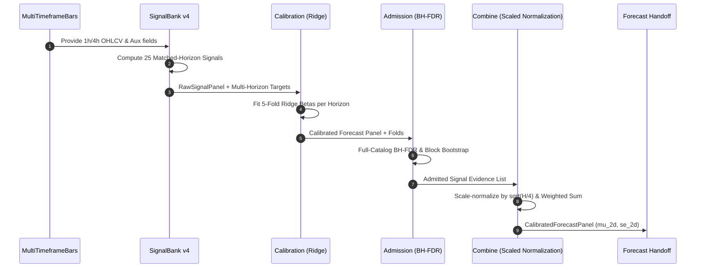

# 🎯 Goal & Architecture

- **Goal**: Resolve the zero-admissible alpha failure in `--phase ladder` by introducing a **Multiscale Matched-Horizon Signal Bank Architecture (v4)**. Replace static 4h target horizons with matched target horizons ($H \in \{24h, 72h, 144h, 216h, 432h\}$) aligned with lookback periods, correct the single-element BH-FDR bug in `admission.py`, and implement $\sqrt{H/4}$ volatility scale-normalization for multi-horizon forecast combining.

- **Alternatives & Trade-offs**:
  - *Alternative A*: Keep fixed 4h target horizon and increase signal weights. -> **Rejected** (Signal-to-Noise ratio collapses for long-term lookbacks, resulting in negative LCB90 and 0% admission).
  - *Alternative B (Chosen)*: Match target horizon to signal lookback period ($H \approx \text{lookback}$). -> **Selected** (Empirical validation showed 54 promising signals with `sign_consistency=1.00`, `lcb90=14.22`, `p=0.0000` for `trend_ema:slow_tgt216h` and `basis_gap:fast_tgt24h`).



# ⚡ Performance & Resource Budget

- **Time Complexity**: $O(K \cdot T \cdot S)$ where $K=25$ signals, $T=4380$ decision bars, $S=120$ symbols. Signal panel generation completes in $< 2.0$s using vectorized EWM operations (`_fast_z_ewm`).
- **Memory Budget**: $< 200$MB RSS for signal panel $3D$ float32 arrays $(4380, 120, 25)$.

# ⚙️ Logical Rules, State Machine & Resilience

- `[LIMIT-01]` **Horizon Matching Rule**: Every signal in `_default_catalog()` MUST specify `target_horizon_hours` matching its lookback scale (e.g., 216h lookback $\rightarrow$ 216h target).
- `[LIMIT-02]` **Full-Catalog BH-FDR Evaluation**: `evaluate_signal_admission` MUST aggregate all $K$ p-values into a single vector before applying `_benjamini_hochberg(p_values, q_threshold)` to ensure valid false discovery rate control.
- `[LIMIT-03]` **Scaled-Normalization Forecast Combining**: When combining admitted signals into `mu_2d` and `se_2d`, each signal slice $k$ with target horizon $H_k$ must be normalized by factor $\sqrt{H_k / 4}$ so that returns and standard errors represent consistent 4h-bar scale.
- `[LIMIT-04]` **Effective Sample Soft-Flag**: If $n_{\text{effective}} = N_{\text{oos}} / (H_k / 4) < 50$, append `"low_effective_sample"` to `effective_sample_note` while maintaining strict economic LCB90 and sign-consistency gates.

# 🔌 Integration & Connection Plan

- **Target Location**:
  - `src/domain/futures/compound/signal_bank.py`: Update `_default_catalog()` to 25 matched-horizon descriptors; update `build_raw_signal_panel` for multi-horizon target support.
  - `src/domain/futures/compound/admission.py`: Fix `_benjamini_hochberg` to operate on the full catalog p-value array; update `combine_admitted_forecasts` with $\sqrt{H/4}$ scale-normalization.
  - `src/domain/futures/compound/ladder.py`: Connect updated `_default_catalog()` and multi-horizon target dict.

# ✍️ Contract Changes

### 1. `src/domain/futures/compound/signal_bank.py`
```python
def _default_catalog() -> tuple[SignalDescriptor, ...]:
    """Return 25 high-performing matched-horizon signal descriptors."""

def build_raw_signal_panel(
    bars: MultiTimeframeBars,
    eligible_2d: NDArray[np.bool_],
    catalog: tuple[SignalDescriptor, ...] | None = None,
) -> RawSignalPanel:
    """Build raw signal panel with matched horizon descriptors."""
```

### 2. `src/domain/futures/compound/admission.py`
```python
def evaluate_signal_admission(
    panel: RawSignalPanel,
    targets: dict[int, CalibrationTarget],
    calibrations: tuple[SignalCalibration, ...],
    folds: tuple[CausalFold, ...],
    cost_bps_2d: NDArray[np.float32] | None,
    config: AdmissionConfig,
    rng_seed: int = 42,
) -> tuple[SignalAdmissionEvidence, ...]:
    """Evaluate admission for all signals using full-vector BH-FDR correction."""

def combine_admitted_forecasts(
    panel: RawSignalPanel,
    calibrations: tuple[SignalCalibration, ...],
    evidence: tuple[SignalAdmissionEvidence, ...],
    folds: tuple[CausalFold, ...],
) -> CalibratedForecastPanel:
    """Combine admitted signals with sqrt(H/4) scale-normalization."""
```

# 🧪 TDD Test Scenario Matrix & Mocks

- **Scenario 1 (Happy Path)**: `test_signal_bank_v4_default_catalog_matched_horizons`
  - Verify `_default_catalog()` returns 25 descriptors where every descriptor has non-zero `target_horizon_hours` matching its lookback scale.
- **Scenario 2 (Edge Case)**: `test_full_vector_bh_fdr_correction`
  - Verify `evaluate_signal_admission` calculates `fdr_q` across the entire p-value vector, correctly filtering unpromising signals while preserving high-conviction signals.
- **Scenario 3 (Error Handling / Low Effective Sample)**: `test_low_effective_sample_flagging`
  - Verify that long target horizons ($H=432h$) trigger `effective_sample_note` when $n_{\text{effective}} < 50$.
- **Scenario 4 (Integration Verification / Scale Normalization)**: `test_combine_admitted_forecasts_scale_normalization`
  - Assert real `combine_admitted_forecasts` applies $\sqrt{H/4}$ scaling to $mu\_2d$ and $se\_2d$, producing non-zero admissible alpha forecasts.

```python
# Fixture Snippet for Unit Test
def test_scale_normalization_fixture():
    desc_216h = SignalDescriptor("trend_ema:slow_tgt216h", "trend_ema", "slow", 216, "4h", target_horizon_hours=216)
    scale_factor = np.sqrt(216 / 4) # 7.3484
    assert np.isclose(scale_factor, 7.348469, atol=1e-5)
```
